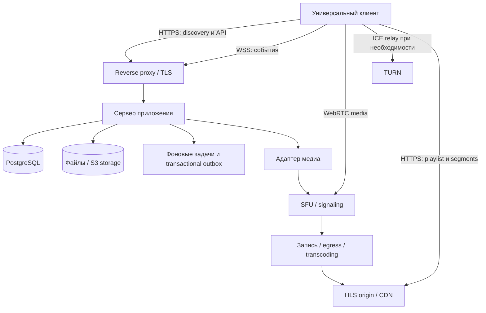
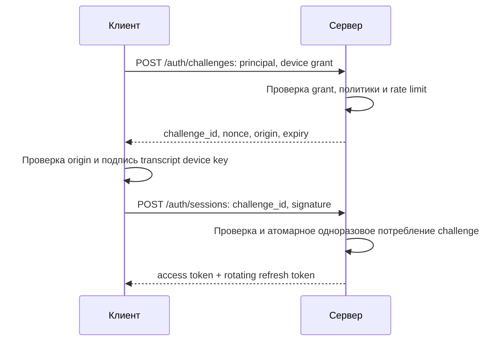
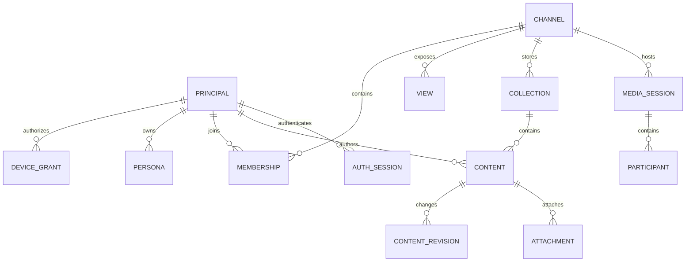

# Space Protocol — открытый протокол каналов и социальных realtime-приложений

**Рабочее имя: Space Protocol (`space`). Архитектурный проект, редакция 0.3 от 7 октября 2026 года.**

Этот документ описывает, что мы хотим построить, как части системы взаимодействуют и какие ограничения необходимо учитывать. [TODO.md](TODO.md) превращает архитектуру в последовательность проверяемых этапов.

> Здесь описана предлагаемая система, а не существующий работающий продукт. Имена маршрутов, форматы и ограничения — проектные решения. Примеры с `...`, условными ключами и доменами `.example` иллюстративны: они не являются криптографическими тестовыми векторами или готовыми конфигурациями для запуска. До стабильного релиза протокол требует реализации, проверки совместимости и независимого анализа безопасности.

## Содержание

Начальная структура репозитория уже создана: [protocol](protocol/README.md), [server](server/README.md), [client](client/README.md), [admin-web](admin-web/README.md), [sdk](sdk/README.md), [deploy](deploy/README.md) и [docs](docs/README.md). Это документированный каркас; исполняемый код и рабочий Compose пока отсутствуют. Правила участия описаны в [CONTRIBUTING.md](CONTRIBUTING.md), статус безопасности — в [SECURITY.md](SECURITY.md).

1. [Конечная идея](#1-конечная-идея)
   - [Prior art и отличия](#prior-art-и-отличия-почему-не-matrix-xmpp-или-nostr)
2. [Термины и границы проекта](#2-термины-и-границы-проекта)
3. [Пользовательские сценарии](#3-пользовательские-сценарии)
4. [Архитектура](#4-архитектура)
5. [Discovery и доверие к серверу](#5-discovery-и-доверие-к-серверу)
6. [Manifest и совместимость](#6-manifest-и-совместимость)
7. [Views, content, sessions и actions](#7-views-content-sessions-и-actions)
8. [Идентичность и иерархия ключей](#8-идентичность-и-иерархия-ключей)
9. [Вход и сессии авторизации](#9-вход-и-сессии-авторизации)
   - [Passkeys / WebAuthn](#95-passkeys--webauthn-как-альтернативный-credential)
10. [Устройства, отзыв и восстановление](#10-устройства-отзыв-и-восстановление)
11. [QR recovery card](#11-qr-recovery-card)
12. [Профили и personas](#12-профили-и-personas)
13. [Модели данных и хранение](#13-модели-данных-и-хранение)
14. [HTTP API](#14-http-api)
15. [Realtime и синхронизация](#15-realtime-и-синхронизация)
16. [Медиа: WebRTC, HLS и комнаты](#16-медиа-webrtc-hls-и-комнаты)
17. [Права, модерация и безопасность](#17-права-модерация-и-безопасность)
18. [Универсальный клиент](#18-универсальный-клиент)
19. [Docker и эксплуатация](#19-docker-и-эксплуатация)
20. [Технологии и структура репозитория](#20-технологии-и-структура-репозитория)
21. [MVP и дальнейшее развитие](#21-mvp-и-дальнейшее-развитие)
22. [Открытые решения и критерии готовности](#22-открытые-решения-и-критерии-готовности)
23. [Источники](#23-источники)

## 1. Конечная идея

Мы строим открытый протокол, по которому независимые серверы объявляют свои социальные пространства, а универсальный клиент понимает, как с ними работать. Владелец сообщества запускает сервер на своём компьютере, VPS или домашнем оборудовании. Пользователь вставляет URL в клиент и получает чат, форум, ленту, голосовую комнату или прямой эфир — без установки отдельного приложения для каждого сообщества.

Возможные применения: семейный сервер, игровое сообщество, клуб разработчиков, личная публикационная площадка, рабочая группа, онлайн-мероприятие. На одном сервере могут сосуществовать несколько каналов и несколько представлений одного канала.

```text
                          Универсальный клиент
                     Windows / Linux / macOS / мобильные
                                  │
               ┌──────────────────┼───────────────────┐
               ▼                  ▼                   ▼
        family.example      games.example       makers.example
        семейный чат        форум + голос       лента + эфир
        Docker-сервер       Docker-сервер       Docker-сервер
        своя база           своя база          своя база
```

У пользователя есть собственный криптографический секрет. Он подтверждает владение ключами, а не вводит пароль в централизованный сервис. Каждое устройство имеет собственные рабочие ключи; серверы получают только необходимые публичные ключи и подтверждения полномочий. Имя и аватар — изменяемый профиль, а не основание для входа.

### Что означает «владеет пользователь»

- Пользователь создаёт и хранит корневой секрет самостоятельно.
- Может восстановить свои производные идентичности без разрешения центрального оператора.
- Может использовать несколько клиентов и несколько устройств, если они совместимы с протоколом.
- Может экспортировать данные и перечень подключений.
- Не передаёт серверу приватный ключ для доказательства владения.

Это **не означает**, что сервер обязан принять пользователя, вернуть удалённые сообщения или выдать чужие данные. Владелец сервера управляет участием, хранением, модерацией и доступностью. Криптография доказывает владение идентичностью; право доступа определяет сервер.

### Основные принципы

1. Открытая спецификация и несколько независимых реализаций.
2. Самостоятельное размещение без обязательного центрального каталога, логина или облака.
3. Явные типы представлений и действий вместо загрузки произвольного кода из manifest.
4. Раздельные уровни: протокол приложения, идентичность, хранение, realtime и медиатранспорт.
5. Простая первая версия: один сервер авторитетен для своих объектов; федерация добавляется отдельно.
6. Совместимость доказывается тестами, а безопасность — проверками и анализом, а не наличием слова «crypto».

### Prior art и отличия: почему не Matrix, XMPP или Nostr

**Создание нового wire protocol пока не обосновано окончательно.** Наш продукт может оказаться универсальным клиентом и набором профилей поверх существующей системы. Self-hosting, комнаты, события, подписи и расширяемость уже существуют; их наличие не доказывает необходимость Space. Сравнение ниже — архитектурная оценка, не результаты benchmarks или interoperability tests.

| Система | Что можно использовать | Отличие предлагаемого Space | Что проверить прототипом |
|---|---|---|---|
| Matrix | Федерация, rooms/events, devices, permissions, sync и E2EE | Независимые server-local principals; авторитетный instance без обязательной репликации room state | Manifest/views поверх custom events, вход по ключу и стоимость auth extension |
| XMPP | Федеративный messaging, service discovery, MUC, pubsub и session negotiation | Обязательный согласованный профиль views/actions | Набор XEP для chat/forum/feed, existing server и минимальный UI |
| Nostr | User-owned signing keys, relay subscriptions, групповые и live extensions | Server-authoritative объекты, ACL и revisions вместо базовой модели переносимых событий | NIP-29/53, scoped keys, moderation, edits и private content |
| Space, если выбран | Manifest/view contracts, scoped identities, единый UX | Пока нет готовых clients, federation, E2EE и доказанной interoperability | Доказать преимущества на тех же сценариях и оценить новую стоимость безопасности |

#### Что уже решено

**Matrix.** Rooms реплицируются между homeservers, данные расширяются собственными event types, user ID имеет форму `@localpart:domain`. Можно исследовать наши views поверх Matrix вместо повторной реализации sync. Homeserver-bound account не означает обязательный центральный оператор или обязательный пароль. [Matrix specification](https://spec.matrix.org/latest/).

Документация E2EE описывает Megolm; Matrix также опубликовал работы и предложения по MLS. Наличие работ не означает «MLS поддерживается всеми Matrix-серверами и клиентами»: проверяем конкретные MSC, implementations и совместимость выбранного stack. [E2EE guide](https://www.matrix.org/docs/matrix-concepts/end-to-end-encryption/), [MLS-направление](https://www.matrix.org/blog/2024/12/25/the-matrix-holiday-special-2024/).

**XMPP.** Core задаёт messaging, presence, authentication и server-to-server связи. Discovery, многопользовательские комнаты, pubsub, Jingle и OMEMO описаны расширениями. Проверяем фактическую комбинацию XEP в выбранных клиентах/серверах; возраст системы и использование XML не являются аргументами против неё. [RFC 6120](https://www.rfc-editor.org/info/rfc6120/), [XEP-0030](https://xmpp.org/extensions/xep-0030.html), [XEP-0045](https://xmpp.org/extensions/xep-0045.html), [XEP-0060](https://xmpp.org/extensions/xep-0060.html), [XEP-0166](https://xmpp.org/extensions/xep-0166.html), [XEP-0384](https://xmpp.org/extensions/xep-0384.html).

**Nostr.** NIP-01 задаёт события с публичным ключом автора и Schnorr-подписью secp256k1; NIP-42 — аутентификацию на relay. User-owned identity здесь уже является основой системы. [NIP-01](https://github.com/nostr-protocol/nips/blob/master/01.md), [NIP-42](https://github.com/nostr-protocol/nips/blob/master/42.md).

Группы и live-сценарии также есть: NIP-29 описывает relay-based groups, NIP-53 — live activities. Несколько relay не равнозначны репликации room state в Matrix. Один повторно используемый public key облегчает сопоставление активности; отдельные ключи возможны, но тогда переносимость identity и связь аккаунтов требуют явной политики. [NIP-29](https://github.com/nostr-protocol/nips/blob/master/29.md), [NIP-53](https://github.com/nostr-protocol/nips/blob/master/53.md).

#### Что может быть нашим отличием

Гипотеза проекта — сочетание **самостоятельных серверов с локальными правилами**, **идентичностей без автоматически раскрываемого общего root ID** и **обязательных типизированных contracts для нескольких views в одном клиенте**. Отдельные элементы не новы и могут реализовываться существующими расширениями.

Авторитетный instance и отсутствие federation в MVP позволяют начать с локальных транзакций и ACL. Это ограничение области, не доказательство превосходства: Matrix можно использовать без включения federation, XMPP/Nostr тоже допускают локальные сценарии. У Space пока нет доказанной меньшей сложности, лучшей производительности или более сильной безопасности.

Новый протокол означает собственную обязанность поддерживать auth, sync, compatibility, abuse protection, clients и migrations. Bridge добавляет trust boundary: mapping может менять authorship, ACL и E2EE semantics. Мост не даёт автоматической совместимости.

#### Четыре допустимых решения

1. **Профиль существующего протокола:** views/manifest поверх Matrix, XMPP или Nostr с их identities и согласованными auth extensions.
2. **Клиент с adapters:** общий UX, отдельные backend semantics; гарантии отображаются по фактическому backend.
3. **Гибрид:** Space для discovery/views/media orchestration, существующая система для messaging; явно определить источник истины и identity mapping.
4. **Новый Space:** выбрать после доказательства существенных несовместимых требований или непропорциональной стоимости расширений.

#### Gate перед собственной реализацией

До этапа 3 подготовить ADR-013 и ограниченные прототипы Matrix, XMPP и Nostr. Для каждого проверить одинаковый сценарий: self-hosted instance → URL → chat и другая view → private membership → второе устройство → revoke/recovery → media join contract.

Отчёт разделяет: работает без изменений; требует профиля/плагина; требует несовместимого изменения; не проверено. Оценить собственный код, эксплуатацию, поддержку, privacy/recovery, доступность готовых clients и test coverage. Указать конкретные versions, sources и blockers; неизвестность не считать недостатком альтернативы.

**Условие выбора нового протокола:** обязательное требование нельзя разумно реализовать существующим профилем либо совокупная стоимость расширения выше с учётом собственной security/interoperability ответственности. Если преимущества не доказаны, корректируем roadmap в пользу существующей основы. Далее описан кандидат Space для сравнения, а не окончательно принятое обязательство.

## 2. Термины и границы проекта

| Термин | Значение | Пример |
|---|---|---|
| Server / instance | Независимая установка с устойчивым `server_id` | Сервер клуба |
| Channel | Пространство с участниками, политиками и содержимым | «Разработка» |
| View | Способ работы с содержимым или комнатой | Чат, форум, лента |
| Content | Сохраняемый объект | Сообщение, тема, публикация |
| Media session | Жизненный цикл звонка, комнаты или эфира | Конференция этой недели |
| Auth session | Временное разрешение API после входа | Access token устройства |
| Action | Типизированная команда пользователя | Отправить сообщение |
| Event | Уведомление об уже зафиксированном изменении | Сообщение создано |
| Principal | Криптографическая идентичность внутри сервера | `u_...` |
| Persona | Контекстный профиль principal | Ник в игровом канале |
| Device grant | Подписанное разрешение рабочему ключу устройства | Вход и публикация |
| Recovery seed | Секрет, из которого воспроизводятся корневые ключи | 32 случайных байта |

Важно не смешивать `auth_session` и `media_session`. Завершение звонка не завершает авторизацию в приложении. Отзыв устройства, наоборот, должен прекращать и API-сессии, и его доступ к комнатам.

### Что протокол делает

Discovery, согласование возможностей, модели объектов, аутентификацию, делегирование устройствам, права, команды, события, синхронизацию и выдачу разрешений на медиасессии.

### Что он использует извне

HTTPS/TLS, WebSocket, стандартные криптографические примитивы, WebRTC, ICE/STUN/TURN, SFU, HLS, базы данных и объектное хранилище. Не создаём собственный видеокодек, шифр, транспорт общего назначения или блокчейн.

### Что откладывается

Федерация, глобальный поиск, произвольные серверные плагины в клиенте, биллинг, бесшовный перенос истории между чужими серверами и сквозное шифрование всех типов контента. Их нужно проектировать отдельно; не объявляем их свойствами MVP.

## 3. Пользовательские сценарии

### 3.1. Первое использование

1. Клиент создаёт recovery seed через системный генератор случайных чисел.
2. Создаёт локальный защищённый vault и первое устройство.
3. Пользователь делает резервную карту; клиент предлагает проверить восстановление.
4. Пользователь вставляет `https://club.example`.
5. Клиент получает discovery и manifest, показывает владельца, адрес, возможности и условия входа.
6. После выбора подключения создаёт локальную идентичность этого сервера.
7. Выполняет challenge-response, получает API-сессию и создаёт профиль.
8. Пользователь видит доступные каналы и начинает общение.

Открытое чтение публичных каналов может работать до создания идентичности. Гостю нельзя автоматически выдавать права публикации.

### 3.2. Добавление второго устройства

Первое устройство подтверждает защищённое сопряжение, пользователь сверяет код на обоих экранах. Новый аппарат генерирует собственный рабочий ключ. Передаются vault либо ограниченные права и зашифрованные данные — в зависимости от режима доверия. История загружается с серверов, локальные настройки восстанавливаются из синхронизируемой копии.

### 3.3. Потеря всех устройств

Пользователь импортирует recovery card, получает те же производные серверные корневые ключи, создаёт новые device grants и входит на известные серверы. Если список серверов был только на потерянном аппарате, его нужно восстановить из отдельного backup или добавить адреса вручную. Если сообщения сохранились на сервере и права действуют, клиент их загрузит.

### 3.4. Владелец сообщества

Поднимает контейнеры, настраивает HTTPS и storage, сохраняет резервную копию `server_id` и серверного ключа, создаёт первый канал и одноразовое приглашение администратора. Меняет политики входа, добавляет модераторов, следит за квотами и проверяет восстановление сервера из backup.

## 4. Архитектура



### 4.1. Сервер приложения

Модули внутри одного процесса на старте:

- Discovery и manifest.
- Authentication: challenge, grants, tokens, revocation.
- Channels, profiles, memberships, permissions.
- Content и типизированные actions.
- Realtime gateway и durable event log.
- Upload pipeline и metadata файлов.
- Media adapter и проверка ролей комнаты.
- Администрирование, аудит, квоты и метрики.

Начинаем с модульного монолита. Микросервисы добавляют распределённые транзакции, диагностику и эксплуатационные расходы до появления реальной необходимости. PostgreSQL — источник истины; Redis при росте используется для presence, rate limiting или fan-out, но не заменяет долговечное хранение сообщений.

### 4.2. Клиент

```text
Интерфейс views
      ↓
Сценарии: подключение / публикация / восстановление / звонок
      ↓
Домен: Channel, Content, Principal, Permissions, Session
      ↓
Protocol SDK ── Local cache / Vault ── Media adapters
      ↓                                  ↓
HTTP / WebSocket                         SFU SDK / HLS player
```

Клиент не должен связывать экран чата с конкретной реализацией сервера. Один SDK проверяет manifest, сериализует API и обрабатывает ошибки; media adapter изолирует SDK поставщика. Это позволяет заменить SFU без переписывания всей модели приложения.

### 4.3. Границы доверия

| Компонент | Что знает | Чему нельзя доверять |
|---|---|---|
| Vault клиента | Recovery seed, локальные ключи | Серверным указаниям экспортировать секрет |
| Сервер | Локальный principal, публичные grants, контент MVP | Подписи без проверки статуса устройства |
| SFU | Участники и медиапотоки без отдельного E2EE | Самостоятельному назначению роли клиентом |
| TURN | IP, время и объём трафика | Наличию relay как доказательству E2EE |
| Backup storage | Зашифрованный backup, метаданные | Возможности сохранить только последнюю честную версию |
| Администратор | База, политики, журналы | Утверждению, что он не видит обычный контент |

## 5. Discovery и доверие к серверу

### 5.1. Начальная точка

В версии 1 сервер размещается на отдельном HTTPS origin. Размещение нескольких независимых instances под разными путями одного origin пока не поддерживаем: это упрощает нормализацию адресов, аудит и разграничение токенов.

```http
GET /.well-known/space-protocol HTTP/1.1
Host: club.example
Accept: application/json
```

```json
{
  "protocol": "space",
  "versions": ["1.0"],
  "server_id": "srv_2b490cd4-7931-4d54-a935-1225ad31f691",
  "canonical_origin": "https://club.example",
  "manifest_url": "https://club.example/api/v1/manifest",
  "server_signing_key": {"alg": "Ed25519", "public_key": "BASE64URL_KEY"}
}
```

`server_id` — случайный устойчивый идентификатор установки, не хеш домена и не хеш меняющегося ключа. Он сохраняется при смене домена и корректном восстановлении backup. Отдельный ключ подписывает документы доверия и миграции; его замена не меняет `server_id`.

### 5.2. Алгоритм подключения

1. Разобрать URL, запретить userinfo, неизвестные схемы и фрагменты с секретами.
2. Для production требовать HTTPS; локальный HTTP допускается только в явном режиме разработки.
3. Нормализовать origin: схема, IDNA hostname, порт; path приглашения обрабатывается отдельно.
4. Получить well-known без токенов; ограничить размер ответа, timeout и число redirects.
5. Не переносить `Authorization` между origin при redirect.
6. Проверить HTTPS, версии, schema, canonical origin и соответствие server identity ранее сохранённой записи.
7. При переходе на другой origin показать явное подтверждение адреса. Не считать redirect доказательством миграции identity.
8. Получить manifest; согласовать типы views и capabilities.
9. Только после подтверждения подключения предъявлять производную идентичность этому серверу.

Для первого визита доверяем TLS и подтверждённому пользователем адресу, затем сохраняем `server_id` и fingerprint серверного ключа: TOFU. Подпись manifest новым ключом из того же ответа не доказывает честность первого подключения. Если домен захвачен или доверие изменилось, клиент показывает конфликт и не переиспользует старую идентичность автоматически.

### 5.3. Миграция домена

Старый серверный ключ подписывает заявление с `server_id`, старым и новым origin, новым ключом при необходимости, сроком и монотонной версией. Клиент проверяет цепочку по сохранённому ключу. Без старого ключа — ручной процесс восстановления доверия, не тихий redirect.

Злоумышленник может скопировать публичный `server_id`. Поэтому клиент хранит связку `server_id + доверенный ключ + origins`, а не доверяет одному UUID. Проверка server identity должна предшествовать выдаче server-local grant.

### 5.4. Домашние серверы

Домашняя установка возможна, но Docker сам не решает CGNAT и firewall. Варианты: доступный внешний адрес и port forwarding; VPN для закрытого сообщества; reverse tunnel с отдельным оператором; VPS как точка входа. Для медиа может потребоваться TURN на доступном адресе. Прокси HTTP не всегда способен перенести UDP WebRTC.

## 6. Manifest и совместимость

Manifest — описание возможностей, а не исполняемый сценарий. Публичный manifest содержит только публичные каналы; после авторизации клиент получает отфильтрованный вариант. В нём нельзя раскрывать названия приватных пространств гостям.

```json
{
  "protocol": {"name": "space", "version": "1.0"},
  "server": {
    "id": "srv_2b490cd4-7931-4d54-a935-1225ad31f691",
    "title": "Клуб разработчиков",
    "origin": "https://club.example",
    "registration": "invite"
  },
  "revision": "mf_17",
  "api_base": "/api/v1",
  "events_endpoint": "/api/v1/events",
  "capabilities": ["core.chat.v1", "core.forum.v1", "core.feed.v1", "media.webrtc.v1"],
  "required_capabilities": ["core.identity.v1"],
  "limits": {"message_utf8_bytes": 16384, "upload_bytes": 26214400, "page_items": 100},
  "channels": [
    {
      "id": "ch_dev",
      "title": "Разработка",
      "views": [
        {"id": "v_chat", "type": "chat", "title": "Общий чат", "collection_id": "col_chat"},
        {"id": "v_forum", "type": "forum", "title": "Обсуждения", "collection_id": "col_forum"},
        {"id": "v_feed", "type": "feed", "title": "Новости", "collection_id": "col_feed"},
        {"id": "v_voice", "type": "voice_room", "title": "Голосовая", "session_template_id": "st_voice"},
        {"id": "v_video", "type": "video_room", "title": "Встречи", "session_template_id": "st_video"},
        {"id": "v_stage", "type": "stage", "title": "Доклады", "session_template_id": "st_stage"},
        {"id": "v_live", "type": "live_stream", "title": "Эфир", "session_template_id": "st_live"}
      ]
    }
  ],
  "extensions": {}
}
```

### Правила версии 1

- Major version меняется при несовместимом контракте. Minor — при совместимом расширении.
- Неизвестные необязательные поля можно игнорировать. Неизвестная обязательная capability запрещает соответствующий сценарий.
- Неизвестный view отображается как «Не поддерживается», без загрузки JavaScript, WebView или executable.
- `extensions` использует namespaced ключи, например `org.example.polls.v1`.
- Клиент имеет собственные предельные размеры. Сервер не может отменить их через manifest.
- Manifest поддерживает `ETag`; условный GET возвращает `304`. Авторизованный cache не переиспользуется для другой identity.
- Показанные возможности не означают наличие прав у пользователя. Права проверяются отдельно и на каждой команде.
- Относительные API-пути разрешаются только относительно проверенного origin. Отдельные media origins объявляются явным allowlist и получают собственные credentials.

Все значения времени — UTC RFC 3339. Бинарные поля — base64url без padding. ID непрозрачны; клиент не извлекает из них роли, время или права. В JSON подписываемых документов запрещаем duplicate keys, NaN, бесконечности и неподдерживаемые числа.

## 7. Views, content, sessions и actions

### 7.1. Почему разделяем

```text
Channel
 ├─ правила и участники
 ├─ collections с Content
 │    ├─ чат → сообщения
 │    ├─ форум → темы и ответы
 │    └─ лента → публикации
 └─ templates и Media sessions
      ├─ голосовая
      ├─ видеоконференция
      ├─ stage
      └─ эфир

View показывает collection или session template.
Action изменяет содержимое или состояние.
Event сообщает о результате.
```

Одна collection может иметь несколько представлений только при явно совместимой семантике. Не превращаем любое сообщение автоматически в форумную тему. Правила replies, ordering и permissions задаёт collection, а не внешний вид экрана.

### 7.2. Сохраняемый контент

```json
{
  "id": "cnt_01",
  "channel_id": "ch_dev",
  "collection_id": "col_chat",
  "type": "message",
  "author_id": "u_LOCAL_PRINCIPAL",
  "persona_id": "ps_default",
  "created_at": "2026-10-07T12:00:00Z",
  "updated_at": "2026-10-07T12:00:00Z",
  "revision": 1,
  "reply_to": null,
  "body": {"format": "plain", "text": "Привет!"},
  "attachments": [],
  "state": "visible"
}
```

| View | Объекты | Особенности |
|---|---|---|
| `chat` | `message`, reply, reaction | Хронология, read cursor, typing |
| `forum` | `thread`, `reply` | Заголовок, ветка, закрепление, закрытие |
| `feed` | `post`, comment | Публикации; MVP сортирует по времени |
| `live_stream` | Media session, опционально запись | Ведущий, зрители, ingest и playback |
| `voice_room` | Media session, participants | Аудио, mute, join/leave |
| `video_room` | Media session, tracks | Камера, экран, выбор устройств |
| `stage` | Media session, очередь выступлений | Host, speaker, audience |

Сообщение, опубликованное записью эфира, и сам активный эфир — разные объекты. Запись может остаться после завершения media session, если политика это разрешает.

### 7.3. Action

```json
{
  "id": "act_CLIENT_RANDOM_ID",
  "type": "content.create",
  "target": {"channel_id": "ch_dev", "collection_id": "col_chat"},
  "input": {
    "type": "message",
    "persona_id": "ps_default",
    "body": {"format": "plain", "text": "Привет!"},
    "attachments": []
  }
}
```

`author_id` сервер берёт из auth session. Клиент не назначает себе другого автора. Action проходит schema validation, проверку membership/ACL, квоты и транзакцию. Успешный ответ содержит созданный объект и позицию события. В базе действует уникальность `(principal_id, action_id)` для повторной отправки.

Основной каталог: `content.create`, `content.update`, `content.delete`, `reaction.set`, `reaction.remove`, `membership.join`, `membership.leave`, `profile.update`, `session.join`, `session.leave`, `session.raise_hand`, `session.set_role`, `moderation.hide`, `moderation.ban`. Последние две группы имеют отдельные права. Клиент поддерживает только известные типы actions и их schemas.

### 7.4. Media session

```json
{
  "id": "ms_weekly_42",
  "channel_id": "ch_dev",
  "view_id": "v_video",
  "type": "video_room",
  "state": "active",
  "started_at": "2026-10-07T12:30:00Z",
  "policy": {"max_participants": 12, "recording": "disabled"},
  "capabilities": ["audio", "video", "screen_share", "reactions"],
  "media": {"transport": "webrtc", "adapter": "livekit.v1", "topology": "sfu"}
}
```

Состояния: `scheduled → starting → active → ending → ended`, с переходом в `failed` при ошибке. Постоянная голосовая view может создавать новую session после опустошения комнаты. `session_id` идентифицирует конкретный жизненный цикл; view остаётся прежней.

## 8. Идентичность и иерархия ключей

### 8.1. Предлагаемая базовая модель

Владелец имеет один случайный 32-байтовый recovery seed. Из него через HKDF-SHA-256 выводятся отдельные 32-байтовые seed для Ed25519-ключей. Рабочие device keys, напротив, создаются случайно и независимо. Нельзя делать копию одного device key на все аппараты: тогда невозможно отозвать конкретный аппарат.

```text
Recovery seed S — 32 байта CSPRNG, только у владельца
 │
 ├─ local master Ed25519 key — локальная идентичность vault
 │   └─ public master ID не отправляется всем серверам
 │
 ├─ server root A (server_id A + identity_slot)
 │   ├─ server-local principal A
 │   ├─ grant → device key A / телефон
 │   └─ grant → device key A / ноутбук
 │
 ├─ server root B (server_id B + identity_slot)
 │   └─ независимый principal B и grants
 │
 └─ backup wrapping key — отдельное назначение
```

Локальный master key и server roots — соседние производные секрета S, а не публичная цепочка сертификатов, связывающая все серверы. Сервер A не получает master public key и не получает сертификат «master → server A», который позволил бы сопоставлять аккаунты.

### 8.2. Точный кандидат derivation profile `identity-kdf-v1`

```text
PRK = HKDF-Extract(SHA256(UTF8("space/identity-kdf/v1")), S)

master_seed = HKDF-Expand(PRK, JCS({purpose:"master",v:1}), 32)
server_seed = HKDF-Expand(PRK,
  JCS({purpose:"server-root",v:1,server_id:SERVER_ID,identity_slot:"default"}), 32)
backup_key = HKDF-Expand(PRK, JCS({purpose:"backup-wrap",v:1}), 32)

server_public = Ed25519PublicFromSeed(server_seed)
principal_id = "u_" + base64url(SHA256(UTF8("space/principal/v1\u0000") || server_public))
```

`JCS` здесь означает UTF-8 canonical JSON по RFC 8785; запись выше — псевдокод, не JSON. Derivation profile фиксируется вместе с тестовыми векторами до первой реальной идентичности. Его нельзя менять при обновлении клиента без явной миграции. Этим проектным профилем мы соединяем стандартные примитивы; он сам по себе не является готовым стандартом и требует review.

В версии 1 обязательный `identity_slot` — `default`. Дополнительные независимые identities на одном сервере откладываются. Несколько personas одного principal — только разные профили, а не криптографическая анонимность внутри сервера.

### 8.3. Свойства и ограничения

- Восстановление S и того же проверенного `server_id` даёт тот же server root и principal.
- Серверные публичные ключи различаются между серверами.
- IP, аватар, имя, время активности и содержимое всё равно могут связать пользователя между площадками.
- Компрометация одного device key не раскрывает S или соседние server roots.
- Компрометация S раскрывает все детерминированные roots. Замена файла QR не отменяет украденный секрет.
- Из S нельзя воспроизвести случайные device keys, но это и не требуется: выдаются новые grants.
- Никогда не используем signing key напрямую как симметричный ключ шифрования.
- Ключи шифрования E2EE проектируются отдельно от ключей входа.

### 8.4. Что хранится на устройстве

| Секрет / данные | Размещение | Резервирование |
|---|---|---|
| Recovery seed | Зашифрованный vault управляющего устройства | Recovery card |
| Server roots | Производятся внутри vault; минимальное время в памяти | Воспроизводятся из S |
| Device private keys | Secure storage либо зашифрованный vault | Не копируются; заменяются |
| Access/refresh tokens | Secure storage, раздельно по origin | Не резервируются |
| Server directory | Локальная база и encrypted backup | Нужен для удобного восстановления |
| Контент cache | Локальная база | Обычно повторно загружается с сервера |
| E2EE state в будущем | Отдельный key store | По отдельной политике истории |

Secure storage не гарантирует аппаратную неэкспортируемость Ed25519 на каждой платформе. Это проверяется платформенным прототипом. Если аппаратных операций нет, используем шифрование vault с wrapping key, защищённым ОС; в документации честно указываем уровень защиты.

## 9. Вход и сессии авторизации

### 9.1. Device grant

Server root разрешает конкретному рабочему ключу входить от имени principal на этом сервере:

```json
{
  "payload": {
    "v": 1,
    "type": "device_grant",
    "server_id": "srv_2b490cd4-7931-4d54-a935-1225ad31f691",
    "principal_id": "u_LOCAL_PRINCIPAL",
    "root_public_key": "ROOT_BASE64URL",
    "grant_id": "dg_RANDOM",
    "device_public_key": "DEVICE_BASE64URL",
    "auth_epoch": 1,
    "scopes": ["auth.login", "content.write"],
    "issued_at": "2026-10-07T12:00:00Z",
    "expires_at": "2026-11-06T12:00:00Z"
  },
  "signature": {"alg": "Ed25519", "value": "ROOT_SIGNATURE_BASE64URL"}
}
```

Подписывается `UTF8("space/device-grant/v1\u0000") || JCS(payload)`. Сервер сверяет hash публичного root с principal, подпись, server ID, epoch, expiry, revoked status и scopes. При первом обращении principal создаётся только согласно политике регистрации: open, invite или approval. Grant не является приглашением и не делает владельца администратором.

Scope grant ограничивает полномочия ключа; фактические права равны пересечению scope, membership и ACL. `content.write` не даёт права писать в закрытый канал.

### 9.2. Challenge-response



```json
{
  "v": 1,
  "purpose": "auth.login",
  "server_id": "srv_2b490cd4-7931-4d54-a935-1225ad31f691",
  "origin": "https://club.example",
  "principal_id": "u_LOCAL_PRINCIPAL",
  "grant_id": "dg_RANDOM",
  "device_public_key": "DEVICE_BASE64URL",
  "challenge_id": "ac_RANDOM",
  "nonce": "32_RANDOM_BYTES_BASE64URL",
  "issued_at": "2026-10-07T12:00:00Z",
  "expires_at": "2026-10-07T12:01:00Z"
}
```

Подписывается `UTF8("space/auth-login/v1\u0000") || JCS(transcript)`. Клиент не подписывает произвольные байты, предложенные сервером: он разбирает и проверяет назначение, origin, principal, grant и срок. Challenge хранится на сервере с TTL 60 секунд и потребляется атомарно даже при двух параллельных запросах. Nonce — 32 байта CSPRNG.

### 9.3. Tokens

Начальная модель: непрозрачные случайные access tokens на 10 минут, refresh tokens на срок до 30 дней с ротацией. Эти сроки — стартовая политика, не свойство криптографии. Refresh family связывается с principal, grant и auth epoch. Повторное использование старого refresh token отзывает family; SDK сериализует refresh, а поведение после потерянного ответа определяется и тестируется явно.

Сервер хранит хеши токенов, не исходные строки. Каждый запрос проверяет, что grant и epoch ещё действуют; cache revocation имеет ограниченную задержку. Удаление устройства закрывает WebSocket и media connections, а не только запрещает следующий вход.

Bearer token можно использовать при краже до expiry/отзыва. MVP не заявляет proof-of-possession для каждого API-запроса. Подписанный challenge защищает вход и replay, но не превращает bearer token в неукрадываемый credential. Credentials не помещаются в обычные URL и логи.

### 9.4. Root-authorized операции

Добавление device grant, изменение auth epoch и миграция ключа требуют root proof. Для них сервер выдаёт отдельный одноразовый challenge с `purpose`, хешем action payload и текущей версией identity state. Подпись root связывает всё действие с challenge. Старая подпись регистрации не может использоваться как подпись отзыва или назначения нового ключа.

Управляющее устройство может требовать локальную биометрию или пароль vault перед использованием root. Это локальная защита, не пароль на сервере.

### 9.5. Passkeys / WebAuthn как альтернативный credential

**WebAuthn нужно исследовать до фиксации device credential format.** Recovery root отвечает за user-owned identity и делегирование, login credential — за повседневный вход. Они могут использовать разные алгоритмы. Не заменяем восстанавливаемый root passkey без отдельной модели recovery.

#### Защита и ограничения

Ed25519 в Dart после чтения secret из secure storage остаётся программным ключом в памяти процесса. Шифрование хранения защищает данные в покое, но не исключает кражу из работающего скомпрометированного приложения.

Passkeys бывают синхронизируемыми и привязанными к устройству. Hardware authenticator может защищать ключ от экспорта в приложение; synced passkey зависит также от credential provider и его recovery. Термин passkey не гарантирует hardware-only хранение. [FIDO Alliance](https://fidoalliance.org/passkeys/).

Credential ограничен RP ID, а assertion имеет authenticator data и client data. Его нельзя проверить как Ed25519-подпись нашего JCS transcript. Нужен полноценный WebAuthn verifier для registration/login; `userVerification: required` — предлагаемая policy prototype. [WebAuthn Level 2](https://www.w3.org/TR/webauthn-2/).

RP ID и origin различаются. WebAuthn определяет UP/UV, backup eligibility/state и signature counter; нулевой counter допустим, подозрительный signCount — сигнал риска, не универсальное доказательство клонирования. Related-origin механизмы не означают разрешение на любой self-hosted origin. [WebAuthn Level 3](https://www.w3.org/TR/webauthn-3/).

| Вариант | Преимущество | Ограничение |
|---|---|---|
| Software Ed25519 + vault | Простой native flow и baseline | Secret в памяти приложения |
| Hardware-backed native signing | Неэкспортируемая операция там, где поддерживается | Разные algorithms/platform APIs; отдельный profile |
| Device-bound WebAuthn | Origin-scoped вход и возможная аппаратная защита | RP binding, user interaction, потеря authenticator |
| Synced passkey | Удобный вход с нескольких аппаратов | Credential не равен одному physical device; revoke касается всех копий |

Кража bearer token после входа остаётся риском при любом credential. Hardware key не защищает от всех действий уже авторизованного вредоносного клиента. Если software recovery root может выдать новый credential, он остаётся резервным путём с более слабой защитой; вся система не становится hardware-only.

#### Кандидат гибридной модели

```text
Recovery seed → server root → подписанная credential binding
                                    ├─ ed25519.v1 рабочий ключ
                                    └─ webauthn.v1 credential ID + COSE key + RP ID
                                                 ↓ assertion
                                         тот же local principal
```

Это предложение, не реализованный API. Ed25519 grant/login остаётся baseline до ADR-014. Экспериментальный profile добавляет `credential_type`; COSE key нельзя трактовать как `device_public_key` старой схемы. Алгоритмы root signature и authenticator независимы.

**Регистрация:** сервер выдаёт creation options с одноразовым challenge; verifier проверяет ceremony. Новый credential временно pending. Root-authorized action связывает с principal credential ID, hash канонически сохранённого COSE public key, algorithm, RP ID, scopes, expiry и auth epoch. Pending credential не выдаёт token до проверки binding. Само создание passkey не разрешает присоединиться к произвольному существующему principal.

**Вход:** отдельный assertion challenge связан на сервере с credential/grant/principal и purpose login. Проверить ceremony, epoch и revoke state, затем выдать auth session. Использовать библиотечный verifier и негативные fixtures для challenge, origin, RP, signature и user verification. Attestation policy выбирается явно: по умолчанию не требовать уникальных аппаратных сведений; доказательство класса защиты требует отдельной оценки privacy и compatibility.

**Хранение:** credential record содержит ID, COSE key/algorithm, RP ID, last signCount, backup flags и status; ссылки на root binding и epoch. Разделить credential, physical device и API session. Если synced credential работает на телефоне и ноутбуке, его revoke отключает оба. Отзыв одного аппарата требует независимых credentials либо отдельного проверенного session/device-binding design.

#### Универсальный клиент и произвольные серверы

Каждый instance должен быть собственным RP. Обязательный общий `login.space.example` создал бы центральную точку входа. Для native client необходимо проверить поддержку произвольных RP на каждой ОС. Credential Manager — отдельный Android API, не Dart signing library. [Android Credential Manager](https://developer.android.com/identity/credential-manager).

В ADR-014 проверить native association/trusted-caller requirements Android/iOS/Windows и browser-assisted ceremony. Browser handoff связывается с исходным запросом через state и одноразовый код; нужны защита callback от перехвата и отсутствие access token в deep link. Наличие Flutter plugin не доказывает совместимость с произвольным сервером.

Смена домена при прежнем server_id не гарантирует работу passkey: RP binding — отдельное ограничение. Кандидат безопасной миграции — подтверждённый новый origin, root proof и регистрация нового credential. Related-origin возможности изучаются отдельно.

#### Recovery и gate

QR восстанавливает S и roots, **не экспортирует и не воспроизводит private WebAuthn credential**. После recovery root регистрирует новый credential и отзывает старый. Recovery synced passkey у provider — независимый путь, не замена карты и backup.

До принятия profile проверить security key, platform authenticator, synced passkey, clean-device QR recovery, credential revoke, потерю provider account, domain migration и два self-hosted RP. Допустимые результаты: optional WebAuthn login; специальный mandatory hardware profile; отложенная поддержка с честным software baseline. Аппаратная защита обещается только для проверенного класса authenticator и платформенной модели.

## 10. Устройства, отзыв и восстановление

### 10.1. Два режима устройства

| Режим | Что получает | Что умеет | Риск |
|---|---|---|---|
| Управляющее | S в защищённом vault | Новые серверы, recovery, grants | Компрометация затрагивает всю identity |
| Ограниченное | Свои device keys и grants | Работать на разрешённых серверах | Не может само выдать новые grants |

MVP может начать с управляющих устройств, но интерфейс обязан честно объяснять, что передача vault даёт полные полномочия. Ограниченный режим добавляется отдельным этапом. Старое ограниченное устройство не способно выдать grant новому устройству без доступа к управляющему root; нельзя скрывать это ограничение за кнопкой сопряжения.

### 10.2. Сопряжение

QR для сопряжения и recovery card — разные форматы и разные экраны.

1. Новое устройство генерирует временную пару ключей и одноразовый pairing request.
2. QR содержит protocol version, ephemeral public key, случайный pairing ID и expiry. Приватных root keys в этом QR нет.
3. Управляющее устройство сканирует QR и устанавливает защищённый канал по проверенному библиотечному протоколу.
4. На обоих аппаратах отображается одинаковый short authentication string; пользователь сверяет его.
5. Пользователь выбирает полное управление либо ограниченные grants.
6. Новый аппарат генерирует рабочие ключи; управляющий подписывает grants или передаёт зашифрованный vault для полного режима.
7. Pairing request потребляется один раз; временные ключи уничтожаются; tokens старого аппарата не копируются.

Проверить готовую Noise-реализацию либо иной опубликованный и проанализированный handshake. Нельзя ограничиться голым ECDH без проверки transcript и идентичности peer. Relay может передавать ciphertext, но не должен видеть S. Реализация и конкретный профиль handshake выбираются ADR до разработки этой функции.

### 10.3. Отзыв

У каждого server principal хранится `auth_epoch`. Отзыв одного `grant_id` сохраняет остальные устройства. Root-authorized `identity.reset_devices` атомарно увеличивает epoch и отзывает все grants и sessions старой эпохи. Новый grant выпускается под подтверждённую новую эпоху.

Состояние отзыва локально серверу. После потери телефона клиент применяет отзыв на каждом известном сервере. До успешной доставки на недоступный сервер старый аппарат может продолжать работать там. Восстановление по QR само по себе ничего не отзывает.

### 10.4. Утрата и компрометация

| Ситуация | Действие | Предел |
|---|---|---|
| Потерян device key | Отозвать grant, выдать новый | Нужен root или управляющее устройство |
| Потеряны все аппараты | Импортировать S из карты | Нужны URL/backup для списка серверов |
| Потерян S, есть только limited device | Продолжать до истечения grant | Полное recovery невозможно |
| Украдена незашифрованная карта | Мигрировать roots на каждом сервере | Злоумышленник тоже владеет S |
| Украден root и обе стороны подписывают | Конфликт / ручная политика recovery | Криптография не отличает владельца от вора |
| Сервер удалил данные | Восстановить серверный backup / пользовательский экспорт | S не восстанавливает содержимое |

В MVP `principal_id` выводится из root key. Смена root означает новую identity, пока не реализована подтверждённая миграция old→new с переносом memberships и authorship references. Не обещаем одновременно неизменный hash-ID и бесшовную замену корневого ключа. Миграция с компрометированным root требует отдельной политики заморозки и разбирательства; подпись украденным ключом не гарантирует законность миграции.

## 11. QR recovery card

### 11.1. Достаточно ли одной картинки

**Да, в открытом режиме одна картинка может содержать весь секрет для восстановления identity.** Это равносильно резервному ключу. Обладатель копии получает те же корневые полномочия.

В защищённом режиме картинка содержит зашифрованный секрет: для восстановления дополнительно нужна passphrase. Невозможно одновременно обещать восстановление только по картинке и защиту от любого, кто получил её копию.

### 11.2. Формат открытой карты

На уровне текста QR: `space-recovery:v1:` + base64url от UTF-8 JCS envelope. Схема URI не должна регистрироваться как автоматически исполняемый вход в identity. Импорт всегда начинается в отдельном локальном экране восстановления.

```json
{
  "v": 1,
  "kind": "identity-recovery",
  "mode": "plain",
  "kdf_profile": "identity-kdf-v1",
  "seed": "32_BYTES_BASE64URL",
  "created_at": "2026-10-07T12:00:00Z",
  "checksum": "BASE64URL_TRUNCATED_HASH"
}
```

Предлагаем checksum: первые 8 байт SHA-256 от domain prefix `space/recovery-check/v1\0` и canonical envelope без поля `checksum`. Это обнаружение случайных ошибок, не подпись и не защита от подмены. QR error correction также не является защитой секрета.

### 11.3. Зашифрованная карта

```json
{
  "v": 1,
  "kind": "identity-recovery",
  "mode": "encrypted",
  "kdf_profile": "identity-kdf-v1",
  "created_at": "2026-10-07T12:00:00Z",
  "password_kdf": {
    "name": "argon2id",
    "version": 19,
    "salt": "16_RANDOM_BYTES_BASE64URL",
    "memory_kib": 65536,
    "iterations": 3,
    "parallelism": 4
  },
  "aead": {"name": "chacha20-poly1305", "nonce": "12_RANDOM_BYTES_BASE64URL"},
  "ciphertext": "ENCRYPTED_PAYLOAD_AND_TAG_BASE64URL"
}
```

Шифруем JCS payload `{seed, kdf_profile}`. AEAD associated data — domain prefix и JCS всех внешних полей кроме `ciphertext`. Неверная passphrase или изменение metadata вызывает отказ проверки tag. Не используем один key/nonce для нескольких шифрований.

Кандидат Argon2id 64 MiB / 3 iterations / 4 lanes соответствует одному из профилей RFC 9106, но время на целевых аппаратах нужно измерить. Импортёр ограничивает допустимые параметры **до** запуска KDF, чтобы QR с огромным memory cost не вызвал отказ в обслуживании. Пароль обрабатывается как UTF-8 с зафиксированным правилом нормализации в recovery specification; предложенный вариант — NFC без trim. До выпуска карты публикуются тестовые вектора с Unicode. Короткий PIN плохо защищает от offline-перебора.

### 11.4. Вид карты

```text
┌──────────────────────────────────────────────────┐
│ РЕЗЕРВНАЯ КАРТА ИДЕНТИЧНОСТИ                     │
│ Версия 1 · Создана 07.10.2026                    │
│                                                  │
│              [настоящий QR-код]                  │
│                                                  │
│ Отпечаток локального master key: ab12 … cd34      │
│ Режим: открытый / защищённый passphrase           │
│ Открытая карта даёт полный доступ её обладателю.  │
│ Данные и список серверов резервируются отдельно.  │
└──────────────────────────────────────────────────┘
```

Это схема оформления, не реальный QR. В приложении нужна обычная QR-библиотека, не генеративное изображение: важны точные модули, quiet zone, контраст и считываемость после печати. Уровень error correction и размер выбираются после измерения payload. Карта не должна содержать рекламные логотипы поверх модулей.

### 11.5. Процесс создания и проверки

1. Пользователь подтверждает локальный доступ к vault.
2. Выбирает режим, читает короткое объяснение полномочий владельца картинки.
3. Клиент формирует envelope, рисует PNG локально и не отправляет его в аналитику.
4. Пользователь выбирает место сохранения; автоматическая отправка в облачную галерею не включается приложением.
5. Клиент просит считать сохранённую карту в тестовом режиме, сравнивает восстановленный master fingerprint и не заменяет текущую identity.
6. После проверки убирает секрет из временных файлов, clipboard и доступных для контроля буферов.

Надёжно уничтожить все копии PNG на SSD, в системных thumbnails и внешней синхронизации приложение не может. Защита устройства и место хранения остаются существенными.

### 11.6. Recovery и backup — разные функции

| Объект | В QR | В encrypted backup | На сервере |
|---|---|---|---|
| S | Да либо ciphertext | Обычно не дублируем | Никогда |
| Server directory и trust pins | Нет | Да | Только сведения данного сервера |
| Подписки и настройки | Нет | Да | Частично |
| Контент | Нет | По политике экспорта | Да, пока не удалён |
| Старые device keys | Нет | По умолчанию нет | Нет приватных ключей |
| E2EE history keys | Не автоматически | Отдельная опция | Только encrypted material |

Для encrypted backup: случайный data key, AEAD chunks, manifest с версиями и hashes, wrapping data key ключом `backup_key`. Сервер хранения не должен видеть plaintext. Неизвестный storage location нельзя вычислить из S: нужна записанная ссылка или настроенный provider. Защита от rollback требует проверки последней известной версии; после потери всех устройств без внешнего якоря старую валидную копию нельзя всегда отличить от последней.

## 12. Профили и personas

### 12.1. Раздельные сущности

```json
{
  "principal_id": "u_LOCAL_PRINCIPAL",
  "persona_id": "ps_default",
  "scope": {"type": "server"},
  "handle": "vivat",
  "display_name": "Виталий",
  "avatar_asset_id": "asset_123",
  "bio": "Разрабатываю открытые инструменты",
  "revision": 3
}
```

Principal стабилен относительно root. `handle` — server-local адресуемое имя, `display_name` может повторяться. Для MVP handle: ASCII lowercase `[a-z0-9_]{3,32}`, уникальный на сервере и без зарезервированных имён. Отображаемые имена поддерживают Unicode, но ограничиваются по длине и очищаются от управляющих символов. Так проще избежать неоднозначности Unicode handles в первой версии.

Persona может переопределять display name и avatar в конкретном канале. Все personas одного principal видны серверу как один владелец; бан principal действует на них все. Если понадобится настоящая раздельная identity на одном сервере, это отдельный identity slot с отдельным root, не смена ника.

### 12.2. Отображение сообщений

В сообщении сохраняются `author_id` и `persona_id`; профиль запрашивается отдельно и кешируется с revision. По умолчанию старые сообщения показывают текущий профиль. Опциональный `author_snapshot` полезен в экспорте и аудите, но не используется как основание для прав или подтверждения автора.

В интерфейсе одинаковые display names различаются handle и кратким fingerprint. Удалённый профиль не должен ломать историю: показываем tombstone автора и сохранённый ID. Массовая смена ника не должна требовать обновления каждой строки content.

## 13. Модели данных и хранение

### 13.1. Концептуальная схема



### 13.2. Основные таблицы

| Таблица | Важные поля / индексы |
|---|---|
| `server_state` | server_id, signing key reference, schema version |
| `principals` | id, root_public_key UNIQUE, auth_epoch, status |
| `device_grants` | grant_id, principal_id, public_key, epoch, scopes, expires_at, revoked_at |
| `auth_sessions` | token hashes, principal_id, grant_id, family_id, expires_at |
| `auth_challenges` | id, transcript, expires_at, consumed_at |
| `personas` | id, principal_id, scope, handle, display_name, revision |
| `channels` | id, title, visibility, join_policy, revision |
| `memberships` | UNIQUE(channel_id, principal_id), roles, status |
| `collections`, `views` | type, channel_id, collection/session-template reference |
| `content` | id, collection_id, author_id, type, parent_id, body, revision, state |
| `content_revisions` | object_id, revision, previous body, edit actor/time |
| `reactions` | UNIQUE(content_id, principal_id, reaction_key) |
| `assets`, `attachments` | storage key, media type, size, hash, owner, scan status |
| `media_sessions` | id, template_id, state, recording_policy |
| `participants` | session_id, principal_id, connection_id, role, joined_at |
| `action_results` | UNIQUE(principal_id, action_id), request hash, result, expiry |
| `events`, `outbox` | ordered cursor, audience scope, object revision, delivery status |
| `moderation_log` | actor, target, reason, timestamp, policy version |

Привязка participant к connection нужна, когда один пользователь вошёл с двух устройств. Mute одного connection не обязательно означает mute principal на всех аппаратах. Серверная moderation mute применяется явно к principal или session participant policy.

### 13.3. Транзакция записи

```text
BEGIN
  проверить principal / epoch / membership / ACL
  зарегистрировать action_id или вернуть сохранённый результат
  проверить expected_revision, если есть
  изменить объект
  записать durable event и outbox
  записать result
COMMIT
после commit: publish через realtime gateway
```

При сбое между commit и отправкой WebSocket событие будет доставлено outbox worker. При повторной отправке action возвращается прежний результат. Event может прийти повторно; клиент дедуплицирует. Не обещаем exactly-once delivery по сети.

### 13.4. Порядок событий

Event cursor должен отражать опубликованный, пригодный к replay порядок. Простая PostgreSQL sequence, выделенная до commit, не гарантирует порядок фиксации: транзакция с меньшим ID может завершиться позже. Для MVP выберем transactional cursor allocation под блокировкой строки счётчика либо ordered outbox publisher с последовательным назначением delivery cursor. Решение фиксируется ADR и тестом конкурентных commits; нельзя пропускать поздно завершившуюся транзакцию.

### 13.5. Retention и удаление

Content retention отдельно от event retention. Пример начальной политики: events 7 дней, action results 7 дней, обычный контент до удаления/квоты. После expiry action result сервер может не распознать очень старый повтор: SDK не должен автоматически переотправлять неопределённую команду спустя это окно без проверки истории и пользователя.

Удаление content создаёт tombstone и event. Attachment удаляется асинхронно, когда исчезли все ссылки и истёк grace period. Backup может сохранять удалённые данные до истечения своей retention. Эти сроки видны администратору и пользователям; удаление из активной базы не обещает мгновенное исчезновение из всех копий.

## 14. HTTP API

### Транспортное решение: gRPC + grpc-gateway

Принято направление [ADR-015](docs/adr/015-api-transport.md): API описывается `.proto`, нативный клиент использует gRPC, веб-панель — HTTP/JSON через grpc-gateway. Domain logic и permissions общие. Ниже приведены проектные HTTP mappings и модели; их точный wire format согласуется с `.proto` и ProtoJSON. Ранее предложенный WebSocket теперь возможный fallback для браузерных событий, а не обязательная основа.

Discovery остаётся HTTPS JSON; файлы — HTTP upload/download; media — WebRTC/HLS. gRPC streaming не заменяет durable replay и cursor. Browser streaming через gateway требует проверки framing/flush/reconnect; отдельный SSE/WS adapter выбираем только при необходимости. Signed identity/recovery envelopes сохраняют JCS canonical bytes независимо от транспортной сериализации.

### 14.1. Основные маршруты

Все пути ниже, кроме well-known, относительно `/api/v1`. Credentials передаются по HTTPS.

| Метод | Путь | Назначение |
|---|---|---|
| GET | `/manifest` | Публичные или доступные текущему principal возможности |
| POST | `/auth/challenges` | Получить одноразовый challenge |
| POST | `/auth/sessions` | Завершить вход |
| POST | `/auth/refresh` | Ротация refresh |
| DELETE | `/auth/sessions/current` | Выход и отзыв текущей family |
| GET | `/identity/devices` | Grants текущего principal |
| POST | `/identity/root-challenges` | Challenge для root-authorized action |
| POST | `/identity/root-actions` | Регистрация/отзыв grants, reset epoch |
| GET | `/me` | Principal, persona и server-local состояние |
| GET | `/channels` | Только видимые каналы |
| GET | `/channels/{id}/permissions` | Эффективные права пользователя |
| GET | `/collections/{id}/content` | История с cursor pagination |
| GET | `/content/{id}` | Объект и revision |
| GET | `/profiles?ids=...` | Batch публичных для запрашивающего profiles |
| POST | `/actions` | Типизированная команда |
| POST | `/uploads` | Начать загрузку и получить ограниченный upload URL |
| POST | `/uploads/{id}/complete` | Завершить, проверить size/hash и scanning |
| GET | `/sessions/{id}` | Доступная media session |
| POST | `/sessions/{id}/join` | Проверить права и получить media credentials |
| POST | `/realtime/tickets` | Одноразовый билет WebSocket |
| GET | `/events` | WebSocket upgrade |
| GET | `/sync` | Replay или согласованный snapshot |

### 14.2. Отправка сообщения

```http
POST /api/v1/actions HTTP/1.1
Authorization: Bearer ACCESS_TOKEN
Content-Type: application/json
Idempotency-Key: act_CLIENT_RANDOM_ID
```

```json
{
  "id": "act_CLIENT_RANDOM_ID",
  "type": "content.create",
  "target": {"channel_id": "ch_dev", "collection_id": "col_chat"},
  "input": {"type": "message", "body": {"format": "plain", "text": "Привет!"}, "attachments": []}
}
```

```json
{
  "action_id": "act_CLIENT_RANDOM_ID",
  "status": "committed",
  "result": {"content_id": "cnt_01", "revision": 1},
  "event_cursor": "ec_OPAQUE"
}
```

`Idempotency-Key` обязан совпадать с body.id. Повтор идентичного запроса возвращает прежний результат; тот же ID с другим canonical request hash даёт `409 idempotency_conflict`. Scope key включает principal, не только устройство, поэтому повтор после reconnect не создаёт дубль.

### 14.3. Редактирование и конфликт

```json
{
  "id": "act_EDIT_RANDOM",
  "type": "content.update",
  "target": {"content_id": "cnt_01"},
  "input": {"expected_revision": 1, "body": {"format": "plain", "text": "Привет всем!"}}
}
```

Если revision уже 2, ответ `409 revision_conflict`. SDK загружает актуальный объект и предлагает пользователю разрешить конфликт. Last-write-wins допустим для отдельных некритичных настроек, но не выбирается скрыто для текста и прав доступа.

### 14.4. Пагинация

```http
GET /api/v1/collections/col_chat/content?limit=50&before=PAGE_CURSOR
```

```json
{
  "items": [],
  "next_cursor": "PAGE_CURSOR_NEXT",
  "has_more": true
}
```

Cursor привязан к collection, фильтрам, порядку и доступам. Сортировка использует устойчивый серверный порядок и ID tie-breaker. Не используем OFFSET для длинной активно меняющейся истории. Page cursor и event cursor — разные типы; клиент не подставляет один вместо другого.

### 14.5. Ошибки

```json
{
  "error": {
    "code": "permission_denied",
    "message": "Недостаточно прав для публикации",
    "request_id": "req_RANDOM",
    "details": {"required_permission": "content.create"}
  }
}
```

| HTTP | Примеры code | Поведение |
|---|---|---|
| 400 | `invalid_request`, `unsupported_action` | Исправить вход; не повторять автоматически |
| 401 | `token_expired`, `device_revoked` | Refresh либо повторный вход; revoke не лечится refresh |
| 403 | `permission_denied`, `membership_required` | Показать ограничение |
| 404 | `not_found` | Также допустимо для скрытого объекта |
| 409 | `revision_conflict`, `idempotency_conflict` | Разрешить конфликт |
| 410 | `cursor_expired` | Получить snapshot |
| 413 | `payload_too_large` | Уменьшить данные |
| 429 | `rate_limited` | Уважать `Retry-After` |
| 503 | `temporarily_unavailable` | Backoff с jitter |

Messages не используются программой для ветвления; ветвление по `code`. Ошибки не содержат приватные keys, полные токены или внутренние stack traces.

### 14.6. Файлы

Upload URL имеет короткий TTL, ограниченные owner, size и content type. Asset становится доступным для attachments только после `complete`, сверки фактического размера/hash и проверки содержимого. При скачивании проверяется доступ к связанному объекту; знание storage key не равно разрешению. Приватные файлы не публикуются через бесконечные общедоступные URL.

Сервер сверяет MIME по данным, ограничивает распаковку архивов, защищается от path traversal, не выполняет загрузки. Preview/transcoding работают в ограниченном процессе. Внешние link previews отключены в MVP: позже нужен SSRF-safe fetcher с DNS/IP проверками и изоляцией.

## 15. Realtime и синхронизация

### 15.1. Подключение

Native SDK может передать auth header в handshake. Для браузера, где произвольный header WebSocket ограничен, клиент получает одноразовый ticket через HTTPS POST. Если ticket передаётся в query, reverse proxy и приложение обязаны удалять его из логов; он действует до 30 секунд и потребляется один раз. Долгоживущий access token не помещается в query. При выбранном cookie-based web auth отдельно проектируются CSRF и Origin validation.

После handshake:

```json
{
  "type": "subscribe",
  "request_id": "sub_1",
  "channels": ["ch_dev"],
  "after_cursor": "ec_LAST_APPLIED"
}
```

Сервер проверяет доступ к каждой подписке. Resume position не даёт дополнительных прав. При изменении ACL поток закрывается или пересчитывается; cache уже полученных данных невозможно «стереть» на недоверенном клиенте.

### 15.2. Event envelope

```json
{
  "v": 1,
  "event_id": "ev_RANDOM",
  "cursor": "ec_OPAQUE",
  "type": "content.created",
  "server_time": "2026-10-07T12:00:00Z",
  "channel_id": "ch_dev",
  "object_id": "cnt_01",
  "object_revision": 1,
  "caused_by_action_id": "act_CLIENT_RANDOM_ID",
  "data": {"content_id": "cnt_01"}
}
```

Durable события: создание/редактирование/удаление контента, смена membership, профиля и состояния session. Ephemeral события: typing, heartbeat, кратковременная presence. Для ephemeral нет гарантии replay; presence имеет TTL и не заменяет membership.

### 15.3. Доставка и cache

- Как минимум однократная доставка durable events в пределах retention, с возможными повторами.
- Порядок гарантируется в объявленном stream, но не между независимыми серверами.
- Клиент применяет revision монотонно и сохраняет cursor в одной локальной транзакции с изменением cache.
- Event older revision не отменяет newer объект. Delete tombstone также имеет revision.
- Cursor отражает пройденную область потока, включая скрытые для пользователя события, без раскрытия их payload. Разрешения фильтруются на replay повторно.
- После получения новых прав клиент запрашивает snapshot новой области: ранее отфильтрованные события не появляются магически из старого cursor.
- Медленный клиент имеет ограниченную очередь; при переполнении получает `resync_required`, а сервер закрывает поток.

### 15.4. Snapshot без потери событий

```text
1. Получить согласованный snapshot и watermark W.
2. Применить страницы snapshot одной логической версии.
3. Подписаться на events after W.
4. Применить накопившиеся изменения и перейти в live.
```

Пагинация snapshot должна быть согласована с watermark, например через snapshot session и стабильное чтение. Нельзя получить первую страницу «сейчас», последнюю через минуту и затем объявить произвольный cursor полной точкой синхронизации. Альтернатива — subscribe first, buffer events, load snapshot, reconcile revisions; она сложнее для MVP.

Если cursor протух, `/sync` возвращает `410 cursor_expired` и путь к новому snapshot. Reconnect использует exponential backoff с jitter, учитывает offline и auth failures. После долгого перерыва client сравнивает manifest и ACL, а не только сообщения.

### 15.5. Offline commands

Клиент может хранить локальный draft и очередь message actions. Каждая команда имеет устойчивый random action ID. Pending bubble показывается до server commit; HTTP result и event сводятся по `caused_by_action_id`. Запрет на публикацию после offline не обходит новая очередь. Для опасных действий — ban, role change, delete — не делаем бесконтрольную автоматическую отправку через недели.

## 16. Медиа: WebRTC, HLS и комнаты

### 16.1. Разделение ответственности

Протокол управляет доступом, ролями и жизненным циклом. Media adapter преобразует это в конкретный signaling и credentials медиасервера. WebRTC не задаёт единственный формат signaling; наличие слова `webrtc` в manifest недостаточно для совместимости двух клиентов. Поэтому объявляется adapter profile, например `livekit.v1`, который SDK поддерживает явно.

| Сценарий | Предлагаемый транспорт | Причина |
|---|---|---|
| Голосовая / конференция | WebRTC через SFU | Интерактивность и несколько участников |
| Stage | WebRTC для speakers и аудитории первой версии | Простая рольная модель; масштаб измеряем |
| Большой эфир | WebRTC/RTMP ingest → transcoding → HLS | Массовое HTTP-воспроизведение |
| Маленький интерактивный эфир | WebRTC через SFU | Низкая задержка |
| Запись | Файл / HLS VOD | Не требует активного звонка |

HLS имеет задержку сегментов и буферизации; LL-HLS требует отдельной поддержки. Он не заменяет интерактивную конференцию. RTMP ingest — вход для encoder вроде OBS, а не универсальный транспорт клиентских звонков. DASH — возможное дополнительное playback capability после MVP.

### 16.2. Join flow

```http
POST /api/v1/sessions/ms_weekly_42/join
Authorization: Bearer ACCESS_TOKEN
Content-Type: application/json
```

```json
{"requested_capabilities": ["audio", "video"], "connection_id": "conn_RANDOM"}
```

```json
{
  "session_id": "ms_weekly_42",
  "participant_id": "pt_RANDOM",
  "role": "member",
  "media": {
    "adapter": "livekit.v1",
    "url": "wss://rtc.club.example",
    "token": "SHORT_LIVED_ROOM_SCOPED_TOKEN",
    "expires_at": "2026-10-07T12:31:00Z"
  },
  "permissions": {"publish_audio": true, "publish_video": true, "publish_screen": false}
}
```

Token scope включает server session, participant, room и разрешённые tracks. Клиент не выбирает роль самостоятельно. SFU API credentials остаются на сервере. ICE server config выдаёт выбранный adapter/SDK; TURN использует временные credentials. Короткий join token обычно ограничивает начало подключения, но не гарантирует автоматическое завершение уже активного звонка: revoke должен вызывать remove participant и блокировать повторный join.

### 16.3. Stage

```text
host:    управляет событием и очередью
speaker: публикует разрешённые аудио/видеотреки
audience: получает медиа, может поднять руку
moderator: удаляет участника, ограничивает публикацию
```

`raise_hand` создаёт request, а не право публикации. Host одобряет запрос через action; backend меняет media permissions, публикует event и уведомляет SDK. Кнопка mute на клиенте не является серверной модерацией: сервер должен запретить публикацию track на SFU.

### 16.4. Эфир

```text
OBS / камера ведущего
       ↓ WebRTC или RTMP ingest, отдельный stream key
Media service
       ↓ transcoding / упаковка
HLS origin → CDN либо напрямую → зрители

Chat и reactions идут параллельно через Channel API/WSS.
```

Stream key секретный, ротируемый и ограниченный эфиром. Не включаем его в общий manifest. Для private HLS защищаются **и playlists, и segments, и keys**, включая cache/CDN; защита только первоначального URL не работает. Возможные решения: подписанные короткие URLs на все ресурсы либо cookies на media origin. Доступ и кеширование проверяются отдельными интеграционными тестами.

### 16.5. Шифрование и записи

WebRTC шифрует транспорт, но при обычном SFU сервер может иметь доступ к медиа. Это не равнозначно E2EE между участниками. Сквозное media encryption требует отдельного key distribution и поддержки SDK; запись/transcoding тогда требуют доверенного участника с ключами или отключаются.

В MVP запись выключена по умолчанию. Включение объявляется участникам до join и при изменении политики; recording status виден постоянно. Consent/policy, срок хранения, доступ к записи и удаление задаются явно. Даже без серверной записи нельзя предотвратить запись экрана другим участником.

### 16.6. Сеть и нагрузка

Нужны доступные UDP endpoints, корректный public address SFU и fallback TURN/TLS для ограниченных сетей. Reverse proxy обслуживает HTTPS/WSS, но WebRTC media часто идёт по отдельным портам. Конкретные ranges зависят от выбранного SFU и фиксируются в deployment guide; не копируем случайную универсальную таблицу портов.

Грубая оценка: SFU outbound приблизительно равен сумме forwarded bitrate для всех подписчиков. 10 участников, каждый получает 9 потоков по 1 Мбит/с → около 90 Мбит/с исходящего трафика до overhead. Simulcast, ограничения качества и active speaker уменьшают нагрузку. HLS 100 зрителей × 3 Мбит/с → около 300 Мбит/с origin egress без CDN; CDN переносит значительную часть отдачи, но не делает её бесплатной. Это расчётный пример, не benchmark.

## 17. Права, модерация и безопасность

### 17.1. ACL

Права вычисляются на backend по principal, membership, roles, scope grant, status и policy. Default deny. Для MVP: `owner`, `admin`, `moderator`, `member`, `guest`, плюс room roles.

| Действие | Guest | Member | Moderator | Admin / owner |
|---|---|---|---|---|
| Читать публичное | Да | Да | Да | Да |
| Читать закрытое | Нет | По membership | По membership | По политике |
| Публиковать | Нет | По collection ACL | По ACL | По ACL |
| Редактировать своё | Нет | В рамках edit policy | В рамках policy | В рамках policy |
| Скрывать чужое | Нет | Нет | В назначенной области | Да |
| Менять роли | Нет | Нет | Только разрешённые | Да, с защитой owner |
| Администрировать сервер | Нет | Нет | Нет | Только server admin |

Server admin и channel owner — разные полномочия. Владение channel не даёт доступ к секретам сервера. Последнего owner нельзя случайно удалить; передачи ownership проходят отдельный сценарий и аудит.

### 17.2. Модель угроз

| Угроза | Защита | Остаточный риск |
|---|---|---|
| Replay подписи входа | Nonce, purpose, origin, TTL, atomic consume | Скомпрометированный client может подписать новый challenge |
| Украденный token | Короткий TTL, refresh rotation, revoke | Работа до отзыва |
| Украденная карта | Encrypted mode и offline хранение | Перебор слабой passphrase, доступ к plaintext |
| Злонамеренный manifest | Schema, limits, no executable code | Обман пользователя текстом и названием |
| Подмена server_id | TLS, trust pin и migration chain | Первый визит зависит от выбранного адреса |
| SSRF | Запрет unsafe fetch, IP/DNS checks, isolation | Сложность rebinding и сетевой конфигурации |
| XSS / вредный markup | Plain text MVP, safe renderer позже | Уязвимости renderer |
| Спам / Sybil | Invites, quotas, rate limits, moderation | Новые keys создаются бесплатно |
| SQL / object access | Parameterized queries, per-object ACL | Ошибки implementation |
| Огромный QR / архив / upload | Resource limits до обработки | Новые parser bugs |
| Взлом server | Минимальные privileges, backups, patching | Открытый контент MVP читается атакующим |
| Rollback server DB | Backup/version procedures, client warnings | Утрата актуальных revoke records |

### 17.3. Минимальный security baseline

- TLS в production; явное локальное исключение для разработки.
- Локальный vault, redaction logs, отсутствие secrets в crash reports и analytics.
- Проверенные криптобиблиотеки, стандартные тестовые вектора, строгая сериализация.
- Rate limit по IP, principal и action; IP не считается устойчивой identity.
- Ограничения JSON size/depth, pagination, подписок, media tracks и upload quotas.
- Checks membership/ACL на HTTP, WebSocket replay, assets и media join.
- Отдельные административные endpoints, audit trail, отсутствие общего default password.
- Invite token случайный, хранимый как hash, с TTL и use count; одноразовое потребление атомарно.
- Logs без message bodies по умолчанию; IP и moderation logs имеют retention.
- Client external URL не получает auth token основного origin.
- Device labels и сведения об аппаратах доступны владельцу identity, не всем участникам.
- Dependency scanning, lockfiles, pinned container digests, SBOM и политика обновлений.

### 17.4. Identity не означает E2EE

MVP хранит обычные сообщения на сервере и защищает сеть TLS. Администратор может читать их. Подпись входа не шифрует контент. Для приватных encrypted групп позже исследуем MLS (RFC 9420), существующие реализации, multi-device membership, key updates, history sharing и recovery.

При E2EE серверный поиск, previews, moderation и восстановление истории меняются. Нельзя обещать «восстановил S — расшифровал все прежние сообщения» без отдельного backup ключевого состояния. Forward secrecy и полный recovery истории имеют реальные tradeoffs.

### 17.5. Backup rollback и отзыв

Восстановление старой серверной базы может вернуть старые grants и ACL. После restore сервер сначала работает в maintenance mode, инвалидирует все tokens, восстанавливает актуальный журнал revocation, сверяет epochs и только затем принимает подключения. Если актуальный revocation state утрачен, нужен отдельный disaster-recovery процесс с повторным root proof и подтверждением устройств. Простое повышение epoch без политики выдачи новых grants недостаточно.

## 18. Универсальный клиент

### 18.1. Основные экраны

```text
┌────────────────────────────────────────────────────────────────┐
│ Серверы       │ Каналы / views │ Активное представление          │
│ Семья         │ # Общий       │ Виталий: Привет!                 │
│ Игры          │ # Новости     │                                 │
│ Клуб          │ Форум         │ [сообщение................][→]  │
│ + По URL      │ Голосовая     │                                 │
├───────────────┴───────────────┴─────────────────────────────────┤
│ Текущая persona · Статус сети · Активный звонок · Настройки      │
└────────────────────────────────────────────────────────────────┘
```

На узком экране панели переходят в последовательные страницы. Переключение сервера не разрывает активный звонок без явного действия; при этом клиент показывает, на каком сервере он остаётся в комнате.

Обязательные сценарии: добавить URL; принять invitation; создать identity; экспортировать и проверить карту; pairing; список устройств; revoke; профиль/persona; chat/forum/feed; reconnect; media device selection; pending/error states; неизвестный view; backup и restore.

### 18.2. Архитектура интерфейса

Registry отображает известные `view.type` нативными компонентами. Тип view не должен создавать отдельный стек входа и синхронизации. Доменный слой не импортирует Flutter widgets; SDK не знает о presentation. Permissions state централизован, но сервер всё равно перепроверяет команды.

Local cache хранит базы отдельно по local identity и server trust context. Logout удаляет tokens и при выборе пользователя cache. Переключение identity не показывает чужие cached приватные каналы. Search сначала server-local; глобальная агрегация — явная функция с ограничением privacy.

### 18.3. Требования к качеству

Доступность клавиатуры и screen reader; понятные ошибки; индикаторы microphone/camera/recording; возможность выбрать output device; reconnect без дублей; ограниченное потребление памяти; pause загрузок в фоне; локализация; отсутствие автоматического camera/microphone access при открытии view.

Native client предпочтителен для первого релиза identity: хранение ключей и доступ к ОС легче контролировать. Web client возможен позже, но требует собственного анализа XSS, supply chain, хранения vault, clipboard и ограничений browser API. Сервер, раздающий JavaScript клиента, может изменить этот JavaScript; для user-owned identity это существенная граница доверия.

## 19. Docker и эксплуатация

### 19.1. Минимальная установка

```text
Обязательно: reverse proxy + app + PostgreSQL + persistent file storage
Для голосовых: SFU + TURN по необходимости
Для эфиров: ingest/egress/transcoder + HLS origin
Позже: Redis / object storage / CDN / metrics stack
```

Личные серверы не обязаны включать медиа. Manifest объявляет только доступные, настроенные capabilities. Если SFU недоступен, текстовое API продолжает работать, а media join возвращает понятную ошибку.

### 19.2. Иллюстративный Compose skeleton

Это направление будущего `deploy/compose.yaml`, **не готовый quick start**. Образ `ghcr.io/your-org/space-server` пока не существует в рамках этих документов. Runtime config, secrets, readiness, миграции, reverse proxy и закреплённые image digests должны появиться в реализации.

```yaml
services:
  app:
    image: ghcr.io/your-org/space-server:${SPACE_VERSION:?set_version}
    restart: unless-stopped
    environment:
      SPACE_PUBLIC_ORIGIN: https://club.example
      SPACE_CONFIG: /run/config/server.yaml
    volumes:
      - ./server.yaml:/run/config/server.yaml:ro
      - app_state:/var/lib/space
      - assets:/var/lib/space/assets
    secrets:
      - db_password
    expose:
      - "8080"
    depends_on:
      - db
  db:
    image: postgres:${POSTGRES_VERSION:?set_version}
    restart: unless-stopped
    environment:
      POSTGRES_DB: space
      POSTGRES_USER: space
      POSTGRES_PASSWORD_FILE: /run/secrets/db_password
    secrets:
      - db_password
    volumes:
      - postgres_data:/var/lib/postgresql/data
secrets:
  db_password:
    file: ./secrets/db_password.txt
volumes:
  app_state:
  assets:
  postgres_data:
```

Путь данных PostgreSQL зависит от закреплённого major image и должен быть проверен при подготовке runnable deployment. Reverse proxy включается в итоговый Compose отдельно; без него skeleton не публикует сервис наружу. Compose secrets с файловым source не являются внешним secrets manager: исходный файл тоже требует защиты.

### 19.3. Обязательная веб-панель управления

**Каждая self-hosted установка поставляется со встроенным веб-интерфейсом настройки и администрирования.** После запуска Docker владелец открывает `/admin` на своём сервере. Для обычного управления не требуется редактировать JSON/YAML или работать в терминале. Универсальный клиент предназначен для участников, веб-панель — для владельцев и администраторов установки.

Панель поставляется вместе с сервером приложения, а не отдельным обязательным облачным сервисом. Инфраструктурные контейнеры DB/TURN/SFU не обязаны иметь собственный UI: их состояние и поддерживаемые настройки агрегирует панель. Установка Docker, DNS, внешний firewall и первичная точка входа остаются инфраструктурными шагами; веб-интерфейс не может настроить недоступное ему оборудование автоматически.

#### Первый запуск

```text
Запустить Docker → открыть /admin → ввести одноразовый setup-код
  → создать или подключить identity владельца
  → выбрать имя сервера и политику регистрации
  → создать канал и выбрать доступные представления
  → проверить настройки → открыть сервер для участников
```

Setup-код создаётся при инициализации и доступен локальному владельцу установки через защищённый файл или локальную bootstrap-команду. Он одноразовый, ограничен по времени и не выдаётся посетителю `/admin`. После привязки owner setup закрывается. Первый публичный посетитель не становится администратором. Browser enrollment использует ту же модель identity/root proof; recovery secret не отправляется backend. При использовании существующего клиента возможен отдельный подтверждённый browser pairing flow.

#### Разделы панели

| Раздел | Что настраивается |
|---|---|
| Обзор | Состояние сервера, место на диске, активные подключения, ошибки служб |
| Каналы | Создание, название, описание, порядок, публичность и политика вступления |
| Представления и контент | Chat/forum/feed/live/voice/video/stage; collections, допустимые content types, attachments, reactions, replies и лимиты |
| Участники и права | Приглашения, approval, роли, доступ к чтению/публикации/медиа и модерация |
| Медиа | Доступные adapters, проверка подключения, ограничения участников, запись и playback policy |
| Данные | Retention, квоты, exports, backup jobs и состояние восстановления |
| Безопасность | Devices владельца, admin sessions, audit, registration policy и trust changes |
| Настройки установки | Origin, branding, поддерживаемые storage integrations, diagnostics и обновления |

Для каждого канала администратор выбирает views и разрешённые типы объектов. Например: публичная лента только с публикациями редакторов; закрытый форум с replies участников; чат без файлов; голосовая с отключённой камерой; stage, где публиковать аудио могут только speakers. View, collection policy и ACL остаются разными сущностями: добавление экрана форума не меняет автоматически права на существующие сообщения.

Переключатель capability работает только при наличии реализованного и настроенного backend. Панель показывает различие «не установлено», «не настроено», «выключено» и «временно недоступно». Включение HLS не устанавливает transcoder автоматически. Manifest генерируется из актуального состояния и прав; настройка не создаёт возможностей, которых сервер не поддерживает.

#### UX изменения конфигурации

1. Администратор редактирует draft и видит пояснения и зависимости.
2. Панель валидирует schema, ссылки, ACL и инфраструктурные prerequisites.
3. Перед сохранением показывает последствия: кто потеряет доступ, что произойдёт с активными комнатами и существующим контентом.
4. Backend применяет изменения атомарно с `expected_revision`, обновляет manifest и аудит, уведомляет клиентов.
5. Ошибка оставляет последнюю рабочую конфигурацию; конфликт параллельных изменений требует повторной проверки.

Выключение view скрывает точку входа, но не удаляет её collection. Запрет новых content types не уничтожает старые объекты. Удаление данных — отдельное действие с подтверждением области и последствий. Смена типа существующей collection требует поддерживаемой миграции либо создания новой; нельзя тихо трактовать forum replies как chat messages. Для настроек, требующих перезапуска, панель сообщает это явно и не обещает, что изменение уже действует.

#### Технические границы и безопасность

Web frontend обращается к административному API, например `/api/admin/v1/channels` и `/api/admin/v1/config/validate`; это отдельный контракт с server-admin permissions. Сервер перепроверяет полномочия каждого запроса. При cookie auth требуются CSRF/Origin checks; admin tokens не помещаются в URL. Используем строгую CSP, безопасный вывод текста, ограниченные сессии и повторное подтверждение чувствительных операций. Код панели имеет доступ к browser identity material, поэтому XSS и supply chain входят в threat model.

Runtime settings хранятся в versioned DB configuration. Secrets передаются write-only, маскируются и не попадают в config export/logs. Read-only environment settings имеют явный приоритет и помечаются в UI как управляемые размещением. Панель не получает Docker socket, произвольный shell или права выполнения команд. Настройка backup расписания допустима, но disaster restore недоступного сервера выполняется recovery-инструментом; просмотр статуса в UI не заменяет проверку восстановления.

**В Core MVP обязательны:** setup wizard, обзор состояния, управление каналами/chat views, типами контента и файлами, membership/ACL, приглашениями, квотами и retention. Forum/feed/media controls появляются вместе с соответствующими backend milestones. Responsive layout, клавиатура, понятные validation errors и состояния сохранения обязательны для панели так же, как для универсального клиента.

### 19.4. Первичная настройка

1. Выбрать домен и публичный origin, проверить DNS и HTTPS.
2. Сгенерировать server identity один раз и сохранить её в persistent state.
3. Настроить storage, quotas, registration mode и allowed media origins.
4. Выполнить миграции отдельной контролируемой командой.
5. Запустить readiness checks; приложение повторяет соединение с DB с backoff.
6. Создать admin bootstrap invitation локальной CLI, одноразово и с коротким TTL.
7. Подключить клиент, подтвердить первый principal администратора.
8. Удалить/потребить bootstrap credential, записать audit event.
9. Сделать backup и проверить restore на отдельной машине.

Нельзя назначать администратора «первому, кто вошёл по публичному URL»: гонку может выиграть посторонний.

### 19.5. Состояние, обновления и резервные копии

Backup включает DB, assets, server_id, signing keys, config и актуальный revocation journal. Секреты шифруются отдельно и восстанавливаются согласованно. Смена `server_id` после удаления volume создаёт другую установку, поэтому старые server-local identities не совпадут автоматически.

Начальные эксплуатационные цели для малого сервера: ежедневный backup, RPO до 24 часов, RTO до 4 часов — только после успешного drill. Для иных требований меняем расписание, WAL archiving и инфраструктуру. Backup без теста восстановления не считается готовой функцией.

Перед upgrade: проверить compatibility, сделать backup, запустить migrations, проверить health и smoke tests. Предпочитаем expand/contract migrations. Откат контейнера после необратимой DB migration может не работать; rollback plan должен учитывать schema, а не только image tag.

### 19.6. Observability

`/health/live` показывает жизнь процесса; `/health/ready` — готовность DB и критических служб. Недоступность optional SFU отображается как degraded media capability, не обязательно общий downtime. Метрики: request latency, action errors, DB saturation, WS connections, outbox lag, reconnect count, upload backlog, media join failures и relay ratio. Trace/request IDs связывают события без записи секретов.

Quota limits задают число channels, users, assets, uploads, active sessions и tracks. Disk-full обязан давать отказ до частичного commit и alert. Graceful shutdown прекращает новые joins, завершает workers, освобождает connections и не теряет outbox.

## 20. Технологии и структура репозитория

### 20.1. Предлагаемый стек, не обязательство протокола

| Область | Кандидат | Что проверить перед фиксацией |
|---|---|---|
| Сервер | Go | Модель транзакций, библиотеки schema/JCS/crypto |
| База | PostgreSQL | Ordered cursor, migration и backup |
| Клиент | Flutter / Dart | Secure storage, Ed25519, WebRTC SDK на платформах |
| API | Protobuf + gRPC + grpc-gateway | Общие contracts, HTTP mappings, browser streaming и conformance |
| Identity | Ed25519, HKDF-SHA-256 | Вектора Go/Dart и strict parsing |
| Recovery encryption | Argon2id + ChaCha20-Poly1305 | Mobile benchmark и AEAD vectors |
| Медиа | Self-hosted LiveKit как первый adapter | Deploy, licenses, SDK platforms, permission API |
| Assets | Local FS сначала, S3-compatible adapter затем | ACL, streaming upload, backup |
| Proxy | Caddy или Nginx | TLS, WS, body limits, redacted logs |
| Cache / queue | Вначале DB outbox | Redis только после измерений |

Не выбираем точные версии библиотек по памяти: перед coding milestone проверяем поддержку, лицензии, уязвимости и платформы. Protocol spec не привязан к Go, Flutter или конкретному SFU. Независимый клиент может использовать другой стек.

### 20.2. Начальный monorepo

```text
project/
├─ README.md
├─ TODO.md
├─ LICENSE                         # выбранная лицензия реализации
├─ CONTRIBUTING.md
├─ SECURITY.md
├─ CODE_OF_CONDUCT.md
├─ protocol/
│  ├─ spec/                        # normative docs по профилям
│  ├─ schemas/                     # JSON Schema
│  ├─ openapi/                     # HTTP contracts
│  ├─ fixtures/                    # canonical data и crypto vectors
│  └─ conformance/                 # независимые проверки серверов/SDK
├─ server-go/
│  ├─ cmd/server/
│  ├─ internal/{identity,auth,channels,content,realtime,media,storage}/
│  └─ migrations/
├─ client-flutter/
├─ sdk-dart/
├─ deploy/
│  ├─ compose.yaml
│  ├─ proxy/
│  └─ examples/
├─ docs/
│  ├─ adr/
│  ├─ threat-model.md
│  ├─ operations/
│  └─ tutorials/
└─ tools/                          # validator, fixtures, load profiles
```

Дерево выше описывает целевую структуру. Начальный каркас использует нейтральные каталоги `server/`, `client/`, `sdk/` и отдельный `admin-web/`, пока выбор технологий не закреплён. Специфичные подкаталоги и код появятся по мере реализации. Разделение на самостоятельные repos можно сделать после стабилизации interfaces. На старте monorepo упрощает согласованные изменения схем и клиентов.

### 20.3. Открытость проекта

Нужны отдельное решение о лицензии спецификации и лицензиях code, contributor rules и понятная процедура protocol changes. Кандидаты: permissive license для SDK, permissive либо copyleft для server/client; финальное решение фиксируется ADR после обсуждения целей распространения. До него нельзя утверждать, что лицензия уже выбрана.

Изменения protocol обсуждаются через proposals с motivation, wire examples, backward compatibility, security impact и test vectors. Реестр capabilities и adapters предотвращает коллизии. Независимая реализация должна иметь возможность пройти conformance без импорта нашего server code.

## 21. MVP и дальнейшее развитие

### 21.1. Первый вертикальный срез

```text
Запуск local Docker server
   → создание identity
   → подключение по URL
   → server-local profile
   → один chat view
   → отправка message
   → получение на втором client
   → reconnect без дубля
   → recovery card и вход после чистой установки
```

Здесь media не нужна: сначала доказываем базовую модель протокола и identity.

### 21.2. Core MVP

Discovery, manifest, server-local identity, управляющие device keys и revoke, проверенная recovery card, profiles, channels/ACL, chat, uploads с квотами, durable events/replay, простой клиент, runnable Compose, backup/restore и security baseline. Forum/feed становятся следующим core milestone; голосовые и эфиры — media milestones. E2EE и federation не блокируют первый практический сервер.

### 21.3. Последующие группы

1. Forum/feed, personas и ограниченные устройства.
2. Voice/video через первый media adapter.
3. Stage, broadcasts, HLS, opt-in recording.
4. Encrypted backup/sync, root migration и hardened recovery.
5. Независимые реализации, conformance и стабильная версия 1.0.
6. E2EE для выбранных сценариев.
7. Federation с отдельным документом угроз и совместимости.

### 21.4. Федерация не равна нескольким серверам в клиенте

До federation клиент самостоятельно подключается к A и B; A не передаёт content на B. Это уже полезная децентрализованная система размещения. Федерация добавляет server-to-server доставки, доверие, addressing, global object IDs, retries, duplicate handling, remote moderation и удаления.

Per-server privacy конфликтует с простым global public identity. Для federation нельзя незаметно раскрыть master ID: связь identities делается явной и opt-in либо используются scoped federation credentials. Изучаем ActivityPub и существующие системы как отдельный ADR, не заявляем совместимость без implementation и interoperability tests.

## 22. Открытые решения и критерии готовности

### 22.1. Решения, которые принимаем до соответствующего этапа

| ADR | Вопрос | Когда |
|---|---|---|
| ADR-001 | Имена, лицензии и governance | До публичного repo |
| ADR-002 | Server trust / migration и canonical origin | До discovery implementation |
| ADR-003 | KDF profile, ID encoding, JCS limits | До сохранения реальных identities |
| ADR-004 | Grants, epochs, token semantics | До auth implementation |
| ADR-005 | Event cursor, replay и snapshot consistency | До realtime implementation |
| ADR-006 | Vault и platform secure storage | До release клиента |
| ADR-007 | Pairing handshake и доверие устройств | До pairing |
| ADR-008 | QR wire format, Unicode и KDF bounds | До export настоящих карт |
| ADR-009 | SFU adapter и media ports | До voice/video |
| ADR-010 | Root compromise / migration policy | До обещания key rotation |
| ADR-011 | Encrypted backup и rollback | До backup sync |
| ADR-012 | E2EE / federation scopes | До соответствующих features |
| ADR-013 | Prior art: существующий профиль или новый Space | До этапа 3 и фиксации основы |
| ADR-014 | Credential profiles: software, hardware и WebAuthn | До фиксации grants и hardware protection claims |
| ADR-015 | gRPC + grpc-gateway и browser event profile | Направление принято; нужен прототип до API реализации |

### 22.2. Общая Definition of Done

Feature считается готовой, когда есть schema и контракт, implementation, негативные и конкурентные tests, понятный UI failure path, migration/rollback при изменении storage, документация и reproducible deployment. Для crypto дополнительно нужны cross-language vectors и review; для media — реальные сети и firewall; для recovery — чистая установка без старого cache; для backup — восстановление на отдельном окружении.

### 22.3. Что мы не обещаем до проверки

Анонимность, E2EE всего контента, неограниченные комнаты, zero-downtime migrations, невозможность потери identity, восстановление удалённых данных из seed, универсальное WebRTC signaling и свободную замену root с неизменным hash-ID. Это разные инженерные задачи, а не автоматические следствия выбранной архитектуры.

## 23. Источники

Ссылки проверены при подготовке документов 7 октября 2026 года. Они описывают стандартные примитивы и внешние технологии; проектные API и KDF composition выше — наши предложения.

- [RFC 8032 — EdDSA / Ed25519](https://www.rfc-editor.org/info/rfc8032/): алгоритм подписей и тестовые вектора.
- [RFC 5869 — HKDF](https://www.rfc-editor.org/info/rfc5869/): derivation с разделением назначений.
- [RFC 8785 — JSON Canonicalization Scheme](https://www.rfc-editor.org/info/rfc8785/): стабильное представление JSON для подписей.
- [RFC 9106 — Argon2](https://www.rfc-editor.org/info/rfc9106/): password KDF и рекомендуемые профили.
- [RFC 8439 — ChaCha20-Poly1305](https://www.rfc-editor.org/info/rfc8439/): AEAD и ограничения nonce.
- [RFC 8825 — обзор WebRTC protocols](https://www.rfc-editor.org/info/rfc8825/): разделение компонентов realtime media.
- [RFC 8216 — HTTP Live Streaming](https://www.rfc-editor.org/info/rfc8216/): playlists и media segments.
- [RFC 9420 — Messaging Layer Security](https://www.rfc-editor.org/info/rfc9420/): основа для отдельного исследования encrypted groups.
- [LiveKit — self-hosted deployment](https://docs.livekit.io/transport/self-hosting/deployment/): сеть и развёртывание кандидата SFU.

**Следующий практический шаг:** пройти этапы 0–2 из [TODO.md](TODO.md), сравнить существующие основы через ADR-013, исследовать credential profiles через ADR-014 и затем закрепить контракты выбранной реализации.
