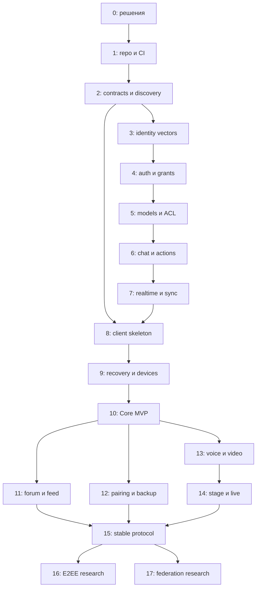

# План реализации Space Protocol

**Редакция 0.3 от 7 октября 2026 года. Статус: архитектурный план и первый локальный прототип.**

[README.md](README.md) объясняет систему и проектные контракты. Этот документ задаёт порядок работы, зависимости, результаты и критерии проверки. Флажки больших этапов пока пустые: локальный прототип не удовлетворяет их полным критериям.

### Первый технический прототип — выполнено

- [x] Экспериментальные `.proto`: GetManifest, CreateContent и ListContent с HTTP annotations.
- [x] Генерация Go bindings, grpc-gateway и OpenAPI с закреплёнными версиями.
- [x] Go-сервер: discovery, manifest, один chat channel, общий сервис gRPC и HTTP/JSON.
- [x] Ограниченное хранилище в памяти, идемпотентность, конфликт повторного ключа и пагинация.
- [x] Интеграционные проверки двух входов, параллельных повторов и ошибок; инструкция запуска.

### Постоянное хранение — выполнено

- [x] PostgreSQL: сообщения и ключи идемпотентности, транзакционный порядок записей.
- [x] Первая миграция с advisory lock, checksum и отказом при неизвестной новой схеме.
- [x] Устойчивые server ID и Ed25519-ключ; discovery отдаёт только публичный ключ.
- [x] Явный режим `-demo`; при отказе базы нет незаметной потери данных через fallback.
- [x] Тесты конкурентной инициализации/записи, перезапуска хранилища и сохранения identity.
- [x] Compose для локальной PostgreSQL и проверка PostgreSQL в CI.

### Durable events и локальная авторизация — выполнено

- [x] Миграция 2: principals, grants, challenges, token hashes и event log; upgrade/backfill с версии 1.
- [x] Сообщение и событие записываются одной транзакцией, idempotency key учитывает principal.
- [x] ListEvents с cursor, пагинацией и replay после reconnect.
- [x] Root-authorized регистрация и отзыв устройства, одноразовый device login, access token.
- [x] Один interceptor для HTTP/gRPC, actor из сессии; отказ от клиентских metadata для доверенных ролей.
- [x] Тестовый CLI register → login → message → retry → events → revoke и проверки в CI.

### Приглашения и права пространства — первый срез

- [x] Миграция 4: memberships, приглашения с хешами и идемпотентное принятие.
- [x] Owner/admin/member/reader; блокировка; отдельный device scope space.manage для управления.
- [x] Приглашения reader/member: срок до 7 дней, число вступлений, отзыв, лимит активных ссылок.
- [x] Атомарное вступление при закрытой регистрации с подтверждением root/device keys.
- [x] Серверные read/write проверки и завершение live Subscribe при блокировке.
- [x] Панель списков, изменение ролей владельцем, revision conflict, выдача и отзыв ссылок.
- [x] Flutter: предварительная проверка кода, подключение по приглашению, интерфейс читателя.
- [ ] ACL отдельных каналов, moderator, pending approvals, leave, QR приглашения.

### Зашифрованные карточки и устройства — первый срез

- [x] Миграция 5: root-authorized recovery grant, дочерние devices и цепочка проверки.
- [x] Один зашифрованный формат WebCrypto/Dart, AES-256-GCM и ограниченный PBKDF2 профиль.
- [x] Экспорт root-card Flutter и delegated-card панели; импорт в обоих клиентах.
- [x] Прежний principal, owner и membership; новый случайный рабочий device key.
- [x] Рабочее устройство из delegated-card не сохраняет управляющий секрет.
- [x] Собственный список devices, self revoke, подписанный отзыв других устройств и каскад recovery revoke.
- [x] Неверный пароль, AEAD, KDF bounds, scope escalation, block, stale challenge и interoperability проверки.
- [x] QR/PNG: локальная генерация и импорт изображения, ограничения размера и двусторонняя совместимость Flutter/WebCrypto.
- [ ] Сканирование камерой; master seed/HKDF; root rotation; нативная проверка Windows secure storage.

### Сопряжение устройств — первый срез

- [x] Миграция 6: независимые code/poll hashes, неизменяемый target и пять минут.
- [x] Root proposal, независимая сверка кода до подписи и root-подписанный pairing_id.
- [x] Target проверяет root signature и сохраняет только рабочий ключ после claim.
- [x] Атомарный approval, target-only claim, cancel/expiry и fail-closed cleanup.
- [x] Flutter и /space: создание запроса и подтверждение исходным root/RootCard.
- [x] PostgreSQL race tests и двусторонняя совместимость WebCrypto/Dart/Go.
- [x] Delegated recovery proof chain: root → recovery key → device, ограничение scopes и каскадный отзыв.
- [ ] QR pairing, push, нативная проверка Windows secure storage.

### Flutter-клиент для Windows — первый срез

- [x] Dart-контракты и нативный gRPC endpoint в discovery.
- [x] Экран доверия, независимые ключи, системное хранилище и вход.
- [x] Чат, polling events, дедупликация, повтор отправки и отзыв устройства.
- [x] Анализ, тесты интерфейса/подписей и Windows release build.
- [x] Dart/Go interoperability проверка в CI.

Следующий срез: stable principal и ротация root, нативная проверка Windows secure storage, затем ACL отдельных разделов. Восстановление прежнего principal/owner через зашифрованный файл и новые device keys уже реализовано. Роли пространства и приглашения уже реализованы для general chat. Subscribe с replay реализован. ADR-013/014 остаются открытыми. Подписанный manifest, production key backend, backup/restore drill, refresh, outbox и полный Docker deployment ещё не выполнены.

> Roadmap не является календарным обещанием. Оценки времени появятся после технических прототипов и определения состава команды. Один этап может состоять из нескольких PR; каждый PR должен оставлять систему собираемой и проверяемой. Не начинаем федерацию или сложное медиа до проверки основного вертикального среза.

## Содержание

### Поток событий — локальный срез

- [x] Server-streaming Subscribe с durable cursor/replay и heartbeat.
- [x] Stream auth, session/grant expiry и остановка при revoke.
- [x] Ограничение подписок и времени отправки; gateway frame deadlines.
- [x] Flutter stream вместо клиентского polling, reconnect/backoff и cancellation guard.
- [x] Проверки Go/HTTP/Dart, replay/live/revoke и сохранения курсора.

Серверный log пока проверяется раз в 500 ms. Event-driven wakeup, jitter, snapshot watermark, browser/proxy profile, retention и ACL остаются отдельными этапами. См. ADR-018.

### UI/UX-прототип и оформление — выполнено отдельно от backend

- [x] Адаптивный HTML/JS-прототип: обзор, чат, форум, лента, voice/video/stage/live, identity/settings и панель владельца.
- [x] Gruvbox Dark по умолчанию, светлый вариант, альтернативные личные палитры.
- [x] Предложение цветов сервером: preview, per-server consent, отмена и отказ переносить согласие на новую версию.
- [x] Проверка контраста, области оформления и согласия; документация переноса в Flutter.
- [x] Базовая палитра Gruvbox перенесена в существующий Flutter-клиент; Windows build и текущие проверки.

### Адаптивная Flutter-оболочка — выполнено

- [x] Desktop rail/sidebar/context и compact bottom navigation/Drawer.
- [x] Обзор, подключение в отдельном dialog/sheet, live chat и экран идентичности с реальным отзывом.
- [x] Поиск разделов/загруженных сообщений, Gruvbox Light/Dark и личные акценты.
- [x] Несекретные настройки и недавние адреса сохраняются отдельно от vault.
- [x] Черновики сохраняются при навигации и разделены по origin в памяти процесса.
- [x] Widget checks широкого/узкого окна, текста 200%, смены темы, черновиков и поиска.

Theme manifest extension, пользовательский color editor и consent store в Flutter ещё предстоят. HTML-форум, медиа и административные действия демонстрационные и не отмечают серверные этапы готовыми. Flutter отображает эти типы как пока недоступные, а не копирует mock content.

- [Как работать с планом](#как-работать-с-планом)
- [Карта зависимостей](#карта-зависимостей)
- [Контрольные версии](#контрольные-версии)
- [Этап 0. Решения и границы](#этап-0-решения-и-границы)
- [Этап 1. Репозиторий и инфраструктура разработки](#этап-1-репозиторий-и-инфраструктура-разработки)
- [Этап 2. Protocol contracts и discovery](#этап-2-protocol-contracts-и-discovery)
- [Этап 3. Identity и криптографические вектора](#этап-3-identity-и-криптографические-вектора)
- [Этап 4. Auth, device grants и отзыв](#этап-4-auth-device-grants-и-отзыв)
- [Этап 5. Серверные модели и права](#этап-5-серверные-модели-и-права)
- [Этап 6. Чат, actions и файлы](#этап-6-чат-actions-и-файлы)
- [Этап 7. Durable realtime и sync](#этап-7-durable-realtime-и-sync)
- [Этап 8. Универсальный клиент: первый срез](#этап-8-универсальный-клиент-первый-срез)
- [Этап 9. Recovery card и управление устройствами](#этап-9-recovery-card-и-управление-устройствами)
- [Этап 10. Core MVP и эксплуатация](#этап-10-core-mvp-и-эксплуатация)
- [Этап 11. Forum, feed и personas](#этап-11-forum-feed-и-personas)
- [Этап 12. Pairing и encrypted backup](#этап-12-pairing-и-encrypted-backup)
- [Этап 13. Voice и video](#этап-13-voice-и-video)
- [Этап 14. Stage и live stream](#этап-14-stage-и-live-stream)
- [Этап 15. Укрепление и стабильный протокол](#этап-15-укрепление-и-стабильный-протокол)
- [Этап 16. E2EE: отдельная программа](#этап-16-e2ee-отдельная-программа)
- [Этап 17. Федерация: отдельная программа](#этап-17-федерация-отдельная-программа)
- [Матрица испытаний](#матрица-испытаний)
- [Риски и нерешённые вопросы](#риски-и-нерешённые-вопросы)
- [Первые задачи для начала работы](#первые-задачи-для-начала-работы)

## Как работать с планом

### Приоритеты

| Метка | Значение |
|---|---|
| P0 | Без этого нельзя безопасно выполнить следующий сценарий |
| P1 | Нужно для выбранного milestone |
| P2 | Улучшение после рабочего milestone |
| Research | Решение не определено; сначала прототип и ADR |

В задачах этапов приоритет по умолчанию P1, если не указан иной. Crypto format, trust model, ACL и revocation — P0. Сроки, memory limits и token TTL из README стартовые: их корректируем по измерениям и фиксируем как явно версионированную policy.

### Формат рабочей задачи

```text
Название: короткое наблюдаемое изменение
Цель: какой пользовательский сценарий появится
Зависимости: этапы / ADR / схемы
Входит: конкретные изменения
Не входит: только существенные границы задачи
Результаты: code / schema / fixture / docs / migration
Проверка: позитивный, негативный и сбойный сценарии
Готово: измеримое условие, ссылка на PR и результаты checks
```

Не переносим весь roadmap в один огромный PR. Сначала контракт и fixture, затем небольшая серверная реализация, SDK и экран, затем интеграционная проверка. Если контракт меняется, обновляем schema, docs, fixtures и обе стороны в одном согласованном наборе изменений.

### Общие правила разработки

- [ ] Каждому security-sensitive решению назначить ADR и ответственного за review.
- [ ] Для каждого этапа оставить reproducible demo и инструкцию проверки.
- [ ] Не смешивать placeholder и production credential.
- [ ] Не использовать настоящие recovery seeds в fixtures, screenshots или issue logs.
- [ ] Строить простые модули с явными границами, без преждевременной общей plugin framework.
- [ ] Проверять поведение, а не только то, что mock вызвал тот же метод.
- [ ] Не принимать milestone по одним unit tests: нужен целевой пользовательский сценарий.
- [ ] Обновлять roadmap по фактической архитектуре; не сохранять устаревший план ради исходной нумерации.

## Карта зависимостей



Клиентский UI skeleton можно проектировать раньше полного backend, используя fixtures и явные mock states. Приёмка реального клиента зависит от этапов 4–7. Research media и secure storage допустимо начинать раньше как ограниченный эксперимент, но он не считается production feature.

## Контрольные версии

| Версия продукта | Входящие этапы | Наблюдаемый результат |
|---|---|---|
| M0: foundation | 0–3 | Проверенные контракты и одинаковая derivation в двух языках |
| M1: технический alpha | 4–8 | Два клиента общаются на одном локальном сервере |
| M2: Core MVP | 9–10 | Recovery, revoke, runnable Docker и проверенный restore |
| M3: социальные представления | 11–12 | Forum/feed, pairing, backup и personas |
| M4: media beta | 13–14 | Голос, видео, stage и эфир с проверенной авторизацией |
| M5: stable 1.0 | 15 | Conformance, review, совместимость и документация |
| После 1.0 | 16–17 | Выбранные E2EE/federation profiles |

Версия продукта не равна версии протокола: приложение 0.x может реализовать draft protocol 1.0. Пока контракты не закреплены, release notes должны прямо предупреждать об экспериментальной совместимости и способах миграции.

## Этап 0. Решения и границы

**Цель:** согласовать минимальную систему до начала кода. **Зависимости:** нет. **Приоритет:** P0.

### Задачи

- [ ] Утвердить рабочее имя, namespace `space`, definition channel/view/content/session/action.
- [ ] Зафиксировать отсутствие обязательного центрального сервиса.
- [ ] Зафиксировать одно HTTPS origin на instance для версии 1.
- [ ] Определить обязательные платформы первого клиента; предложенный старт — Windows и Android, затем расширение по результатам SDK spike.
- [ ] Выбрать server/client stack после маленьких compatibility experiments.
- [ ] Выбрать лицензии спецификации, SDK, сервера и клиента; оформить ADR-001.
- [ ] Зафиксировать, что plaintext server content в MVP доступен администратору.
- [ ] Описать first release scope: chat, identity, recovery, devices, ACL, uploads, sync, Docker.
- [ ] Развести server-local identity и persona; не отправлять общий master ID всем серверам.
- [ ] Описать ownership, registration modes и bootstrap администратора.
- [ ] Создать начальную threat model с assets, adversaries и trust boundaries.
- [ ] Определить поддерживаемый small-server load profile для будущих performance tests.

### P0: Prior art и выбор основы — ADR-013

- [ ] Прочитать [Prior art в README](README.md#prior-art-и-отличия-почему-не-matrix-xmpp-или-nostr); отделить обязательные требования от предпочтений UI/JSON/языка.
- [ ] Сделать ограниченные прототипы Matrix, XMPP и Nostr на одинаковых сценариях и записать версии компонентов.
- [ ] Matrix: custom events для views, account/device/recovery, auth extension и deployment без обязательной federation.
- [ ] XMPP: MUC/pubsub/discovery profile, auth options и поддерживаемый набор XEP.
- [ ] Nostr: NIP-01/42/29/53, private membership, moderation, revisions и scoped identities.
- [ ] Сравнить готовые clients/SDK, свой код, эксплуатацию и долгосрочную поддержку.
- [ ] Для MLS записать отдельно: стандарт, proposal, implementation и проверенная interoperability; не приравнивать исследования к готовой универсальной поддержке.
- [ ] Рассмотреть четыре варианта: существующий профиль, adapters клиента, hybrid и новый Space.
- [ ] В отчёте различать unsupported, требует extension и не проверено.
- [ ] Принять ADR-013 до production identity formats этапа 3; при выборе существующей основы переписать contracts и roadmap.

**Gate:** выбирать собственный Space только при показанном существенном несовместимом требовании либо доказанном преимуществе совокупной стоимости с учётом собственной security/interoperability ответственности. Без доказательств предпочесть существующую основу. Новые экраны сами по себе не требуют нового wire protocol.

### Результаты

`docs/adr/001-project-scope.md`, `docs/threat-model.md`, release scope, решение о лицензиях. Прототипы secure storage/crypto/media должны иметь отдельный краткий отчёт: что работает на выбранных платформах, что не проверено.

### Приёмка

Команда может однозначно ответить: кто хранит secret, кто видит сообщения, как устроен первый вход, что восстановит QR и кто управляет правами. Любое обещание E2EE, анонимности или неограниченной federation удалено из MVP marketing.

## Этап 1. Репозиторий и инфраструктура разработки

**Цель:** каждый участник воспроизводимо собирает проект. **Зависимости:** этап 0.

### Задачи

- [ ] Создать monorepo со структурой из README.
- [ ] Добавить выбранные LICENSE, CONTRIBUTING, SECURITY и policy protocol changes.
- [ ] Настроить formatter/linter, lockfiles, минимальные CI jobs.
- [ ] Закрепить toolchain versions; documented update process.
- [ ] Поднять local PostgreSQL без публикации DB в интернет.
- [ ] Создать server entry point, configuration loader, graceful shutdown.
- [ ] Добавить structured logs с redaction и request IDs.
- [ ] Разделить `/health/live` и `/health/ready`.
- [ ] Создать migration runner; протестировать empty DB → current schema.
- [ ] Создать fixture server или fixture runner для клиентской разработки.
- [ ] Добавить secret scanning и dependency/license checks.
- [ ] Установить правило: production secrets не коммитятся; example config содержит только dummy values.

### Приёмка

Чистое окружение по инструкции запускает app и DB; readiness не становится зелёным без DB. Завершение процесса не оставляет повреждённое состояние. CI собирает server и выбранные client targets. Отсутствие media containers не ломает текстовый сервер.

## Этап 2. Protocol contracts и discovery

### API transport — ADR-015

- [ ] Следовать [ADR-015](docs/adr/015-api-transport.md): `.proto` как источник application/space contracts, gRPC для native, grpc-gateway HTTP/JSON для web.
- [ ] Добавить proto packages, google.api.http mappings и reproducible code generation.
- [ ] Генерировать SDK/server bindings и OpenAPI; проверять breaking changes и reserve removed field numbers.
- [ ] Зафиксировать ProtoJSON правила и отличия от иллюстративных моделей README.
- [ ] Верифицировать signed JCS envelopes после обоих transport round trips.
- [ ] Реализовать prototype CreateContent, admin method и Subscribe с Flutter/browser через Docker HTTPS proxy.
- [ ] Проверить shared auth/ACL, metadata mapping, statuses/error details, deadlines/cancellation и idempotency.
- [ ] Проверить gateway stream framing, terminal errors, flush, proxy buffering, reconnect/replay и revocation.
- [ ] Выбрать browser streaming profile; WS-задачи этапа 7 применять только при подтверждённом fallback, а не создавать второй транспорт автоматически.
- [ ] Убедиться, что direct in-process gateway registration не обходит auth interceptors.

**Цель:** клиент безопасно распознаёт сервер и его возможности. **Зависимости:** 1, ADR-002.

### Контракты

- [ ] JSON Schema для well-known, manifest, common IDs, errors и timestamps.
- [ ] OpenAPI skeleton с auth, channels, actions и sync.
- [ ] Capability registry с major/minor semantics.
- [ ] Правила unknown fields, required capabilities, extension namespaces.
- [ ] Ограничения размеров, depth, enum и batch list.
- [ ] Fixtures valid/invalid; отдельные non-production placeholders.
- [ ] Описать trust pinning и migration statement schema.
- [ ] Определить различие публичного и авторизованного manifest cache.

### Сервер и SDK

- [ ] Persistent `server_id` и signing key; restart не создаёт новую identity сервера.
- [ ] Well-known endpoint и публичный manifest.
- [ ] Manifest renderer из текущей конфигурации, без ручного рассогласования enabled capabilities.
- [ ] `ETag`, conditional GET и версия manifest.
- [ ] Discovery SDK: URL parser, HTTPS checks, timeouts, redirect limits.
- [ ] Запрет переноса credentials на другой origin.
- [ ] Trust store с server_id, key fingerprint и canonical origin.
- [ ] UI error data для unsupported version, invalid schema и trust conflict.

### Приёмка

Fixtures с несовместимой required capability отклоняются. Неизвестный необязательный view безопасно виден как неподдерживаемый. Смена server key вызывает trust conflict. `http://` не принимается в production mode. Приватный channel не появляется в guest manifest. Redirect на другой origin не получает токены и не подтверждает миграцию сам по себе.

## Этап 3. Identity и криптографические вектора

**Цель:** две реализации получают одинаковые ключи и ID, не используя самодельную криптографию. **Зависимости:** 2, ADR-003 и ADR-006. **Приоритет:** P0.

Дополнительные gates: ADR-013 выбирает протокольную основу до production identity format; ADR-014 выбирает credential profiles до фиксации grants. Контракты Space ниже условны до этих решений.

### Задачи

- [ ] Выбрать проверенные Ed25519/HKDF/JCS libraries для Go и Dart.
- [ ] Реализовать `identity-kdf-v1` с точными byte encodings и domain separation.
- [ ] Проверить стандартные RFC vectors библиотек либо обеспечить их покрытие независимой проверкой.
- [ ] Опубликовать project vectors: seed → master public → server roots → principal IDs.
- [ ] Добавить vectors для разных server_id и `identity_slot`.
- [ ] Reject неправильную длину seed/public key/signature, duplicate JSON keys и malformed base64url.
- [ ] Создать vault interface, платформенные storage adapters и fake adapter только для tests.
- [ ] Проверить CSPRNG на целевых системах; отсутствие secure randomness вызывает отказ создания identity.
- [ ] Определить vault lock/unlock, export access и minimum secret lifetime.
- [ ] Документировать аппаратную и программную защиту на каждой платформе.
- [ ] Исключить secrets из debug `toString`, exceptions, logs и telemetry.

### Приёмка

Go и Dart на одних fixtures выдают byte-identical public keys, IDs и canonical payload. Изменение server_id меняет server root; изменение hostname при том же доверенном server_id — нет. Рабочие ключи создаются независимо и не выводятся из S. На locked vault нельзя получить root operation. Review фиксирует, что profile composition — собственный protocol design и не подменяется ссылкой на RFC.

### P0: Passkeys/WebAuthn и hardware profile — ADR-014

- [ ] Разделить recovery root, login credential, physical device и API session.
- [ ] Сравнить software Ed25519, hardware-backed native signing, device-bound WebAuthn и synced passkeys.
- [ ] Проверить native APIs на целевых ОС и поддержку произвольных self-hosted RP; наличие Flutter plugin недостаточно.
- [ ] Проверить browser-assisted flow: state, одноразовый код, защита callback от перехвата и отсутствие token в deep link.
- [ ] Исследовать RP/origin binding и domain migration при неизменном server_id.
- [ ] Выбрать verifier, допустимые COSE algorithms, UV policy и attestation/privacy policy.
- [ ] Спроектировать typed credential binding и root-authorized registration; assertion не является Ed25519-подписью JCS.
- [ ] Проверить challenge, authenticator data/clientDataJSON и signCount policy, включая допустимый zero counter.
- [ ] Проверить synced credential на двух аппаратах: credential revoke отключает все копии, не один device.
- [ ] Восстановить root по QR на чистом устройстве и зарегистрировать новый credential без старого authenticator.
- [ ] Проверить потерю provider account; обязательного единственного облачного provider быть не должно.
- [ ] Зафиксировать software root recovery как alternate authorization path: hardware-only гарантии не распространяются на всю систему автоматически.
- [ ] Решить, включать ли optional WebAuthn profile в MVP; иначе записать blockers и software protection baseline.

**Результат:** platform matrix, prototype registration/login/revoke/recovery, threat analysis и ADR-014 до фиксации credential contract. Выбор протокольной основы ADR-013 должен предшествовать production identity format; при выборе существующего протокола этот этап адаптируется к его модели.

## Этап 4. Auth, device grants и отзыв

**Цель:** вход без централизованного логина и управляемые устройства. **Зависимости:** 3, ADR-004. **Приоритет:** P0.

### Backend

- [ ] Если выбран WebAuthn profile: отдельные creation/assertion options, pending credential, root binding, COSE record и полноценная ceremony verification.
- [ ] Credential type согласуется capability; assertion не передаётся в Ed25519 signature field.
- [ ] Для synced credentials определить отзыв всех копий и отдельные границы session/device revoke.

- [ ] Таблицы principals, grants, auth epochs, challenges, sessions и revoked grants.
- [ ] Grant verification: root hash, signature, server_id, epoch, expiry, scopes.
- [ ] Registration modes open/invite/approval; separate grant proof и admission policy.
- [ ] Challenge transcript и prefix; TTL и atomic consumption.
- [ ] Challenge rate limit, bounded storage и cleanup.
- [ ] Login endpoint и hashed opaque tokens.
- [ ] Refresh family rotation, reuse detection и logout.
- [ ] Root challenge/action flow с action payload hash и current state version.
- [ ] Отзыв отдельного grant; сброс всех устройств повышением epoch.
- [ ] Device list и приватность labels.
- [ ] Middleware проверяет текущий revoke status на каждом запросе.
- [ ] Event/notification hooks для закрытия WS и media при revoke.
- [ ] Зафиксировать максимальную задержку cache invalidation.

### SDK

- [ ] Проверять transcript локально до подписи.
- [ ] Не подписывать arbitrary bytes server request.
- [ ] Привязывать token storage к identity и origin.
- [ ] Single-flight refresh; не запускать параллельную ротацию из нескольких HTTP requests.
- [ ] Определить retry после потерянного refresh response: либо безопасный bounded recovery, либо повторный login.
- [ ] Различать expired token, revoked device, closed registration и permission denial.

### Приёмка

Один challenge, отправленный параллельно дважды, создаёт не более одной успешной auth session. Подпись для A не работает на B; login signature не работает как root-action proof. Просроченный, отозванный и старый epoch grant отклоняются. После revoke старый refresh не выдаёт доступ, активный WS закрыт. В логах и DB dump нет исходных bearer tokens или private keys.

## Этап 5. Серверные модели и права

**Цель:** понятная модель сообществ и защита каждого объекта. **Зависимости:** 4.

### Задачи

- [ ] Channels, collections, views, session templates и их FK constraints.
- [ ] Membership states: invited/pending/active/left/banned.
- [ ] Roles и ACL evaluator с default deny.
- [ ] Profile/persona model и server-local handle validation.
- [ ] Batch profile lookup с visibility limits.
- [ ] Получение effective permissions для UI.
- [ ] Bootstrap admin CLI с одноразовым hashed invitation.
- [ ] Owner transfer и защита последнего owner.
- [ ] Audit log для membership, roles и moderation changes.
- [ ] Фильтрация list/get/manifest по одному policy layer.
- [ ] Cache invalidation ACL и versioning.

### Приёмка

Один member не читает приватный channel другого по угадываемому ID. Guest не узнаёт его title из manifest, events или profile lookup. Channel owner не получает server admin права. Имя `admin` не делает пользователя администратором. Смена display name не меняет identity и не требует правки всей истории. Invite race не допускает второго использования одноразового credential.

## Этап 6. Чат, actions и файлы

**Цель:** первый сохраняемый пользовательский контент. **Зависимости:** 5.

### Чат и команды

- [ ] Common content schema и plain text message type.
- [ ] `content.create/update/delete`, replies, revisions и tombstones.
- [ ] Server-assigned author_id, created_at и revision.
- [ ] Idempotency table с principal scope, request hash и retention.
- [ ] Action и event commit в одной транзакции.
- [ ] Stable cursor pagination по collection.
- [ ] Optimistic concurrency для edits.
- [ ] Edit window, delete policy и moderation hide.
- [ ] User-facing request IDs и structured errors.
- [ ] Message byte limits, quotas и rate limits.

### Assets

- [ ] Upload init/stream/complete lifecycle.
- [ ] Ограничение размера до и во время загрузки.
- [ ] Hash/size verification, scan status и MIME sniffing.
- [ ] Asset ownership и разрешение attachment references.
- [ ] ACL-aware downloads с short-lived credentials при необходимости.
- [ ] Cleanup incomplete uploads и unreferenced assets.
- [ ] Отдельный ограниченный preview worker; external previews пока выключены.
- [ ] Tests path traversal, decompression limits и private file leakage.

### Приёмка

Повтор action после потерянного HTTP response не дублирует сообщение. Тот же action ID с другим текстом даёт conflict. Edit устаревшей revision не стирает чужую правку. Клиент не может подменить author_id. Deleted content не возвращается обычным list endpoint. Asset другого private channel не скачивается по известному URL без доступа.

## Этап 7. Durable realtime и sync

**Цель:** reconnect и сбои без потерянных сообщений. **Зависимости:** 6, ADR-005. **Приоритет:** P0 для приёмки M1.

### Задачи

- [ ] Зафиксировать ordered cursor strategy и concurrency proof через tests.
- [ ] Transactional outbox и retry worker.
- [ ] Event schema, durable log и retention cleanup.
- [ ] WS auth: headers native; одноразовый ticket для web-compatible profile.
- [ ] Subscription ACL, bounded queues, heartbeat и disconnect cleanup.
- [ ] Replay после cursor с повторной проверкой доступа.
- [ ] Snapshot session/watermark и согласованная pagination.
- [ ] `cursor_expired`, `resync_required` и recovery path.
- [ ] Ephemeral typing/presence с TTL и отдельным rate limit.
- [ ] SDK reconnect/backoff/jitter.
- [ ] Local apply event + cursor одной транзакцией.
- [ ] Dedup event IDs, monotonic object revisions и delete tombstones.
- [ ] Reconciliation optimistic message по action ID.
- [ ] Metrics outbox lag, buffer overflow и replay duration.

### Приёмка

Принудительно остановить process после DB commit до WS publish: после restart событие доставляется. Медленная клиентская сеть не увеличивает server memory без ограничения. События во время paginated snapshot не теряются. Поздний commit с ранее выделенным ID не пропускается. После 8 дней offline при retention 7 дней client выполняет snapshot, а не остаётся навсегда рассинхронизированным. Revoke access прекращает replay и новую доставку.

## Этап 8. Универсальный клиент: первый срез

**Цель:** реальное приложение вместо API demo. **Зависимости:** 2 для skeleton; 4–7 для M1.

### Задачи

- [ ] Native app scaffold и Protocol SDK boundary.
- [ ] Identity creation, vault unlock и локальный identity switch.
- [ ] Add server by URL с trust confirmation.
- [ ] Servers/channels/views navigation и responsive layout.
- [ ] Native view registry; unsupported view placeholder.
- [ ] Server-local profile create/update и avatars.
- [ ] Chat timeline, paging, replies, draft и pending messages.
- [ ] Reconnect/offline/auth/permission error states.
- [ ] Upload progress и cancel, доступные media previews.
- [ ] Permissions-aware controls и server denial handling.
- [ ] Local cache partition по identity и server trust context.
- [ ] Logout с выбором удаления cache.
- [ ] Keyboard navigation, screen reader и большие шрифты.
- [ ] Integration harness: два клиента, один сервер.

### Приёмка M1

Новый пользователь создаёт identity, добавляет URL, входит и отправляет сообщение. Второй client видит его realtime. Потеря сети и restart приложения не создают дублей. После identity switch приватная история предыдущего пользователя не появляется. Сервер с неизвестным view не ломает остальные экраны. Нет автоматически открытого microphone/camera.

## Этап 9. Recovery card и управление устройствами

**Цель:** identity переживает потерю устройства. **Зависимости:** 3–4, 8, ADR-008. **Приоритет:** P0 для Core MVP.

### Формат и криптография

- [ ] Зафиксировать plain/encrypted QR envelope и protocol prefix.
- [ ] Зафиксировать checksum, base64url, JCS и secret lengths.
- [ ] Зафиксировать passphrase Unicode normalization без неявного trim.
- [ ] Выбрать Argon2id bounds; измерить профиль на слабейшей поддерживаемой платформе.
- [ ] Реализовать AEAD envelope с metadata в associated data.
- [ ] Cross-language encrypted recovery vectors, включая Unicode.
- [ ] Limits payload size, JSON depth и KDF parameters до выделения памяти.
- [ ] Не поддерживать future format через «попробуем как v1».

### Интерфейс

- [ ] Экран create card с явным выбором режима.
- [ ] PNG generation локальной QR-библиотекой, quiet zone и human-readable metadata.
- [ ] Без seed в filename, logs, thumbnails приложения и analytics.
- [ ] Save dialog и понятные предупреждения о cloud-synced locations.
- [ ] Import через camera и image file; оба пути используют один parser.
- [ ] Test restore mode без замены текущего vault.
- [ ] Список devices и отзыв с локальным подтверждением root access.
- [ ] Восстановление создаёт новый device key и grant.
- [ ] Экран выбора: восстановить directory backup либо добавить servers вручную.
- [ ] Предложение отозвать потерянные устройства на известных серверах.
- [ ] Видимый статус отзыва каждого server, включая offline failures.

### Приёмка

На чистой установке с удалённым cache сканировать сохранённую PNG и войти на прежний сервер с тем же principal. Старые device private keys не требуются. Encrypted card с неправильной passphrase не изменяет vault. Тестировать печать, масштабирование и несколько cameras. Повреждённая или oversized карта не вызывает crash/OOM. Текст интерфейса не обещает восстановление всех сообщений только из QR.

Plain card должна быть проверена также как threat scenario: её копия действительно даёт те же root права. Это свойство режима надо показать пользователю, а не объявлять ошибкой реализации.

## Этап 10. Core MVP и эксплуатация

**Цель:** другой человек может самостоятельно установить и безопасно использовать первый сервер. **Зависимости:** 1–9.

### P0: Встроенная веб-панель администрирования

Первый срез встроен по /space: названия, включение чата, open/closed регистрация, revision, audit, logout. [Инструкция](admin-web/README.md). Полная панель и готовый app container ещё предстоят.


- [ ] Поставлять admin frontend вместе с app container; маршрут `/space`, без обязательного внешнего сервиса.
- [x] Первый setup wizard: локальный одноразовый код (15 минут), browser owner enrollment и атомарное закрытие bootstrap.
- [x] Первый AdminService: отдельное root-signed разрешение space.manage и проверка owner на каждом запросе.
- [ ] Dashboard: health, storage, подключения, ошибки и статус optional media services.
- [ ] CRUD channels, collections и views с типами контента, порядком, видимостью и join policy.
- [ ] Настройки публикации, replies, reactions, uploads, quotas и retention.
- [ ] Membership, invitations, approval, roles и moderation UI.
- [ ] Capability states: не установлено / не настроено / выключено / недоступно; запрет включения без prerequisites.
- [ ] Draft → validate → impact preview → apply с expected revision и audit.
- [ ] Единый источник manifest/runtime config; уведомления клиентам при смене доступности и ACL.
- [ ] Отключение view не удаляет content; изменение collection type требует миграции или новой collection.
- [ ] Пометки read-only environment overrides и настроек, требующих restart.
- [ ] Secrets write-only, masked UI, без исходных значений в export и logs.
- [ ] Admin auth, CSRF/Origin при cookies, CSP, защита renderer и подтверждение чувствительных действий.
- [ ] Никакого Docker socket, arbitrary shell или backend-получения recovery seed.
- [ ] Responsive UX, keyboard navigation, validation messages, pending/error states.
- [ ] Настройки backup jobs и отчёты; disaster restore через recovery tooling отдельно.
- [ ] Расширять панель forum/feed/media controls одновременно с этапами 11/13/14.

**Приёмка панели:** владелец проходит setup, создаёт публичный чат и приватный канал, ограничивает публикацию/файлы, выдаёт роль и приглашение через браузер без ручной правки конфигурации. Участник видит актуальные views/permissions. Не-администратор получает отказ через прямой API; два конкурентных сохранения не затирают настройки. Выключение view сохраняет историю, unsupported capability не включается, невалидный draft не ломает рабочий сервер.

### Deployment

- [ ] Runnable Compose с app, DB, proxy и persistent storage.
- [ ] Реальные published images, pinned versions/digests, supported architectures.
- [ ] HTTPS guide, local-only development mode и firewall instructions.
- [ ] DB readiness/retry; migration command и bootstrap procedure.
- [ ] Container least privilege, non-root где возможно, resource limits.
- [ ] Config reference и `.env.example` без реальных credentials.
- [ ] Volume layout, ownership permissions и storage quotas.
- [ ] Upgrade/migration/rollback instructions.
- [ ] Home hosting guide: CGNAT/VPN/tunnel tradeoffs без обещания универсального доступа.

### Operations и security

- [ ] Consistent DB/assets/key backup procedure.
- [ ] Restore drill на чистой машине с сохранением server_id и trust key.
- [ ] Policy для актуального revocation state после restore.
- [ ] Invalidate tokens после disaster restore.
- [ ] Monitoring/alerts: disk full, DB failure, outbox lag, backup age.
- [ ] Retention docs для content, events, action results, audit и backups.
- [ ] Security review auth, ACL, recovery и uploads.
- [ ] Release notes, known limitations и support boundaries.
- [ ] Contribution instructions и reproducible sample community.

### Приёмка M2

Сторонний проверяющий по инструкции поднимает сервер без помощи автора. Два клиента работают с ним. Recovery на чистом устройстве подтверждён. Потерянное устройство отзывается. Backup восстанавливает DB, assets и server identity. Старый backup не возвращает доступ отозванному устройству через незаметный rollback. Обновление одного release на следующий проходит migration smoke test. Critical findings закрыты либо feature выключена до исправления.

## Этап 11. Forum, feed и personas

**Цель:** единый протокол обслуживает разные социальные сценарии. **Зависимости:** 10.

### Задачи

- [ ] Forum thread/reply schemas и `core.forum.v1` capability.
- [ ] Titles, closed/pinned states, pagination replies и unread state.
- [ ] Feed post/comment schemas, chronological ordering и publish policy.
- [ ] Safe Markdown subset, только после renderer security review; plain text остаётся baseline.
- [ ] Native forum/feed views через существующий SDK и auth.
- [ ] Shared reactions/bookmarks без смешивания collection semantics.
- [ ] Server persona и channel overrides display name/avatar.
- [ ] Current profile display и optional audit snapshot.
- [ ] Deleted author fallback и duplicate display-name disambiguation.
- [ ] Moderator queue и hide/restore/ban audit.
- [ ] User export content в документированном формате.
- [ ] Server-local search с соблюдением ACL; encrypted search пока не заявляется.

### Приёмка

Один channel содержит chat/forum/feed с раздельными collections и правами. Смена persona влияет на отображение, но не даёт обход ban. Forum close блокирует новые replies и через API. Search не возвращает приватные объекты постороннему. Неизвестный content subtype отображается безопасно и не теряется при cache sync.

## Этап 12. Pairing и encrypted backup

**Цель:** удобное добавление устройств и восстановление списка серверов/настроек. **Зависимости:** 9–10, ADR-007 и ADR-011.

### Pairing

- [ ] Выбрать audited handshake implementation и фиксированный profile.
- [ ] Pairing request с ephemeral key, ID, expiry и one-time state.
- [ ] Короткий код проверки на двух экранах и обязательное подтверждение доверия.
- [ ] Encrypted relay либо local transport; relay не видит vault.
- [ ] Full-management и limited-device modes.
- [ ] Новое устройство генерирует свои device keys; tokens не копируются.
- [ ] Limited mode получает только выбранные server grants.
- [ ] Ограниченное устройство не предлагает самостоятельное управление roots.
- [ ] Timeout, cancel, replay protection и очистка temporary secrets.

### Backup

- [ ] Versioned server directory с trust pins, subscriptions и settings.
- [ ] Random data keys, AEAD chunks и authenticated manifest.
- [ ] Wrapping ключа backup отдельно от signing keys.
- [ ] Export/import файл; затем optional remote storage adapter.
- [ ] Locator storage: что нужно записать дополнительно к recovery card.
- [ ] Conflict policy для multi-device settings; explicit revision.
- [ ] Rollback detection при наличии last-known version; честное ограничение после полной потери state.
- [ ] Restore dry run, размер и доступность backup до удаления старых копий.
- [ ] Backup retention и garbage collection.

### Приёмка M3

Limited device может писать по выданному grant, но не подключать новые servers от имени root. Relay packet capture не содержит secret. Подмена peer вызывает несовпадение verification code или отказ handshake. Импорт directory backup сохраняет trust context. Старый валидный backup не выдаётся за гарантированно последний, если нет внешнего якоря версии.

## Этап 13. Voice и video

**Цель:** работающие комнаты через отдельный media adapter. **Зависимости:** 10, ADR-009; participant/ACL contracts этапа 5.

### Backend и инфраструктура

- [ ] Проверить self-hosted SFU candidate на целевых SDK/platforms.
- [ ] Зафиксировать `media.webrtc.v1` и конкретный adapter profile.
- [ ] Media session states, session templates и participant connection model.
- [ ] Join permissions и короткоживущие room-scoped credentials.
- [ ] SFU API secrets остаются backend-only.
- [ ] SFU events/webhooks: verify authenticity, dedup, reconcile delayed/out-of-order events.
- [ ] Time-limited TURN credentials и documented port/firewall mapping.
- [ ] Server-side remove participant и revoke publish permissions.
- [ ] Cleanup abandoned sessions и reconciliation после restart.
- [ ] Graceful media degradation при недоступном SFU.

### Клиент

- [ ] Voice room roster, join/leave, mute и speaking indicators.
- [ ] Device selection, permissions prompts и denied permission UI.
- [ ] Video tiles, camera toggle и screen share.
- [ ] Отдельные audio/video/screen publication permissions.
- [ ] Call bar при переключении server/view.
- [ ] Reconnect и restore tracks после сети без скрытой активации камеры.
- [ ] Mobile background/interruption behavior по ограничениям ОС.
- [ ] Basic network-quality indication и адаптация качества.
- [ ] Recording/E2EE status явно отображается.

### Приёмка

Два и несколько участников общаются в реальных сетях. Проверить NAT, UDP blocked → TURN/TLS fallback, VPN и mobile network switching. Audience без permission не публикует audio прямым SFU API. Revoke device прекращает уже установленный media connection. Недоступность media не ломает chat. Документация прямо указывает, что обычный SFU mode не даёт participant-to-participant E2EE.

## Этап 14. Stage и live stream

**Цель:** выступления и трансляции с масштабируемым просмотром. **Зависимости:** 13.

### Stage

- [ ] Host/speaker/audience/moderator roles.
- [ ] Raise hand queue, accept/reject, promote/demote actions.
- [ ] Update SFU permissions как результат server-authorized action.
- [ ] Обработка нескольких hosts и конкурентных role changes.
- [ ] Session audience quotas и measured scaling.
- [ ] Moderation removal, server mute и аудит.

### Live stream

- [ ] WebRTC либо RTMP ingest profile; OBS integration demo.
- [ ] Stream-key lifecycle, rotation и secret redaction.
- [ ] Egress/transcoding pipeline, HLS origin и adapter contract.
- [ ] Public/private playback policies.
- [ ] Authorize playlists, segments и encryption keys; CDN cache policy.
- [ ] Expired playback credentials и seamless refresh.
- [ ] Streaming player и live state/reconnect.
- [ ] Chat/reactions связаны с session, но остаются обычными protocol objects.
- [ ] Opt-in recording, visible status, policy acceptance и retention.
- [ ] Recording asset pipeline и доступ после ended session.
- [ ] Cost/bandwidth metrics, quality variants и viewer quotas.

### Приёмка M4

В stage слушатель не публикует до повышения роли; demote блокирует publish на SFU. Private HLS segment не доступен без playback permission даже при известном URL и через CDN cache. Stream key не попадает в manifest. Ending stream завершает ingest и выдачу новых credentials. Запись объявлена участникам и доступна только согласно ACL. Измерен выбранный audience load profile; цифры публикуются с условиями, а не как универсальная ёмкость.

## Этап 15. Укрепление и стабильный протокол

**Цель:** документация и реализации готовы для внешнего использования. **Зависимости:** выбранные capabilities 10–14; не обязательно включать все экспериментальные features в 1.0.

### Compatibility

- [ ] Normative spec отделена от tutorials и проектных предложений.
- [ ] JSON Schema/OpenAPI/SDK находятся в одной опубликованной версии.
- [ ] Независимый conformance runner проверяет discovery, auth, actions и sync.
- [ ] Минимальная вторая реализация клиента или сервера проходит tests.
- [ ] Golden fixtures для signatures, KDF, QR, errors, events и capability negotiation.
- [ ] Backward compatibility matrix: current и предыдущий поддерживаемый release.
- [ ] Deprecation policy и migration guide.
- [ ] Registry extensions и media adapter profiles.

### Security и resilience

- [ ] Независимый review identity, grants, recovery, pairing и key storage.
- [ ] Fuzz tests JSON/QR/manifest/action parsers.
- [ ] Concurrent tests auth challenge, token rotation, ACL changes и cursor order.
- [ ] Chaos tests DB outage, process kill, disk full, packet loss и outbox retry.
- [ ] Load profile и measured p50/p95/p99 latency, error rate, memory, CPU и DB locks.
- [ ] Root migration design и compromise response procedure.
- [ ] Vulnerability disclosure process, signed releases/SBOM и reproducible artifacts где возможно.
- [ ] Security-sensitive logs/telemetry audit.
- [ ] Final deployment/upgrade/restore drill.

### Приёмка M5

Внешний разработчик реализует хотя бы один client flow по spec и проходит conformance без чтения server internals. Release не содержит незакрытых critical/high findings в включённых сценариях. Unsupported features выключены manifest, а не скрыты только UI. Известные ограничения, поддерживаемые платформы и миграции опубликованы. Тестовый backup drill выполнен на release candidate.

## Этап 16. E2EE: отдельная программа

**Цель:** добавить сквозное шифрование там, где оно действительно нужно. **Зависимости:** устойчивые identity, device membership и sync; ADR-012. **Статус:** Research, после Core MVP.

### Исследование

- [ ] Выбрать первый сценарий: private group chat, а не все views сразу.
- [ ] Исследовать MLS implementations и platform support.
- [ ] Определить crypto group membership и связь с server memberships.
- [ ] Определить forward secrecy, post-compromise security и multi-device epochs.
- [ ] Определить history sharing для нового устройства и recovery policy.
- [ ] Решить, нужны ли encrypted backups старых message keys и какие гарантии они ослабляют.
- [ ] Описать attachments encryption, search, notifications, moderation и abuse reporting.
- [ ] Отдельно исследовать media E2EE, key distribution и несовместимость с server-side recording/transcoding.
- [ ] Threat model untrusted server, malicious participant и rollback/reordering.

### Gate перед реализацией

Опубликованный ADR, работающий isolated prototype, cross-device tests, анализ лицензий и crypto review. Нельзя переносить название E2EE на plaintext channel или обычный SFU session. QR recovery без E2EE state не объявляется восстановлением encrypted истории.

## Этап 17. Федерация: отдельная программа

**Цель:** серверы могут обмениваться выбранными объектами, сохраняя понятное доверие и moderation. **Зависимости:** стабильные contracts и локальная эксплуатация; ADR-012. **Статус:** Research.

### Исследование и проект

- [ ] Выбрать первый federation flow: например публичные feed posts, не произвольные chat/media сразу.
- [ ] Сравнить ActivityPub interoperability с собственным ограниченным profile.
- [ ] Определить global object addressing, authority и ownership.
- [ ] Server-to-server authentication, key discovery, rotation и replay protection.
- [ ] Delivery queue, retries, idempotency и poison-message handling.
- [ ] Remote edits/deletes/tombstones и retention conflicts.
- [ ] Remote moderation, blocklists, spam и rate limits.
- [ ] Определить opt-in link server-local identities без автоматического master ID disclosure.
- [ ] Разобрать private federation ACL и leakage через fan-out.
- [ ] Описать split-brain, unavailable server и identity migration.
- [ ] Создать два независимых federation nodes и interoperability suite.

### Gate

Отдельная normative spec и threat model. Серверы не включают federation по умолчанию до тестов и operator controls. Наличие двух URL в одном универсальном клиенте не считается реализацией federation.

## Матрица испытаний

### Обязательные end-to-end сценарии

| ID | Сценарий | Ожидаемый результат | Milestone |
|---|---|---|---|
| E01 | Создать identity и добавить URL | Валидный server-local principal | M1 |
| E02 | Подключить другой сервер | Другой public root, master ID не раскрыт | M1 |
| E03 | Повторить подписанный challenge | Replay отклонён | M1 |
| E04 | Потерять HTTP response на send | Одна message, прежний result | M1 |
| E05 | Два edits одной revision | Один commit, второй conflict | M1 |
| E06 | Kill после commit до publish | Outbox доставляет event после restart | M1 |
| E07 | Writes во время snapshot pages | Нет пропусков/отката revisions | M1 |
| E08 | Unauthorized private GET/WS/upload | Нет утечки content и metadata | M2 |
| E09 | Clean install + plain QR | Тот же principal, новый device key | M2 |
| E10 | Wrong passphrase / tampered QR | Vault не изменён, безопасный отказ | M2 |
| E11 | Device revoke | HTTP/refresh/WS/media недоступны | M2/M4 |
| E12 | Restore server backup | Сохранены server identity и revoke safety | M2 |
| E13 | Cursor за пределами retention | Snapshot и восстановленная синхронизация | M2 |
| E14 | Server key/origin changed | Trust warning, нет тихого reuse identity | M2 |
| E15 | Limited pairing device | Нет root management полномочий | M3 |
| E16 | Переключить local identity | Нет чужого cache/tokens | M2 |
| E17 | UDP закрыт | TURN fallback либо ясная ошибка | M4 |
| E18 | Audience пытается publish | SFU permission отказ | M4 |
| E19 | Private HLS segment URL | Без credentials не читается | M4 |
| E20 | Unknown view/capability | Безопасная деградация | M1/M5 |
| E21 | WebAuthn wrong origin/RP/challenge/UV | Отказ без выдачи auth session | До включения profile |
| E22 | Synced passkey на двух аппаратах, revoke | Обе копии credential теряют доступ | До включения profile |
| E23 | Clean install + QR + новый authenticator | Тот же principal, новый credential | До включения profile |
| E24 | Смена domain при том же server_id | Явная credential migration, не тихий reuse | До включения profile |

### Performance profiles

Сначала определяем сценарий, затем порог. Пример стартового стенда: 2 vCPU/4 GiB, 100 concurrent текстовых клиентов, 10 message actions/с на протяжении 30 минут, размер сообщения до 1 KiB, без media на том же хосте. Это **входные условия будущего теста**, не заявленная производительность.

- [ ] Измерить latency API и commit→event, p95/p99 и error rate.
- [ ] Выбрать принятие, например p95 commit→event до 500 мс на локальном стенде, после baseline и обсуждения.
- [ ] Проверить memory не растёт монотонно после отключения клиентов.
- [ ] Измерить cursor allocator contention и outbox lag.
- [ ] Проверить историю 100 000 объектов и pagination без full table scans.
- [ ] Media benchmark отдельно: room size, codec, bitrate, simulcast и network topology.
- [ ] Argon2 benchmark отдельно: time, peak memory и UX слабого аппарата.
- [ ] Публиковать hardware, versions, load generator и raw summary, чтобы результаты можно было повторить.

### Security regression suite

- [ ] Challenge replay/cross-origin/cross-purpose.
- [ ] Grant scope, expiry, auth_epoch, signature canonicalization.
- [ ] Refresh reuse и потерянный ответ.
- [ ] IDOR для channels/content/assets/profiles/sessions.
- [ ] ACL change в процессе replay/upload/download/media join.
- [ ] Malformed JSON/base64/QR, oversized inputs и KDF cost bounds.
- [ ] Manifest endpoint injection, redirects и auth leakage.
- [ ] Upload traversal, archive bombs и preview isolation.
- [ ] Redaction token/seed/stream key во всех logs.
- [ ] Backup rollback и восстановление устаревшего revocation state.

## Риски и нерешённые вопросы

| Риск | Признак | Что делаем | Когда закрыть |
|---|---|---|---|
| Разные canonical bytes в Go/Dart | Signature mismatch | Fixtures и cross-language vectors | Этап 3 |
| Identity format меняется после выпуска карт | Старые карты перестают работать | Versioned immutable profile и importer compatibility | До этапа 9 |
| Vault protection слабее ожидаемой | Platform SDK не умеет нужный key operation | Platform spike и честные protection tiers | Этап 3/8 |
| Device отзыв не прекращает звонок | SFU сохраняет connection | Explicit remove participant и deny rejoin | Этап 13 |
| Cursor пропускает late commit | Пропущенные events под concurrency | Ordered allocation/publisher ADR | Этап 7 |
| Backup не включает server identity | Восстановленный server выглядит новым | Backup manifest и restore drill | Этап 10 |
| Украденный S нельзя отозвать локально | Атакующий выдаёт новые grants | Root migration/compromise policy | До обещания rotation |
| Per-server persona воспринимается как анонимность | Пользователь связывает разные nick с отдельными identities | UI wording и отдельная модель slots позже | Этап 11 |
| SFU SDK не работает на выбранной платформе | Build/runtime failure | Spike до фиксации adapter | Этап 0/13 |
| Private HLS cache раскрывает segments | Незащищённый direct URL | End-to-end origin/CDN auth tests | Этап 14 |
| Проект превращается в десятки подсистем сразу | Нет рабочего chat slice | Milestone gates и ограниченный MVP | Постоянно |

### Вопросы для обсуждения перед coding

1. Какие две платформы действительно нужны первыми?
2. Открытая регистрация по умолчанию или invitation-only?
3. Управляющий vault на каждом аппарате допустим для первой версии или limited mode обязателен сразу?
4. Обязательны ли файлы для Core MVP либо их можно включить во второй alpha?
5. Каковы реальные размеры сообществ и ограничения hosting budget?
6. Какая модель лицензирования соответствует цели проекта?

До ответов используем предложения README как baseline для прототипа, но не считаем их утверждёнными условиями публичного release.

## Первые задачи для начала работы

Эти задачи можно оформить как первые issues. Порядок соответствует зависимостям; полного production клиента здесь ещё нет.

1. [ ] **ADR о scope и trust model.** Зафиксировать origin, server_id, отсутствие общего master ID в server API и plaintext content MVP.
   - [ ] **ADR-013:** сравнить Matrix/XMPP/Nostr и обосновать выбор основы до production formats.
2. [ ] **Toolchain/platform spike.** Минимальный Go/Dart Ed25519/HKDF/JCS round trip и проверка secure storage на двух целевых платформах.
   - [ ] **ADR-014:** проверить WebAuthn/hardware credentials, self-hosted RP и recovery flow до фиксации grants.
3. [ ] **Repo/CI scaffold.** Сборка сервера, SDK и клиента, formatter, fixtures validation.
4. [ ] **Well-known/manifest schema.** Один channel с chat view, unsupported view fixture и trust conflict case.
5. [ ] **Identity vectors.** Два server_id, один S, независимые device keys, byte-identical outputs в Go/Dart.
6. [ ] **Persistent server state.** Restart/restore сохраняют server_id и signing key; lost volume явно означает новый server.
7. [ ] **Auth vertical slice.** Grant → challenge → signature → session; replay test и device revoke.
8. [ ] **Chat vertical slice.** Create action → DB+outbox → list content → second client; retry без дубля.
9. [ ] **Sync proof.** Concurrent writes, kill between commit/publish, reconnect и согласованный snapshot.
10. [ ] **Recovery proof.** Export настоящей тестовой QR PNG и import на чистой установке; verify same principal/new device key.

**Первый законченный результат:** небольшой сервер и два клиента, которые подключаются по URL, общаются, восстанавливают identity из проверенной карты и корректно отзывают потерянное устройство. После этого расширяем систему, опираясь на работающий фундамент.


### Перезапуск и чистое восстановление — автоматическая проверка

- [x] Новый процесс Dart: прежние principal, owner и grant после чтения тестовой device-only записи.
- [x] Полный перезапуск Chromium с настоящим IndexedDB и повторным входом.
- [x] Пустой браузерный профиль + recovery PNG; неверный пароль без изменения vault; повторный перезапуск восстановленного профиля.
- [x] Нативный Windows integration runner для системного защищённого хранилища.
- [ ] Root rotation с постоянным principal, двойной подписью и crash-safe журналом. [ADR-023](docs/adr/023-restart-and-root-rotation.md) — предложение, API ещё отсутствует.

[Инструкция ручной проверки](docs/RECOVERY-DRILL.md).


### Ротация root — серверный срез

- [x] История root и неизменяемый principal; запрет повторной регистрации retired root.
- [x] Двойная подпись, атомарный epoch switch и выдача нового working grant.
- [x] Отзыв старых grants/sessions/recovery; отмена pending/approved pairing.
- [x] Идемпотентный receipt для повторного commit после потери ответа.
- [ ] Проверка root-history клиентами и recovery envelope v2.
- [ ] Crash-safe pending journal в защищённом хранилище.
- [ ] UI ротации в Flutter и /space, новые карточки.
- [ ] Полная Go/WebCrypto/Dart interoperability и нативная Windows проверка.

- [x] Нативный Windows secure storage: отдельная release-сборка, три процесса write/reopen/cleanup и изолированный случайный test slot. Добавлен Windows CI-job. Проверка другого Windows-профиля/компьютера остаётся ручной.
