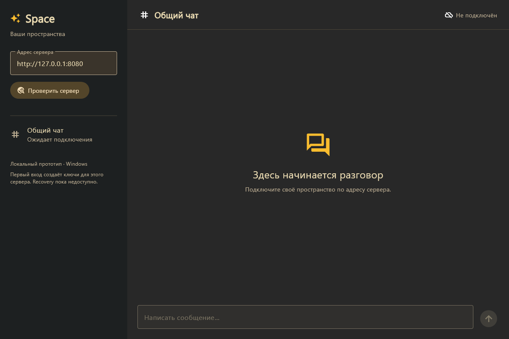

# Space: Flutter-клиент для Windows

Первый нативный клиент локального прототипа. Flutter 3.47.6 / Dart 3.13.5; Windows — первая проверенная платформа. Android и Flutter Web ещё не добавлены.

Тема по умолчанию — Gruvbox Dark. Адаптивная оболочка уже перенесена в Flutter: обзор, чат, навигация, идентичность, личные настройки и поиск. [Проект полного UI/UX](design/README.md) сохраняет HTML-прототип будущих представлений, включая оформление сервера по согласию.



Изображение получено из Flutter-рендера начального экрана, без вымышленных сообщений или подключения.

## Что работает

- Desktop shell: rail пространств, разделы и контекстная панель при ширине от 1320.
- Compact shell: нижняя навигация и Drawer при ширине менее 760; подключение открывается отдельным sheet.
- Обзор, поиск разделов и загруженных сообщений (Ctrl/Cmd+K), настройки Gruvbox Light/Dark и двух альтернативных акцентов.
- Личные настройки и до 12 недавних адресов сохраняются в `shared_preferences`. Там нет ключей или токенов.
- Черновик остаётся при смене раздела/темы и отделён по origin; он хранится только в памяти до закрытия приложения.

- Подключение по локальному origin, например `http://127.0.0.1:8080`.
- Discovery по HTTP без redirect, проверка версии/ключа/адреса gRPC, затем manifest через gRPC.
- Подтверждение первого доверия; сохранение `origin + server ID + public key`. Изменение identity блокирует подключение.
- Независимые root/device Ed25519-ключи для сервера, проверка challenge перед подписью.
- Root-authorized registration, device login и root-authorized revoke.
- Текстовый чат, страницы истории, gRPC-подписка durable events с heartbeat, cursor replay и дедупликацией.
- Восстановление потока после transient error/EOF с backoff; истёкший token обновляется через device login. Отозванный grant не регистрируется заново.
- Повтор неудачной отправки с тем же текстом использует прежний idempotency key в рамках процесса.
- Вход с сохранённым grant после перезапуска; токен только в памяти. Перед expiry выполняется новый device login, без refresh token.

## Запуск

Запустите [Go-сервер](../server/README.md) с PostgreSQL. HTTP по умолчанию `127.0.0.1:8080`, gRPC — `127.0.0.1:9090`. Флаги `-http` и `-grpc` изменяют порты. Discovery объявляет фактический gRPC endpoint; клиент не угадывает порт.

Из каталога `client`:

```powershell
flutter pub get
flutter run -d windows
```

Нажмите «Добавить пространство» → введите адрес → «Проверить сервер» → проверьте origin и отпечаток → «Доверять и подключиться». Подключение закрывается после успешного входа и открывается чат. Отпечаток полезно сравнить с известным серверным ключом. На первом визите действует локальная TOFU-модель; сам отпечаток не доказывает владельца сервера.

Недавние адреса находятся в левой панели/Drawer. Сейчас активен один сервер за раз: выбор другого закрывает текущую сессию и предлагает проверить новый адрес. Это не отзыв grant — ключи и разрешение прежнего сервера сохраняются. Кнопка отзыва находится в «Идентичности» и требует подтверждения.

Go `-demo` не предоставляет настоящую identity/auth, поэтому этот Flutter-клиент его не принимает. Без локального Docker серверные интеграционные проверки выполняются в CI; приложение можно собрать независимо от базы.

## Архитектура

```text
app.dart → ChatController → SpaceSession → generated Dart gRPC clients
                               ↓
                         IdentityVault
                               ↓
                      SecureIdentityVault
```

`core.dart` содержит протокольную логику без Flutter UI. Discovery — HTTP, application API — нативный gRPC. `generated/` получен из общего `.proto`. `chat_controller.dart` управляет подключением, событиями и повтором отправки. `secure_vault.dart` — адаптер платформенного хранилища. `preferences.dart` отвечает за несекретные личные настройки, `ui/` — за shell, панели, подключение, чат и поиск.

Windows-ключи сохраняются через `flutter_secure_storage`, одним защищённым record на origin; trust pin хранится вместе с ними. Private keys не пишутся в обычные файлы/логи, небезопасного fallback нет. Это программные Ed25519-ключи; аппаратная изоляция/passkeys не заявляются. Native backend входит в Windows-сборку; автоматическая сквозная проверка Windows vault на реальном устройстве ещё требуется.

Профиль генерирует случайные server roots. Master recovery seed/HKDF ещё не реализованы. В «Идентичность» доступна зашифрованная per-server карточка JSON и импорт прежней идентичности; потеря vault без заранее созданной карточки по-прежнему означает потерю ключей. Отозванный grant не заменяется автоматически. Хранилище не следует удалять для обхода отзыва.

## Проверки и генерация

```powershell
flutter analyze
flutter test
flutter build windows --release
```

Проверены широкий/узкий интерфейс, текст 200%, запрет отправки до подключения, сохранение и разделение черновиков, переключение темы, восстановление личных настроек, поиск, ограничения URL, trust conflict и отказ подписывать challenge другого сервера/origin/device/purpose. В CI Dart-клиент подключается к Go-серверу и PostgreSQL: register, login, message, retry, reconnect, events и revoke с отказом `Unauthenticated`.

Генерация из корня репозитория:

```powershell
dart pub global activate protoc_plugin 25.1.0
buf generate protocol/proto --template client/buf.gen.yaml
```

Для Buf в Windows `dart.exe` должен быть в PATH раньше `dart.bat`: обычно `<Flutter SDK>/bin/cache/dart-sdk/bin`. Сгенерированные файлы коммитим. Версии runtime-зависимостей фиксирует `pubspec.lock`.

При ошибке MSVC из-за длинного пути используйте короткий checkout либо junction к `client`, выполните там `flutter clean`, `flutter pub get` и сборку. Результат: `build/windows/x64/runner/Release/`; для переноса нужен весь каталог, не один `.exe`.

## Что дальше

ACL отдельных разделов, несколько одновременных пространств, полноценный vault UX, Android, Flutter Web с HTTP adapter, медиа и уведомления. Сейчас один общий чат, роли и open/closed registration и локальные insecure transports. Подписанный manifest, TLS-профиль и key migration ещё не реализованы; клиент не предназначен для публичного сервера. [Профиль подписки и ограничения](../docs/adr/018-event-stream.md).

Форум, лента и встречи представлены состояниями «Пока недоступно», без демонстрационных участников или публикаций. Клиент не запускает микрофон/камеру. Custom color editor и серверное оформление по согласию пока остаются в HTML-прототипе: текущий manifest не предоставляет theme extension. Поиск работает в загруженных данных, не выполняет серверный full-text запрос. Несколько одновременных сессий и сохраняемая история/черновики требуют отдельной реализации.

## Подключение по приглашению

В окне подключения укажите адрес сервера и код iv_…, затем нажмите «Проверить сервер». Клиент проверяет server_id приглашения, показывает роль и отпечаток, а после подтверждения доверия вступает атомарно с регистрацией устройства. Существующий grant не перерегистрируется автоматически. Для reader поле отправки отключено; сервер независимо запрещает запись. Роль обновляется на heartbeat, блокировка завершает поток PermissionDenied. Сообщения, ранее прочитанные на устройстве, нельзя отозвать задним числом.

В открытом режиме новый root становится member; в закрытом новый root допускается только по приглашению. Известный заблокированный root не возвращает доступ через регистрацию устройства. Browser и Flutter пока имеют разные roots: не открывайте одноразовый код для вступления в браузере, если планируете использовать его только в Flutter. [Подробности прав и приглашений](../docs/ADMIN-GUIDE.md).
## Восстановление и устройства

В «Идентичность» появились сохранение зашифрованной JSON-карточки, восстановление из файла и список своих разрешений с отзывом. Карточка содержит полномочия одного сервера и его trust pin; рабочий device key каждый раз генерируется заново. Пароль открывает файл локально, а не является серверным паролем. Карточку панели можно импортировать во Flutter и сохранить прежний principal/owner; оригинальная Flutter-карточка открывается также в панели.

Исходный Flutter root-card восстанавливает полный управляющий root. Delegated-card панели выдаёт рабочий device, не сохраняющий root/recovery secret; чтобы отозвать другие устройства или подключить ещё один аппарат, нужна исходная карточка и пароль. Self revoke доступен без неё. Отзыв root-containing устройства не отзывает украденную копию root; root rotation ещё предстоит. [Инструкция и SSH](../docs/ADMIN-GUIDE.md), [формат и ограничения](../docs/adr/021-recovery-cards.md). Root-подписанный pairing уже работает; QR/PNG и delegated pairing реализованы; master-seed/HKDF ещё предстоит. Не проверяйте потерю единственной рабочей копии прежде, чем подтвердите восстановление отдельно.
## Сопряжение со своей идентичностью

В подключении после проверки discovery появился «Доверять серверу и начать сопряжение». Код pc_… передайте исходному устройству. В его разделе «Идентичность» подготовьте проверку, сравните коды до подписи и введите код с нового аппарата. После подписи новый клиент проверяет Ed25519 root proof и выполняет target-only claim. В working vault нет root/recovery seed. Подтверждение исходным Flutter и исходным браузером проверено со сквозным Go API. [Пошаговый сценарий](../docs/ADMIN-GUIDE.md), [профиль сопряжения](../docs/adr/022-device-pairing.md).

Пошаговая инструкция: [руководство приложения](../docs/APPLICATION-GUIDE.md).

Ротация root во Flutter: [пошаговая инструкция](../docs/APPLICATION-GUIDE.md#смена-корневого-ключа-во-flutter). Нужны обновлённый сервер со схемой 7 и эта версия клиента. Vault v3 читает v1/v2; обратный переход на старую сборку после записи v3 не поддерживается. Root history и recovery payload v2 проверяются в Dart и WebCrypto. Сопряжение после ротации пока отключено на стороне источника: используйте новую карточку.

## Управление выбранным сервером

Владелец или администратор открывает «Управление пространством» в боковой панели или разделе идентичности. Настройки, каналы, участники и приглашения доступны в том же приложении; используется текущая сессия gRPC. Для действий устройству нужен scope space.manage. Устройства доступны в том же разделе. При отсутствии space.manage владелец явно подтверждает выдачу разрешения своему устройству; подпись требует сохранённого root или исходной корневой JSON/PNG-карточки. Recovery-карточка не расширяет свои права. [План переноса](../docs/adr/025-unified-administration.md).

При сборке Windows через короткий junction он должен указывать на корень репозитория, а сборка выполняться из его client: относительные зависимости ../packages должны оставаться доступны.

## Каналы и права в общем приложении

Откройте «Управление пространством», затем блок «Каналы и права». Здесь доступны создание чата, название, порядок, архив и публичный предпросмотр. Настройте правила ролей или выберите отдельного участника из списка; при большом списке загрузите следующую страницу либо укажите полный principal_id.

Правило участника полностью заменяет правило роли. Снятие «Видеть» отключает остальные разрешения; отправка требует чтения. Пустые правила оставляют доступ только администрации. Изменения применяются после «Сохранить права». Owner/admin и scope устройства проверяет сервер; читатель не получает отправку даже через индивидуальное правило.

Метаданные и права используют одну revision. При конфликте несохранённые поля сохраняются в форме. «Загрузить канал заново» явно заменяет их актуальными значениями. Архив сохраняет историю и запрещает отправку; снимите флажок, чтобы вернуть канал. Список остаётся доступным для настройки при выключенных чатах.

HTML /space и возможность включить прежнюю панель удалены. Управление выполняется основным приложением; независимые API сохранены.

## Участники и приглашения в приложении

Откройте «Управление пространством». В блоке «Участники» доступны поиск по загруженным идентификаторам и ролям, обновление и следующая страница. Владелец нажимает «Изменить права», выбирает reader/member/admin или блокировку и подтверждает изменения. Роль владельца этим экраном не меняется. Администратор видит список без редактирования ролей. При конфликте revision значения остаются в форме; явное обновление заменяет их текущими серверными значениями.

В блоке «Приглашения» выберите участника или читателя, срок от минуты до семи дней и число использований 1–100. После создания скопируйте код для приложения или ссылку для вставки в приложение. Локальная ссылка требует того же компьютера или подходящего SSH-туннеля; она ещё не публичная интернет-ссылка. Копирование выполняется только по нажатию кнопки.

Код хранится только в памяти формы и показывается при создании. Его можно скрыть; после закрытия экрана он не восстанавливается из списка. Список содержит только роль, срок, использованные места и состояние. Отзыв запрещает новые вступления, но не блокирует уже вступивших людей. Для этого владелец блокирует участника отдельно. Приглашение не повышает и не понижает существующую роль.


Ссылку приглашения origin#invite=… вставьте в поле «Адрес сервера или ссылка приглашения». В ручном режиме bootstrap откройте управление в приложении, явно разрешите управление устройству, затем введите одноразовый setup-код сервера. Автоматический первый владелец и ручной setup — разные режимы сервера.

Каталог каналов и права автоматически обновляются отдельной WatchChannels-подпиской, даже когда ни один чат недоступен для чтения. Названия/архив/роль обновляются в текущем интерфейсе; при отзыве чтения история очищается, при возврате доступ восстанавливается. Новый транспорт требует обновлённого сервера; подробности в [ADR-026](../docs/adr/026-channel-catalog-stream.md).

Непрочитанные сообщения отображаются рядом с каналами и обновляются через каталог. Позиция чтения локальна этому устройству; активное окно помечает видимые сообщения, фон и скрытый чат — нет. В истории есть разделитель и переход к новым записям. [Границы профиля](../docs/adr/027-local-unread-positions.md).
