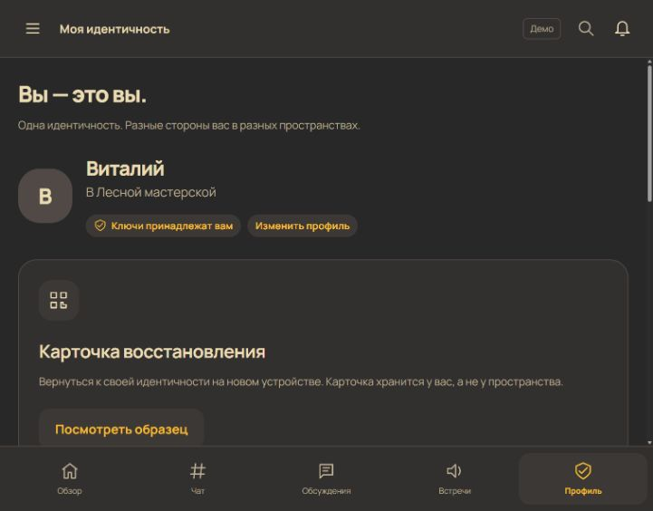

# Space: предложение UI/UX для всего приложения

Это интерактивный HTML/CSS/JS-прототип и основа для переноса в Flutter. Он показывает конечный опыт, включая функции, которых пока нет в backend. Все люди, статусы, встречи и сообщения демонстрационные. Микрофон, камера и настоящие пользовательские ключи не используются.



## Открыть

Из корня репозитория:

```powershell
node client/design/prototype/serve.mjs
```

Затем [http://127.0.0.1:8765](http://127.0.0.1:8765). Можно открыть `prototype/index.html` напрямую, однако работа localStorage и clipboard зависит от браузера. Сервер нужен только для выдачи статических файлов.

## Каким я вижу Space

Место для небольших сообществ и осмысленного общения. По умолчанию — Gruvbox Dark: тёплый графит, кремовый текст, жёлтые, зелёные и оранжевые акценты. Есть светлый Gruvbox и альтернативные личные палитры. Немного воздуха, выраженная типографика и спокойные иллюстрации оставляют фокус на разговоре и людях.

Вместо обязанности следить за всем — понятный обзор, сохранённые находки, ответы именно вам и встречи, на которые вы сами захотели прийти. Нельзя заранее гарантировать, что люди полюбят продукт. Это гипотеза, которую проверяем на реальных сценариях и участниках.

## Карта приложения

| Раздел | Для чего | Главный сценарий |
| --- | --- | --- |
| Пространства | Независимые серверы и сообщества | Добавить по URL, проверить доверие, выбрать профиль |
| Обзор | Спокойное возвращение | Продолжить разговор или открыть сохранённое |
| Чат | Быстрый разговор | Написать, ответить в ветке, поставить реакцию |
| Обсуждения | Долгие разговоры | Найти тему, создать свою, продолжить мысль |
| Лента | Публикации выбранных людей | Прочитать, обсудить, сохранить |
| Комнаты | Выбор формата присутствия | Голос, видео, сцена, эфир |
| Идентичность | Ключи и профили | Устройства, recovery, отдельные personas |
| Настройки | Личный комфорт | Цвета, плотность, уведомления, тихий режим |
| Панель владельца | Управление сервером | Views, политики входа, roles, backup |

Протокол остаётся открытым; это дизайн одного reference client, а не обязательный внешний вид всех клиентов.

## Три компоновки

**Компьютер, широкое окно:** rail пространств → список разделов → содержимое → дополнительный контекст. Контекст можно скрыть; composer остаётся на месте. Пространства не смешиваются с каналами.

**Планшет и среднее окно:** rail, более узкая навигация и содержимое. Участники/контекст открываются отдельно; карточки перестраиваются, а не уменьшаются вместе с текстом.

**Телефон:** содержимое во всю ширину; снизу пять основных направлений: обзор, чат, обсуждения, встречи, профиль. Полный список каналов и настроек — в меню. Контекст, поиск и ветки — отдельные окна/экраны. На реальном мобильном клиенте модальные сценарии следует превращать в sheets или full-screen routes с системной кнопкой назад.

Порог зависит от доступной ширины окна, а не названия устройства. Это соответствует подходу [адаптивных компоновок Material](https://m3.material.io/foundations/layout/canonical-examples/overview). Keyboard shortcuts не заменяют видимые кнопки.

## Основные пути

### Первое знакомство

1. Понять, что идентичность принадлежит человеку.
2. Создать локальную identity либо восстановить существующую.
3. Добавить первое пространство по URL/приглашению.
4. Увидеть адрес, ключ доверия, возможности и условия входа.
5. Подтвердить доверие отдельно от регистрации профиля.
6. Выбрать имя/persona здесь, вступить согласно серверной политике.
7. Получить простой первый шаг: прочитать закреплённое или написать приветствие.

Не показываем новичку HKDF, protobuf и auth epochs. Сложные параметры — в диагностике. При этом последствия доверия, экспорта секрета и отзыва должны быть понятными.

### Возвращение

Открываем последний контекст, сохраняем черновик и положение истории. Непрочитанное привязано к конкретному месту. Обзор предлагает несколько важных событий, не поток бесконечных рекомендаций. Можно отключить badges, приглушить пространство или оставить только личные ответы.

### Чат

Обычные сообщения — простая типографика без лишних контейнеров. Имя и аватар различают людей, цвет помогает, но не является единственным сигналом. Enter отправляет на desktop; Shift+Enter добавляет строку. На телефоне системная клавиатура не должна неожиданно отправлять текст. Ветки позволяют развить разговор без перегрузки общего канала.

Отправка имеет состояния: черновик, отправляется, отправлено, ошибка. Retry сохраняет idempotency key. При новом сообщении не перескакиваем к низу, если человек читает историю; показываем ненавязчивое «Новые сообщения». Для слабого соединения нужен видимый reconnect state.

### Голос и видео

Перед входом: понятные роли, preview устройств и выбор «слушать». По умолчанию микрофон и камера выключены. Активная сессия заметна в общей оболочке и остаётся доступной при переходе в другой раздел. Выход — одной кнопкой.

В stage слушатель не становится спикером сам; «поднять руку» не включает микрофон. Разрешение роли и согласие на передачу звука — разные шаги. Live показывает, кто ведёт эфир, есть ли запись и кто её увидит. Любая запись объявляется до участия.

### Идентичность

Отделяем личную identity от профиля на сервере и от ключа устройства. Сначала показываем человеку доступные устройства и понятные действия. Recovery карточка не соседствует с кнопкой «Поделиться»: экспорт — отдельный локальный сценарий с ясными последствиями. Для зашифрованной карточки прямо говорится о пароле; история/список серверов — отдельный backup.

Отзыв показывает область: одно устройство на этом сервере, все сессии grant, либо корневая операция. После отзыва не создаём новый grant незаметно. Текущий HTML-прототип не экспортирует никакие секреты.

## Оформление пользователя и сервера

Пользователь задаёт свою палитру. Сервер может предложить ограниченный набор цветов; выбранное пространство применяет его после preview и явного согласия. Собственная тема сохраняется. Отключение согласия сразу возвращает её.

Согласие привязано к одному серверу и конкретному предложению. Обновление цветов не считается заранее разрешённым. Список пространств, настройки identity и системные предупреждения остаются под контролем пользователя. Тёмный режим, reduced motion, масштаб текста и доступность не переопределяются сервером.

В прототипе доступны Gruvbox и четыре альтернативные палитры, редактор четырёх основных цветов светлого варианта, контрастная проверка, предварительный просмотр, согласие/отмена и изменение предложения владельцем. Тёмный вариант сохраняет спокойные поверхности и адаптирует акценты. [ADR-017](../../docs/adr/017-space-appearance.md) описывает границы и будущий manifest contract.

## Дизайн-система

| Элемент | Решение |
| --- | --- |
| Тёмная основа по умолчанию | Gruvbox: `#282828`, поверхности `#32302F`, текст `#EBDBB2` |
| Светлый вариант | Gruvbox Light: `#FBF1C7`, поверхность `#F9F5D7` |
| Базовый акцент | Жёлтый `#FABD2F` в тёмном Gruvbox; пользователь может заменить |
| Дополнительные акценты | Глина, шалфей, песочный, мягкий ирис |
| Текст | Manrope с Cyrillic; системный Segoe UI как fallback |
| Шкала отступов | 4, 8, 12, 16, 24, 32 |
| Скругления | 10–12 для controls, 16–24 для containers |
| Иконки | Собственные простые SVG, единый stroke |
| Анимация | Короткие 150–250 ms переходы и обратная связь |
| Основные targets | 44–48 px; реакции компактнее с достаточным интервалом |

Manrope загружается через Google Fonts; для production/Flutter нужно сохранить шрифт локально с лицензией и не создавать сетевую зависимость. Все иллюстрации прототипа сделаны CSS/SVG, внешние фотографии не используются.

Цветовые значения Gruvbox опираются на [оригинальную палитру morhetz](https://github.com/morhetz/gruvbox); компоновка, компоненты и иллюстрации разработаны для Space. Уже выбранные личные палитры сохраняются при обновлении, старый невыбранный стандартный зелёный вариант мигрирует в Gruvbox.

Ориентир доступности — WCAG 2.2: контраст текста, видимый focus, keyboard navigation, подписи, не только цвет и удобные targets. [Минимальный размер цели WCAG](https://www.w3.org/WAI/WCAG22/Understanding/target-size-minimum) не равен обязательным 44 px для любого элемента; мы выбираем большие основные controls для комфорта. Формальный полный accessibility audit ещё предстоит.

## Что интерактивно

Чат/черновик, ветки, реакции, создание темы/записи, фильтры, сохранённые записи, поиск разделов и сообщений, personas, уведомления, темы, плотность, quiet mode, участие/выход и controls демонстрационных комнат, доступность views в панели владельца, palettes/consent.

localStorage содержит только демонстрационный контент и настройки. Настоящие ключи, серверная авторизация, WebRTC/HLS, backup, file upload и реальные приглашения не реализованы. Никакие кнопки не отправляют сообщения реальным людям. Некоторые подробные административные сценарии показаны как информационные состояния, а не действующие backend операции.

## Перенос в Flutter

1. **Design tokens:** `SpaceTheme`, surfaces, semantic colors, typography, spacing и light/dark. Отдельные user theme и space overlay с consent store.
2. **Adaptive shell:** rail/sidebar/context для desktop; bottom navigation + routes/sheets для compact. Не строить две разные системы навигации.
3. **Живой вертикальный срез:** текущие discovery, trust check, secure vault, login, history, sending/retry, events и revoke. Демоданные из HTML не переносить в production flow.
4. **Состояния:** loading/empty/error/offline, revoked device, trust conflict, expired session и unsupported capabilities. Новые виды не изображают готовую серверную функцию.
5. **Разговоры:** threads/reactions/forum/feed после соответствующих API/ACL. Разделы появляются из manifest с учётом прав.
6. **Встречи:** voice/video/stage/live после media adapter; permission, preview, ongoing session, role changes, network recovery.
7. **Identity UX:** seed/recovery + tested vault; device list и persona management. Hardware claims только для проверенных profiles.
8. **Admin web:** самостоятельная панель Docker-сервера, повторно использующая tokens и язык интерфейса; секреты не попадают в клиентские mock forms.
9. **Проверка:** Windows/Android/web, keyboard/screen reader, масштаб 200%, safe areas/keyboard, реальные люди и слабая сеть.

Существующий Flutter-клиент остаётся рабочим протокольным прототипом и уже получил базовую палитру Gruvbox Dark. Полная адаптивная оболочка и серверные предложения оформления пока реализованы отдельно в HTML. Переносить следует готовые сценарии по очереди, сохраняя реальные проверки API и безопасности.

## Как проверить, хочется ли возвращаться

Сначала 5–8 людей проходят подключение, поиск темы, отправку сообщения, отключение уведомлений и вход/выход из комнаты. Смотрим, где они теряются и как объясняют свой опыт. Далее проверяем возвращение через несколько дней: помнят ли контекст, понимают ли непрочитанное, не боятся ли настройки ключей.

Полезные показатели: время до первой успешной беседы, завершение выбранных сценариев, ошибки отправки/подключения, понимание уведомлений, качественная удовлетворённость. Возвращаемость не оптимизируется ценой навязчивости. Аналитика добровольная и не собирает текст сообщений, ключи или межсерверную identity.
