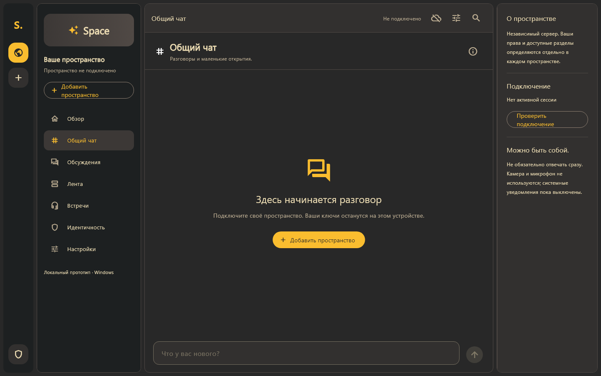
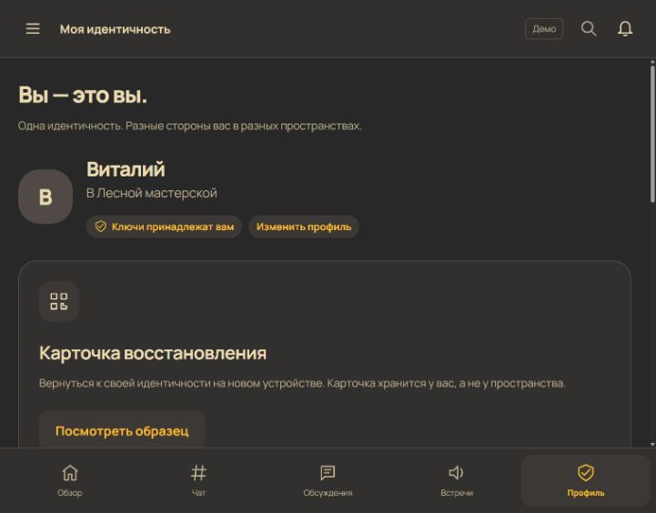
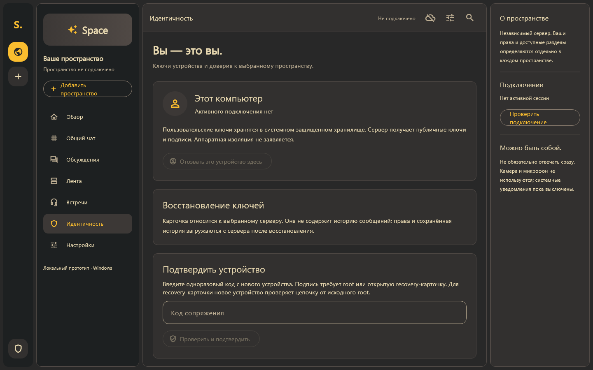
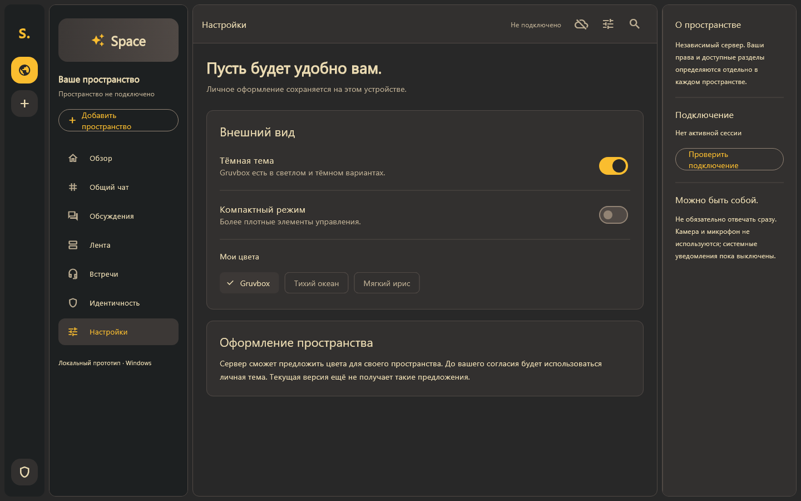

# Руководство приложения Space

Space — универсальный клиент независимых пространств. Это руководство относится к экспериментальной Windows-версии от 9 октября 2026 года. Работают подключение к одному серверу, общий чат, подписка на события, приглашения, локальные ключи, recovery JSON/PNG, сопряжение и оформление. Форум, лента, голосовые комнаты, видео, stage и трансляции пока представлены как будущие разделы.

## Содержание

1. [Установка и интерфейс](#установка-и-интерфейс)
2. [Подключение](#подключение)
3. [Чат и права](#чат-и-права)
4. [Идентичность и карточка](#идентичность-и-карточка)
5. [Перенос через сопряжение](#перенос-через-сопряжение)
6. [Оформление](#оформление)
7. [Неполадки и ограничения](#неполадки-и-ограничения)

## Установка и интерфейс

Распакуйте Windows-архив целиком в отдельную папку. Запускайте `space_client.exe` рядом с DLL и каталогом `data`; перенос одного EXE недостаточен. Перед заменой сборки закройте приложение. Пользовательские ключи сохраняются через системное защищённое хранилище; распаковка новой сборки не заменяет recovery-карточку.

На широком экране слева находятся пространства и навигация, в центре — выбранный раздел, справа — сведения о пространстве. В узком окне используется нижняя навигация. Кнопки идентичности, оформления и подключения открывают соответствующие панели. Радиус основных поверхностей — 12 px, тема по умолчанию — Gruvbox.

*Снимок интерфейса Flutter из проверочного запуска без подключения. Кнопка отправки отключена, потому что нет рабочей сессии. Это реальный интерфейс, а не изображение работающего чата с сервером.*

*HTML-прототип оформления: иллюстрирует общий дизайн. Его содержимое и будущие разделы не являются подтверждением реализованного API.*

| Раздел | Назначение и текущий статус |
|---|---|
| Обзор | Сведения о пространстве и переход к чату |
| Общий чат | Чтение, отправка, история и события подключённого сервера |
| Идентичность | Проверочные сведения, карточки и устройства |
| Настройки | Тема, плотность интерфейса и выбор собственных цветов |
| Форум, лента, комнаты и эфиры | Будущие возможности; серверные функции пока отсутствуют |

## Подключение

1. Откройте **«Подключение к серверу»**.
2. Введите HTTP-адрес пространства, например `http://127.0.0.1:8080`.
3. При закрытой регистрации введите предоставленный код приглашения `iv_…`.
4. Нажмите **«Проверить сервер»**.
5. Проверьте адрес, сведения discovery и отпечаток серверного ключа. Сравните отпечаток с полученным от владельца по доверенному каналу.
6. Для новой независимой идентичности нажмите **«Доверять и подключиться»**. Для уже существующей используйте восстановление или сопряжение.

При первом самостоятельном подключении создаются отдельные root/device keys для этого сервера. Они сохраняются в защищённом хранилище ОС. Повторное подключение к прежнему origin использует сохранённую идентичность. Если прежний сервер неожиданно предъявляет другой ключ, выясните причину у владельца, прежде чем менять доверие.

Нативный клиент читает discovery по HTTP и подключается к объявленному gRPC endpoint. Для удалённого локального сервера нужны оба SSH-проброса: HTTP и gRPC. Инструкция — в [руководстве панели](ADMIN-GUIDE.md#запуск-и-удалённый-доступ). Подключение по публичному HTTPS и Flutter Web ещё не входят в текущий профиль.

Приглашение связывает новую идентичность с членством. Оно не переносит вашу прежнюю идентичность. Независимый вход в браузере создаёт другой principal; для единого principal используйте карточку или сопряжение.

## Чат и права

После подключения откройте **«Общий чат»**. История загружается с сервера; новые сообщения поступают через подписку. При восстановлении соединения клиент продолжает чтение событий и устраняет повторы.

Для отправки введите текст и нажмите кнопку **«Отправить»**. Прототип ограничивает сообщение 4096 байтами UTF-8: русские символы занимают больше одного байта. При повторной отправке одного запроса используется идемпотентность, чтобы сетевой повтор не создавал второе сообщение.

Читатель может читать, но не отправлять; участник может читать и писать. Блокировка, отзыв устройства или отключение чата закрывают соответствующий доступ на сервере, включая активную подписку. Администраторские настройки находятся в `/space`; эта версия Flutter не содержит полноценной административной панели.

Не считайте текст в поле отправленным, пока интерфейс не подтвердил результат. При потере соединения проверьте состояние подключения и сообщения об ошибках. Сообщения хранятся в PostgreSQL и доступны серверу; сквозное шифрование чата ещё не реализовано.

## Идентичность и карточка

В разделе **«Идентичность»** можно сверить principal ID и отпечаток, сохранить карточку, восстановиться из файла, посмотреть устройства и отозвать их доступ. Эти действия относятся к текущему серверу.

*Экран без подключения: управляющие действия становятся доступны после входа.*

### Сохранить резервную карточку

1. Подключитесь исходной идентичностью.
2. Нажмите **«Сохранить карточку»**.
3. Задайте и подтвердите пароль длиной от 12 символов.
4. В диалоге формата выберите **«QR в PNG»** или **«JSON»**.
5. Сохраните файл. Проверьте его открытие на другом устройстве до удаления исходной установки.

JSON и PNG несут один и тот же зашифрованный пакет. QR чёрно-белый с белыми полями, независимо от темы приложения. Для резервной копии сохраняйте оригинал; обрезка, размытие и перекодирование могут помешать чтению.

Исходный Flutter экспортирует root-card: она восстанавливает полный управляющий root для этого сервера. Браузерная панель создаёт delegated-card: она восстанавливает рабочее устройство через ограниченный recovery key. Оба формата открываются в Flutter и браузере.

Карточка вместе с паролем позволяет действовать от имени вашей идентичности в пределах содержащегося разрешения. Не публикуйте их вместе. Забытый пароль не сбрасывается сервером. Карточка не содержит архив чатов и не заменяет серверную резервную копию.

### Восстановиться из изображения

1. Откройте **«Идентичность» → «Восстановить из файла»**.
2. Выберите оригинальный PNG или JSON.
3. Введите пароль карточки.
4. Проверьте адрес и подтвердите восстановление. Если для этого адреса уже сохранена другая идентичность, сначала сохраните её карточку.
5. Дождитесь подключения и проверьте прежний principal/роль.
6. Откройте список устройств и отзовите потерянные рабочие разрешения.

Создаётся новый случайный device key. При восстановлении delegated-card рабочая запись не сохраняет root/recovery secret: для дальнейших управляющих подписей снова понадобится карточка и пароль. При восстановлении root-card возвращается root authority.

PNG можно открыть из файла; камера подключена отдельной кнопкой ниже. Максимум изображения — 8 MiB, размеры 64–2048 px по каждой стороне; максимум JSON — 16 KiB. Проверяются размер, QR-префикс, формат, ограничения KDF и аутентичность шифротекста. Неправильный пароль и повреждение должны завершаться отказом.

Восстановление зависит от доступности прежнего сервера, совпадения его ключа и origin, действующего recovery-разрешения и членства. Оно не обходит блокировку владельцем.

### Отзыв устройств

В списке проверьте grant ID, текущий аппарат и срок доступа. Кнопка **«Отозвать доступ»** завершает разрешение на сервере. Текущее рабочее устройство можно отозвать без карточки; для чужого grant при отсутствии root приложение попросит файл и пароль.

Отзыв recovery-разрешения закрывает карточку и все её дочерние устройства. Сначала обеспечьте другой путь доступа. Отзыв устройства, хранящего root, не уничтожает уже скопированный root secret: для смены root используйте обновлённый сценарий ниже.

## Перенос через сопряжение

Сопряжение удобно, когда исходное устройство доступно: новое получает только свой рабочий ключ.

1. На новом аппарате откройте подключение и проверьте сервер.
2. Выберите **«Доверять серверу и начать сопряжение»**.
3. Передайте показанный код `pc_…` исходному устройству. Срок запроса — пять минут.
4. На исходном аппарате в разделе идентичности введите код и нажмите **«Проверить и подтвердить»**.
5. Если исходный аппарат не содержит root authority, откройте свою recovery-карточку JSON/PNG с паролем.
6. Сравните код проверки на обоих экранах до выдачи подписи. Введите код с нового аппарата на исходном и нажмите **«Коды совпадают — подписать»**.
7. Завершите подключение на новом аппарате и проверьте список устройств.

Новое устройство проверяет подпись разрешения. Для delegated recovery проверяются обе ступени: root → recovery key → новый device key. Подпись связана с конкретным запросом, сервером, ключом и правами. Новое устройство сохраняет рабочие ключи после завершения target-only claim.

При несовпадении кода отмените запрос. Просьбу неизвестного человека «подтвердить мой код» рассматривайте как попытку подключиться к вашей идентичности. Не подтверждайте её.

## Оформление

Откройте **«Настройки»**. Доступны тёмная/светлая тема, компактный режим и собственная палитра. По умолчанию используется Gruvbox. Выбор оформления хранится отдельно от криптографических ключей.

Архитектура предусматривает серверную тему с согласия пользователя; её согласование исследовано в HTML-прототипе. Текущая панель `/space` не предоставляет редактор серверной палитры. Настройки внешнего вида не меняют роли, grant или идентичность.

Интерфейс адаптируется к размеру окна, но это ещё не выпущенное Android/iOS-приложение. Windows-сборка является проверенной целевой платформой этого среза.

## Неполадки и ограничения

| Проблема | Что проверить |
|---|---|
| Сервер не найден | Процесс сервера, HTTP-порт, SSH-туннель и адрес |
| Discovery есть, чат не подключается | gRPC-порт и его проброс |
| Отправка отключена | Подключение, reader-роль, блокировка, включение чата |
| Регистрация закрыта | Действующее приглашение или восстановление прежней идентичности |
| Карточка не открывается | Пароль, целостность оригинала, размер и формат |
| Сопряжение истекло | Отмените старый запрос и создайте новый |
| Разрешение отозвано | Действующая карточка или исходный root; не повторяйте обычный вход бесконечно |
| Серверный ключ изменился | Остановитесь и уточните причину у владельца |
| Потеря всех файлов и ключей | Центрального восстановления по почте/паролю нет |

Экспериментальный срез пока не включает master seed/HKDF, passkeys/WebAuthn, сквозное шифрование, федерацию, голос/видео, push и полноценный production TLS-профиль. Не удаляйте единственную рабочую копию идентичности ради проверки recovery.

Связанные документы: [панель управления](ADMIN-GUIDE.md), [сборка клиента](../client/README.md), [безопасность](../SECURITY.md), [план](../TODO.md).

Проверка перезапуска и чистого восстановления: [RECOVERY-DRILL.md](RECOVERY-DRILL.md). Автоматический CI проверяет Chromium/IndexedDB и новый процесс Dart; нативное Windows secure storage требует отдельного ручного сценария.

## Смена корневого ключа во Flutter

1. Войдите на исходном устройстве с root authority. Устройство, подключённое только через delegated-card, не может начать ротацию.
2. Откройте **«Идентичность» → «Смена корневого ключа» → «Сменить корневой ключ»**.
3. Подтвердите закрытие доступа прежним устройствам и карточкам. ID пользователя, роль и сообщения сохраняются.
4. Приложение создаст новый root/device, проверит challenge и обе подписи, запишет новый секрет в отдельный защищённый журнал и только затем завершит переход на сервере.
5. Дождитесь повторного подключения и сохраните новую recovery-карточку.

Если приложение закрылось или ответ потерян, проверьте адрес прежнего сервера и нажмите **«Завершить сохранённую смену»**. Повтор возвращает тот же grant. Даже частично записанный active slot восстанавливается из проверенного журнала после получения соответствующего receipt сервера.

Если запрос истёк **до** серверного commit, подключитесь прежними ключами и выберите **«Обновить истёкший запрос»**. Сохраняются те же новые root/device и operation ID, заменяется challenge. Если сервер уже завершил переход, используйте завершение сохранённой смены: повтор работает и после истечения challenge.

Новые карточки после ротации содержат payload v2 с полной историей подписей. Их можно открыть в обновлённых Flutter и `/space`; старые сборки этот формат не поддерживают. Сопряжение после ротации поддерживается: новый аппарат проверяет историю ключей. Для большой истории выбирайте JSON. QR имеет предел 2800 байт; обычные карточки используют уровень M, длинные — L. Исходный PNG не следует обрезать или перекодировать.

Экспериментальная история ограничена 16 переходами и размером recovery payload. Клиент отказывается начинать ротацию, если новая история не помещается в читаемую карточку. Ротация не заменяет backup базы и не гарантирует победу в гонке с атакующим, уже владеющим старым root.

## Восстановление камерой

В разделе «Идентичность» нажмите **«Сканировать камерой»**, разрешите доступ и наведите камеру на QR-карточку Space. После чтения камера остановится. Введите пароль карточки и подтвердите прежний адрес сервера. Проверки шифрования, истории ключей и прав те же, что при импорте PNG.

Микрофон не используется. Кадры обрабатываются локально; в Windows отдельные JPEG-кадры создаются только во временной папке и удаляются после обработки. Камера закрывается при отмене, успешном чтении и уходе приложения в фон. Выбор камеры доступен при наличии нескольких устройств. При отказе доступа или отсутствии камеры остаётся восстановление PNG/JSON.

На Windows разрешение для настольных приложений настраивается в «Параметры → Конфиденциальность и безопасность → Камера». Приложение не меняет системные разрешения автоматически. Поддержка других нативных платформ пока не проверена.

## Сопряжение после смены корневого ключа

Ограничение временного отключения снято: сервер передаёт root history вместе с pairing proof, обе реализации проверяют прежний principal и текущую эпоху. Используйте обычный сценарий сопряжения и сравнение кодов. Новое устройство не получает root/recovery secret.

## Несколько каналов

После входа клиент получает список каналов с вашими эффективными правами. На широком экране выберите канал в боковой панели. На узком экране используйте список **Канал** над сообщениями. Кнопка обновления рядом повторно загружает список, права и текущую историю.

Старый поток отменяется при переключении. Сообщения и ключ повтора отправки относятся к выбранному каналу; черновики каждого канала сохраняются отдельно в памяти приложения. Черновики не переживают закрытие приложения и не записываются на сервер.

Выбранный канал, курсор получения событий и отметка последнего прочитанного сообщения сохраняются на устройстве отдельно для каждой комбинации адреса сервера, server_id и principal_id. Сообщения, access tokens и секретные ключи в этом файле настроек не сохраняются. Отметка чтения обновляется, когда открытый чат прокручен до конца; при наличии более новых сообщений показывает границу прочитанного. Между переключениями сохраняется положение прокрутки в памяти; после перезапуска точное положение внутри длинной истории пока не восстанавливается.

Архив отмечен в списке: его историю можно читать, отправка отключена. Видимый канал без read показывает пустое состояние с объяснением. При отзыве read/visible уже показанная история очищается, поток останавливается; можно выбрать другой доступный чат. Это не удаляет копии данных, которые пользователь ранее сохранил отдельно.

Список обновляется вручную и при heartbeat подписки; отдельные события изменения каналов ещё предстоят. Старые сборки клиента поддерживают только general: обновите приложение вместе с сервером для новых каналов и скрытого публичного предпросмотра general.

## Настройка выбранного сервера

У владельца/администратора появляется «Управление пространством» в боковой панели и разделе идентичности. Экран использует существующую сессию; закрытие экрана не отключает чат. Пока доступны основные настройки. Сервер проверяет роль и разрешение устройства space.manage; приложение не повышает их автоматически.

## Каналы и права в общем приложении

Откройте «Управление пространством», затем блок «Каналы и права». Здесь доступны создание чата, название, порядок, архив и публичный предпросмотр. Настройте правила ролей или выберите отдельного участника из списка; при большом списке загрузите следующую страницу либо укажите полный principal_id.

Правило участника полностью заменяет правило роли. Снятие «Видеть» отключает остальные разрешения; отправка требует чтения. Пустые правила оставляют доступ только администрации. Изменения применяются после «Сохранить права». Owner/admin и scope устройства проверяет сервер; читатель не получает отправку даже через индивидуальное правило.

Метаданные и права используют одну revision. При конфликте несохранённые поля сохраняются в форме. «Загрузить канал заново» явно заменяет их актуальными значениями. Архив сохраняет историю и запрещает отправку; снимите флажок, чтобы вернуть канал. Список остаётся доступным для настройки при выключенных чатах.

Формы общие для приложения и /space/flutter/. Участники и приглашения доступны в общем модуле. Управление устройствами и recovery пока остаётся в HTML-панели /space.

## Первый вход на новом сервере

Новый сервер с PostgreSQL по умолчанию назначает первого успешно вошедшего пользователя владельцем. Запустите сервер и войдите по ключу через приложение Space или /space; setup-code не нужен. Открытие страницы без авторизации прав не даёт. После входа доступны настройки и каналы, а остальные пользователи не становятся администраторами автоматически.

Назначенный владелец сохраняется при перезапуске. Старые базы без владельца остаются в прежнем режиме: для явного включения выполните `space-server -first-owner`, затем запустите сервер. Команда `-setup-code` по-прежнему позволяет явно выбрать ручной режим. Владельца уже настроенного сервера эти команды не заменяют.

Подробности и проверки: [ADR-026](adr/026-first-login-owner.md).

## Участники и приглашения в приложении

Откройте «Управление пространством». В блоке «Участники» доступны поиск по загруженным идентификаторам и ролям, обновление и следующая страница. Владелец нажимает «Изменить права», выбирает reader/member/admin или блокировку и подтверждает изменения. Роль владельца этим экраном не меняется. Администратор видит список без редактирования ролей. При конфликте revision значения остаются в форме; явное обновление заменяет их текущими серверными значениями.

В блоке «Приглашения» выберите участника или читателя, срок от минуты до семи дней и число использований 1–100. После создания скопируйте код для приложения или ссылку для браузера. Локальная ссылка требует того же компьютера или подходящего SSH-туннеля; она ещё не публичная интернет-ссылка. Копирование выполняется только по нажатию кнопки.

Код хранится только в памяти формы и показывается при создании. Его можно скрыть; после закрытия экрана он не восстанавливается из списка. Список содержит только роль, срок, использованные места и состояние. Отзыв запрещает новые вступления, но не блокирует уже вступивших людей. Для этого владелец блокирует участника отдельно. Приглашение не повышает и не понижает существующую роль.

Нативное приложение и /space/flutter/ используют те же формы. Устройства и восстановление остаются следующими пунктами переноса.
