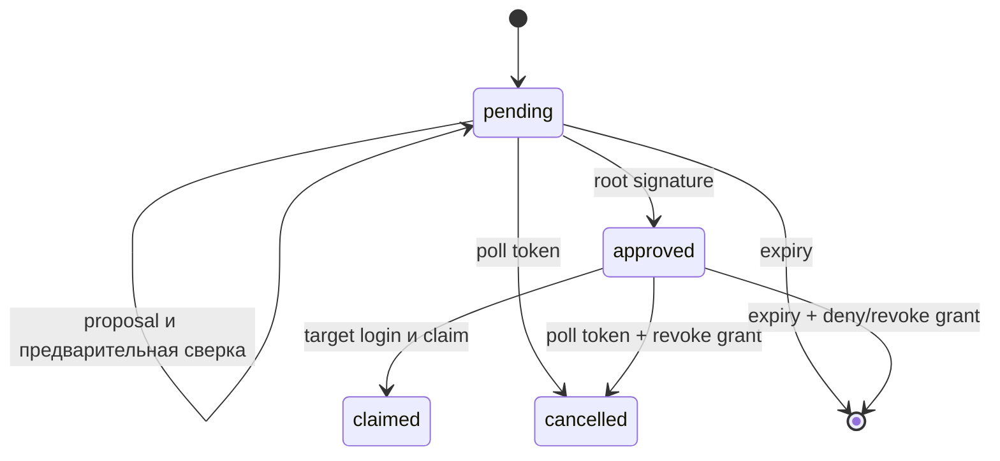

# ADR-022: root-подписанное сопряжение устройств

Дата: 8 октября 2026. Статус: первый работающий локальный профиль. В первом варианте подтверждает исходный root или корневая карточка Flutter. Делегированная recovery-карточка продолжает восстанавливать devices через ADR-021, но не подписывает pairing.

## Результат

Новое устройство входит с прежним principal, owner и membership, создавая собственный рабочий Ed25519 key. Root/private recovery key и карточка между аппаратами не передаются. В рабочем vault/IndexedDB сохраняются только device private key, root public key, grant ID и сведения доверия.

Сопряжение отдельное от приглашения: приглашение создаёт/принимает членство новой идентичности, pairing подключает аппарат к существующей идентичности. Не объединяем эти действия в одной регистрации.

## Порядок

1. Новый клиент проверяет discovery/pin и создаёт случайный device key. CreatePairing получает public key, название и administrative flag. Сервер фиксирует неизменяемые public key/flag, ID, срок пять минут, code и poll token.
2. Code pc_ и poll token pt_ независимы, каждый содержит 32 случайных байта в base64url. Они передаются в POST JSON, не в URL, и сохраняются на сервере только как SHA-256. На исходное устройство передают только code. Pending requests ограничены 64 на сервер.
3. Подтверждающий клиент вводит code, читает запрос и проверяет свою root authority. ProposePairing требует действующую сессию и неблокированное членство, закрепляет public root своего principal. Proposal не выдаёт grant. После первой proposal другая root identity не может её заменить.
4. Оба клиента независимо рассчитывают код проверки: первые 8 bytes SHA-256 от UTF-8 `space/pair-check/v1\0SERVER_ID\0PAIR_ID\0manage|chat\0` || ROOT_PUBLIC_32 || DEVICE_PUBLIC_32. Отображаются 16 hex digits в четырёх группах. Флаг scopes входит в код. Название устройства информационное и не заменяет эту проверку.
5. На управляющем устройстве пользователь вводит код, показанный новым устройством, и отдельно подтверждает подпись. Root подписывает обычный device.register transcript с новым обязательным pairing_id. Клиент проверяет точный target key, root, origin/server, scopes, времена, nonce и pairing ID. Сервер проверяет pending/expiry/proposed root, неизменяемый target и scopes под блокировкой, затем транзакционно создаёт grant и переводит запрос в approved. Второй approval не создаёт ещё один grant.
6. Новый клиент получает transcript/root signature через собственный poll token. Он проверяет JCS subset, pairing ID, target key, scopes и корневую Ed25519-подпись независимо от серверного статуса. Proposal root не может измениться. При проверке уже использованного transcript допускается прошедший 60-second challenge expiry, но только в пределах пяти минут запроса и при действующем grant.
7. Пользователь завершает вход после проверки. Новое устройство выполняет device login собственным private key и ClaimPairing. Claim требует сессию именно выданного target grant; исходное устройство завершить его вместо нового не может. Только после успешного claim клиент сохраняет новый record. Code/poll hashes очищаются, повтор claim тем же target idempotent.

SAS проверяется **до** выдачи root-подписи: сверка только после выдачи не предотвращает подпись для подменённого публичного ключа. Код проверки и отдельное ручное подтверждение — часть обязательного пользовательского сценария, не декоративный статус. Это экспериментальный протокол, требующий независимого анализа перед публичным использованием.

## Состояния и срок

Pending/approved действуют максимум пять минут. До claim Authenticate/login/management проверяют также срок pairing. Просроченный approved grant не превращается в обычный grant при очистке. Очистка отзывает истёкшие grants/сессии; удаляет только истёкшие записи без grant. Записи с grant остаются для проверки/истории. После claimed pairing deadline больше не ограничивает устройство, но обычный grant истекает через 30 суток и может быть отозван.

Cancel с poll token завершает запрос и отзывает уже выданный grant/сессии. Нельзя отменить claimed этим токеном: после claim применяется обычный self/root revoke. Одновременные completion сериализуются строкой pairing и создают ровно один grant. Общий лимит 32 активных grants на principal сохраняется.

## Права и ограничения

Нативный requester по умолчанию просит chat.read/chat.write; requester панели также space.manage. Управляющий экран показывает запрошенные полномочия. Root signature отдельно разрешает scopes, а серверная роль owner/admin/member/reader по-прежнему определяет реальные действия: pairing не повышает membership. Administrator flag не даёт участнику право на настройки.

Рабочее сопряжённое устройство root не хранит, само себя отзывает, а для привязки следующего аппарата требуется исходный root/корневая карточка. Подтверждение через delegated recovery chain и её полный proof bundle отдельным этапом ещё предстоит. Истёкший working grant не заменяется автоматически.

Локальный loopback/SSH origin должен быть одинаковым для обоих клиентов. Нет публичного HTTPS-профиля, QR pairing, имён устройств в постоянном grant, управляемого push вместо polling и полного browser/vault restart drill. Ротация скомпрометированного root также не реализована; RootCard-устройство остаётся управляющим и его root не отзывается простым grant revoke.

## Проверка

PostgreSQL: предварительная proposal, отказ анонимному proposer, подмена target/scopes, четыре competing root completions с одним победителем, чужой claim, идемпотентный claim, одноразовые secrets, cancel до approval, expiry approved, fail-closed cleanup и сохранение claimed grant после deadline. WebCrypto/Dart/Go interoperability: браузер подтверждает Flutter, Flutter подтверждает браузер, коды вычисляются независимо до подписи, root proof проверяется, owner сохраняется, новый working record не содержит управляющих секретов, member не получает управление от administrative flag. Поддельная подпись отвергается.
