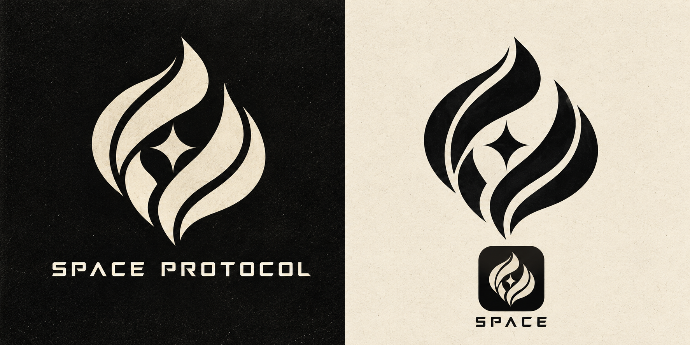
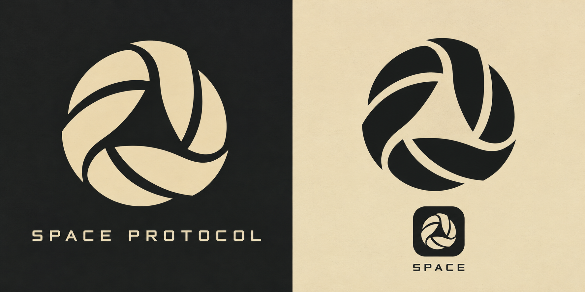

# Логотип Space — выбранное направление

Основной вариант по выбору пользователя: **№3 «Живая искра»**. Переплетённые формы пламени и звезда между ними; чёрно-кремовая палитра и выразительный силуэт по предоставленным референсам.

## Контрольный вариант

№4 — компактный геометрический знак из трёх переплетённых элементов. Он создан для сравнения и пока не заменяет основной вариант №3.

## Архив предложений

- №1: space-identity-concept-v1.png; отдельная иконка space-app-icon-concept-v1.png.
- №2: space-identity-concept-v2.png.

Изображения — растровые дизайнерские концепции. Перед выпуском основного варианта нужно подготовить точный SVG, самостоятельный знак, надпись и платформенные размеры иконки. Вариант №3 подключён как иконка Windows и знак в боковой панели Flutter. Отдельный исходник: space-app-icon-v3.png. PNG 512×512 и ICO создаются командой dart run tool/prepare_app_icon.dart из client/.
